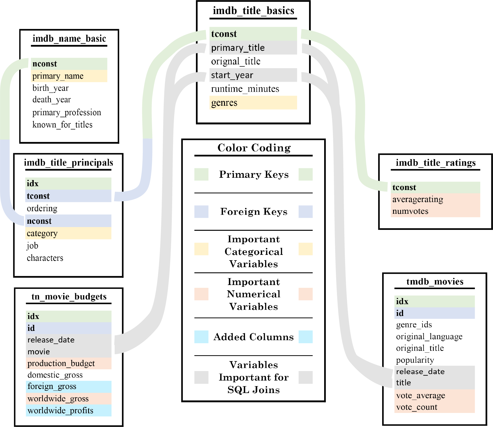

## <a href="https://github.com/sarnadpy32/microsoft_productions/blob/master/Phase%201%20-%20Project.ipynb">Project Notebook</a>
## <a href="https://github.com/sarnadpy32/microsoft_productions/blob/master/Presentation.pptm">Project Presentation</a>


&emsp;For my project, I utilized data from the three sources shown below to gain insight into the film industry in order to provide useful recommendations for Microsoft as they prepare to enter the streaming media market.


* **[A Gladiator Wishes to Enter the Arena](#gladiator)**
* **[Exploring and Preparing the Data](#expl_and_prep)**
    * **[Importing and Investigating the Data](#imp_invest)**
    * **[Fixing and Adding Data](#fix_add)**
    * **[Turning the DataFrames into a SQL Database](#turn_sql)**
* **[Standards for Qualifying as Important](#import_stand)**
    * **[Unique Genre Combinations](#g_combos)**
    * **[Individual Genres](#individ_gs)**
* **[Functions Created for Visualizations](#visual_funcs)**
    * **[Modifying Key rcParams](#mod_rc)**
    * **[Pastel Color Maker](#pastel)**
    * **[Tick Params Functions](#tick_params)**
    * **[Tick Formatters and Label Creators](#tick_format)**
    * **[Minimum and Maximum Tick Finders & Quantile Finders](#tick_finder)**
    * **[Main Plotting Function](#main_plot)**
* **[Finding the Most Financially Important Genres](#fin_find)**
    * **[Unique Genre Combinations](#fin_com)**
        * **[All Years - Top 10 Unique Genre Combinations](#fin_ay_com)**
        * **[Yearly - Top 10 Unique Genre Combinations](#fin_y_com)**
    * **[Individual Genres](#fin_ind)**
        * **[Creating and Preparing the Necessary Tools for Analysis](#fin_tools)**
        * **[All Years - Individual Genres](#fin_ay_ind)**
        * **[Yearly - Individual Genres](#fin_y_ind)**
* **[Exploring the Financially Important Genres](#fin_expl)**
    * **[The Top 10 Most Financially Important Unique Genre Combinations](#fin_imp_com)**
    * **[The Most Financially Important Individual Genres](#fin_imp_ind)**
    * **[Finding the Important Crew Members of Films from the Most Financially Important Genres](#fin_crew)**
    * **[Directors](#fin_dir)**
        * **[The Directors SQL Query](#fin_dir_sql)**
        * **[The Best Directors of the Top 10 Most Important Unique Genre Combinations](#fin_dir_com)**
        * **[The Best Directors of the Most Important Individual Genres](#fin_dir_ind)**
    * **[Writers](#fin_writ)**
        * **[The Writers SQL Query](#fin_writ_sql)**
        * **[The Best Writers of the Top 10 Most Important Unique Genre Combinations](#fin_writ_com)**
        * **[The Best Writers of the Most Important Individual Genres](#fin_writ_ind)**
    * **[Actors](#fin_actor)**
        * **[The Actors SQL Query](#fin_actor_sql)**
        * **[The Best Actors of the Top 10 Most Important Unique Genre Combinations](#fin_actor_com)**
        * **[The Best Actors of the Most Important Individual Genres](#fin_actor_ind)**
    * **[Actresses](#fin_actress)**
        * **[The Actresses SQL Query](#fin_actress_sql)**
        * **[The Best Actresses of the Top 10 Most Important Unique Genre Combinations](#fin_actress_com)**
        * **[The Best Actresses of the Most Important Individual Genres](#fin_actress_ind)**
* **[Finding the Most Important Genres in terms of Online Ratings](#rat_find)**
    * **[Unique Genre Combinations](#rat_com)**
        * **[All Years - Top 10 Unique Genre Combinations](#rat_ay_com)**
        * **[Yearly - Top 10 Unique Genre Combinations](#rat_y_com)**
    * **[Individual Genres](#rat_ind)**
        * **[Creating and Preparing the Necessary Tools for Analysis](#rat_tools)**
        * **[All Years - Individual Genres](#rat_ay_ind)**
        * **[Yearly - Individual Genres](#rat_y_ind)**
* **[Exploring the Important Genres in terms of Online Ratings](#rat_expl)**
    * **[The Top 10 Most Important Unique Genre Combinations in terms of Online Ratings](#rat_imp_com)**
    * **[The Most Important Individual Genres in terms of Online Ratings](#rat_imp_ind)**
    * **[Finding the Important Crew Members of Films from the Most Important Genres in terms of Online Ratings](#rat_crew)**
    * **[Directors](#rat_dir)**
        * **[The Directors SQL Query](#rat_dir_sql)**
        * **[The Best Directors of the Top 10 Most Important Unique Genre Combinations](#rat_dir_com)**
        * **[The Best Directors of the Most Important Individual Genres](#rat_dir_ind)**
    * **[Writers](#rat_writ)**
        * **[The Writers SQL Query](#rat_writ_sql)**
        * **[The Best Writers of the Top 10 Most Important Unique Genre Combinations](#rat_writ_com)**
        * **[The Best Writers of the Most Important Individual Genres](#rat_writ_ind)**
    * **[Actors](#rat_actor)**
        * **[The Actors SQL Query](#rat_actor_sql)**
        * **[The Best Actors of the Top 10 Most Important Unique Genre Combinations](#rat_actor_com)**
        * **[The Best Actors of the Most Important Individual Genres](#rat_actor_ind)**
    * **[Actresses](#rat_actress)**
        * **[The Actresses SQL Query](#rat_actress_sql)**
        * **[The Best Actresses of the Top 10 Most Important Unique Genre Combinations](#rat_actress_com)**
        * **[The Best Actresses of the Most Important Individual Genres](#rat_actress_ind)**
* **[Final Analysis and Recommendations](#final_analysis)**
    * **[Recommendations for Individual Genres](#reco_individ)**
    * **[Recommendations for Unique Genre Combinations](#reco_combo)**
    * **[Interactive Visualization Feature](#int_viz)**

<a id='gladiator'></a>


&nbsp;&nbsp;&nbsp;&nbsp;Microsoft is developing their own streaming service that will feature content which they intend to produce in-house.
&ensp;As they are entering into an already crowded and competitive market, it would be advantageous for them to analyze the viewing preferences of moviegoers, and then produce movies and/or television shows based on the insights gained from such an analysis.

&nbsp;&nbsp;&nbsp;&nbsp;I have performed such an analysis based on data provided to me by Flatiron School from the sources shown above.
&ensp;I have identified the individual genres, as well as various genre combinations, which have resulted in the highest total *and* average:
* Worldwide Gross Revenue
* Worldwide Profits
* Number of Online Votes

&nbsp;&nbsp;&nbsp;&nbsp;I then performed a deeper level of analysis into the highest performing genres and genre combinations, based on certain standards which I will delineate in later sections, for each of the metrics above.
&ensp;I also determined the directors and writers of, as well as the actors and actresses who performed in, films from those high performing genres and genre combinations.

&nbsp;&nbsp;&nbsp;&nbsp;My analysis will be able to provide the Microsoft team assigned to lead their entry into the streaming market with strategic insights into the viewing tendencies of moviegoers.
&ensp;These insights will guide them as to the type of content they may wish to produce to generate the highest possible levels of financial returns.

<a id='expl_and_prep'></a>
 

&nbsp;&nbsp;&nbsp;&nbsp;For this project I was provided data from <a href="https://www.imdb.com/">IMDb</a>, <a href="https://www.themoviedb.org/">The Movie DataBase (TMDB)</a>, <a href="https://www.the-numbers.com/">The Numbers</a>, <a href="https://www.boxofficemojo.com/">Box Office Mojo</a>, and <a href="https://www.rottentomatoes.com/">Rotten Tomatoes</a>.
&ensp;I incorporated data from IMDb, TMDB, and The Numbers.
&ensp;I chose not to use any of the data from Box Office Mojo or Rotten Tomatoes.

&nbsp;&nbsp;&nbsp;&nbsp;The Numbers and Box Office Mojo datasets both contained financial information, but after exploring each of them I determined that The Numbers data was more useful as it contained a column named `production_budget`, which could be used to determine profits, while the Box Office Mojo data did not have such information, diminishing its value and essentially making its use redundant.

&nbsp;&nbsp;&nbsp;&nbsp;I was originally planning to use the Rotten Tomatoes data as it did contain useful data.
&ensp;First, it contained a `rating` column with the <a href="https://www.motionpictures.org/">Motion Picture Association</a>'s rating which could have been a valuable categorical variable.
&ensp;It also contained data on critics' reviews, specifically if the review was `'fresh'` or `'rotten'` (good or bad, respectively), which could then be used to calculate their `Tomatometer` ranking system, which is based on the percentage of fresh reviews.
&ensp;However, the number of movies contained within the data from Rotten Tomatoes was much smaller in size by comparison, and an even smaller number of those movies could be compared directly with the insights gained through my financial analysis.
&ensp;This was because there was no column containing the title information for the movies, and any comparison to the financial analysis dataframes I created would have to be performed based purely on the even more limited `theater_date` column.
&ensp;The resulting dataset from such a comparison was about half the length or less when compared with the length of the financial analysis dataset, thereby severely limiting the value of the data, and perhaps even resulting in a misleading analysis.
&ensp;All the reasons stated above led to me to exclude the Rotten Tomatoes data from my final analysis.

<a id='imp_invest'></a>
 

&nbsp;&nbsp;&nbsp;&nbsp;After importing and investigating the datasets provided to me, I chose to use the data from the tables shown in the image below for my analysis.
&ensp;The image also shows how I used the tables to create an SQL database so that different columns from the various tables could be joined together to build the dataframes that I would need to properly analyze the data and create the appropriate visualizations.
&ensp;Important columns for either joining or analyzing are identified.
&ensp;Also included are any new columns that I created, based on data already in the corresponding table, to enhance my analysis.  

&nbsp;&nbsp;&nbsp;&nbsp;There were two other tables containing data from IMDb that I chose not to include in my database.
&ensp;One contained a table of movies with the director(s) and/or writer(s) for each movie.
&ensp;As that information was already present in the `imdb_title_principals` table, it was unnecessary to include.
&ensp;The other table I chose to exclude contained data regarding the various translations of titles for specific regions of the world, which did not contribute to my analysis.

&nbsp;&nbsp;&nbsp;&nbsp;As I joined the various tables to create new dataframes for visualizations and analysis, I made sure to include the connection to the `tn_movie_budgets` table in order to make certain that any analysis of the non-financial metrics was always linked to the initial financial analysis that I performed.



<a id='fix_add'></a>


&nbsp;&nbsp;&nbsp;&nbsp;In order to perform my analysis, changes needed to be made to some of the columns within a few of the dataframes created from the tables shown above.
&ensp;I first had to remove punctuation from any column with financial data that was in string form, and then change the data type of that column to a numerical data type.
&ensp;I then could add other financial columns based on those columns that could be of significance to my or future analysis.
&ensp;I also changed any columns containing any date or year data to the same format so that they could be easily compared.
&ensp;Finally, I rearranged the column order of one of the dataframes, not out of any necessity, but just for personal preference.

<a id='turn_sql'></a>


&nbsp;&nbsp;&nbsp;&nbsp;Once the dataframes were prepared, I created a SQL database file and populated it with the dataframes.
&ensp;I then checked to make sure everything functioned correctly.

<a id='import_stand'></a>


&nbsp;&nbsp;&nbsp;&nbsp;As I explored the results based on the metrics, I developed a set of standards for what I would consider to be important genres or genre combinations.
&ensp;The standards applied for both financial and online ratings-based metrics.

<a id='g_combos'></a>


<a id='combo_standards'></a>
### **<center><u>Standards for Qualifying as a Financially Important Genre Combination</u></center>**

* For each metric, if a unique genre combination appeared in the ***All Years - Top 10 Unique Genre Combinations***, it was added to a list of important genre combinations for that metric. 


* For a unique genre combination to even be considered eligible for the ***All Years - Top 10 Unique Genre Combinations***, there had to have been **at least three movies made** with that specific genre combination within the period covered.


* Any time a genre combination appeared in a ***Yearly - Top 10 Unique Genre Combinations*** for a metric, it was also added to the list of important genre combinations for that metric.


* After the number of appearances of each unique genre combination was determined, the ten combinations with the highest number of appearances became the ***Top 10 Most Important Unique Genre Combinations*** for that metric.

<a id='individ_gs'></a>


<a id='individ_standards'></a>
### **<center><u>Standards for Qualifying as a Financially Important Individual Genre</u></center>**

* For each metric, if an individual genre’s value was in the **Top 25%** of all of the individual genres in the ***All Years - Individual Genres*** for that metric, it was considered a financially important individual genre.  


* For an individual genre to even be included in the ***All Years - Individual Genres***, there had to have been at least three movies made that included the individual genre in their `'genres'` description within the period covered.


* If an individual genre’s value was in the **Top 25%** of all of the individual genres in **any** of the ***Yearly - Individual Genres*** for a metric, it was also considered a financially important individual genre for that metric.

<a id='visual_funcs'></a>


&nbsp;&nbsp;&nbsp;&nbsp;In this section, I created and stored all of the functions I wrote that were necessary to create my visualizations.
&ensp;I would come back later and modify them as needed.

<a id='mod_rc'></a>


&nbsp;&nbsp;&nbsp;&nbsp;I first made some important changes to the default `rcParams` settings in `matplotlib`.
&ensp;I did this so that I could use, what in my opinion were, more aesthetically appealing fonts.
&ensp;I also created lists of the spine sides to easily change their appearance later.

<a id='pastel'></a>


&nbsp;&nbsp;&nbsp;&nbsp;This function allowed me to take one of the hundreds of colors to choose from by name, and turn it into a pastel of itself, so that when that color would be covering large patches, they would not be overwhelming to the viewer.
&ensp;I could also still use the original colors for any lines or markers, as I would want them to stand out as much as possible.

<a id='tick_params'></a>


&nbsp;&nbsp;&nbsp;&nbsp;These functions are used to control details about the grid, ticks, tick labels, and spines for the main plotting axes, or a twinned axes, depending on what kind of plot I needed to create.

<a id='tick_format'></a>


&nbsp;&nbsp;&nbsp;&nbsp;These functions were used to either format ticks or create tick label lists that would be aesthetically appealing and in the right format, as well as functional so that large numbers would not overlap.

<a id='tick_finder'></a>


&nbsp;&nbsp;&nbsp;&nbsp;These functions were created to find the first possible quantile corresponding to a positive value, based on a set incremental step value, so that matching values (in quantile terms) could be used to find appropriate minimum and maximum tick values for an axes with a twinned axes that needed their scaling to match.
&ensp;If there was no twinned axes, then they were still used as needed to find appropriate minimum and maximum tick values for the axes being plotted.
&ensp;Sometimes no minimum values were necessary, but it was easier to just include that feature in the quantile finder.

<a id='main_plot'></a>


&nbsp;&nbsp;&nbsp;&nbsp;This is the only function for creating visualizations that I used for this project, as I used it for every plot that I created.
&ensp;As such, there is a lot of information here.
&ensp;It may seem dense and overwhelming at first, but I think that with the aid of the code comments, it should be understandable.
&ensp;I admit, however, that one might have to view the whole function before realizing just how everything fits together.

&nbsp;&nbsp;&nbsp;&nbsp;This is because I wanted my visualizations to have a similar format.
&ensp;I have also gone through the tedious process of rewriting plotting functions over and over in the past, which was an unproductive use of my time.

&nbsp;&nbsp;&nbsp;&nbsp;I designed the function so that simple strings could be passed through to be used in conditionals to determine whether to use or not to use certain plot elements for any type of visualization, while maintaining a certain uniformity in format and style among all the visualizations that I created.

<a id='fin_find'></a>  


&nbsp;&nbsp;&nbsp;&nbsp;I decided I wanted to find the individual genres and genre combinations that performed the best in the four financial metrics I have listed below.

- Total Worldwide Gross Revenue
- Total Worldwide Profits
- Average Worldwide Gross Revenue
- Average Worldwide Profits

&nbsp;&nbsp;&nbsp;&nbsp;I created lists of the various strings that I would need for each metric so that I could iterate through them to easily create a dataframe containing only the essentials that I would need to create each visualization.  I would also use these lists for the remainder of the current section, as well as in the next in other ways.

&nbsp;&nbsp;&nbsp;&nbsp;I determined the financial performance of each genre combination and create a visualization of the Top 10 for each financial metric by using the SQL query shown below.
&ensp;In order to make sure I was matching the correct movies together, I had to compare not only the `primary_title` column with the `movie` column, but I had to check if the `start_year` column values were present in the `release_date` column of any matching titles.

&nbsp;&nbsp;&nbsp;&nbsp;I also prohibited any movies that were missing genre values, and movies from 2020, as the film industry was heavily impacted by the COVID-19 pandemic and any data from that year would be flawed.

&nbsp;&nbsp;&nbsp;&nbsp;I then checked for duplicated data on a deeper level, trying to save as much data as possible.

&nbsp;&nbsp;&nbsp;&nbsp;I used `pandas` to add and manipulate the data to either enhance my analysis, or to enforce the standards of financial importance, as I found it easier than having to write more complex SQL queries that achieved the same result.
&ensp;Also, more complex SQL queries would have, in most cases, taken significantly longer to run.
&ensp;The same goes for any SQL query presented hereafter.

```python
"""
SELECT 
    tconst, start_year, primary_title, genres, worldwide_gross, worldwide_profits
FROM imdb_title_basics
JOIN tn_movie_budgets
    ON (primary_title = movie AND (release_date LIKE '%' || start_year || '%'))
WHERE genres NOT Null AND start_year != '2020' AND start_year != '2021';"""
```

<a id='fin_com'></a>


<a id='fin_ay_com'></a>  


<a id='fin_y_com'></a>  


<a id='fin_ind'></a>


<a id='fin_tools'></a>


&nbsp;&nbsp;&nbsp;&nbsp;in order to get data on the performance of each individual genre, I would have to use a custom groupby mapper function in `pandas`.
&ensp;To build such a mapper function, I first had to obtain a list of all of the unique individual genres that make up the multitude of unique genre combinations in the `genres` column.
&ensp;I then created a dictionary with a different named color for each of the unique individual genres so that they would be consistent and more easily identifiable in any visualization featuring individual genres.

<a id='fin_ay_ind'></a>


&nbsp;&nbsp;&nbsp;&nbsp;The dataframe and visualization created below uses the custom mapper function previously mentioned to aggregate the financial data based on if a movie had a particular individual genre in its genre description.
&ensp;After that, the same steps were taken as in the genre combination sections to prepare the dataframe to be used in my plotting function.

&nbsp;&nbsp;&nbsp;&nbsp;I then created a dictionary with individual genres that met the standards defined above for each financial metric.


<a id='fin_y_ind'></a>  


&nbsp;&nbsp;&nbsp;&nbsp;In this section I did the same as in the one above, just instead aggregating on a yearly basis as well.
&ensp;I then updated the important individual genres dictionary I created with any individual genres that met the criteria in any year for each metric.


<a id='fin_expl'></a>


&nbsp;&nbsp;&nbsp;&nbsp;As my dictionary of financially important individual genres was already complete, before going any further, I first had to tally up the number of appearances of each unique genre combinations, based on the standards for genre combinations, into a dictionary for each metric.
&ensp;I then turned those dictionaries into dataframes to facilitate their manipulation, and then sorted them from greatest to least, only keeping the top ten results.
&ensp;The result was the ***Top 10 Most Important Unique Genre Combinations.***

<a id='fin_imp_com'></a>


&nbsp;&nbsp;&nbsp;&nbsp;Even though I was exploring important genre combinations, I still used the dataframe created for the individual genres section as I would again be using a custom mapper function to isolate only the important genre combinations.
&ensp;I created boxplots of all the movies for each financially important genre combination based on the financial data columns from which the previously mentioned metrics were derived.
&ensp;As the Worldwide Profits would probably be of the most immediate interest, I have included that visualization as an example below.


<a id='fin_imp_ind'></a>


&nbsp;&nbsp;&nbsp;&nbsp;I again used a custom mapper function, this time to isolate the data that included the financially important individual genres.
&ensp;I then created boxplots of all the movies that included each genre based on the financial data.
&ensp;I again included the Worldwide Profits visualization, this time for the most important individual genres, below.


<a id='fin_crew'></a>


&nbsp;&nbsp;&nbsp;&nbsp;In order to add value to my analysis, I found the top performing directors, writers, actors, and actresses in each metric for each of the financially important genres and genre combinations.
&ensp;To do so, I had to join additional tables together with slightly more complex SQL queries that will be shown at the start of each corresponding section below.
&ensp;As the SQL queries were more complex, if I added aggregate functions to the query itself it would take significant amount of time to run.
&ensp;For that reason, I wrote a query with no aggregate functions similar to the general query in the Individual Genres section.
&ensp;From there I could perform aggregate functions myself with `pandas`, and then run a prepared dataframe through my plotting function to get the desired result.
&ensp;I have also shown an example for one type of visualization created in each section below. 

<a id='fin_dir'></a>


<a id='fin_dir_sql'></a>


```python
"""
SELECT 
    tconst, nconst, primary_name, directors, start_year, primary_title, genres, 
    worldwide_gross, worldwide_profits
FROM imdb_title_basics
JOIN tn_movie_budgets
    ON (primary_title = movie AND (release_date LIKE '%' || start_year || '%'))
JOIN imdb_title_principals
    USING(tconst)
JOIN imdb_title_crew
    USING(tconst)
JOIN imdb_name_basic AS nb
    USING(nconst)
WHERE genres NOT Null AND category = 'director' AND 
      start_year != '2020' AND start_year != '2021'
ORDER BY start_year, primary_title;"""
```

<a id='fin_dir_com'></a>


Example Visualization:


<a id='fin_dir_ind'></a>


Example Visualization:


<a id='fin_writ'></a>


<a id='fin_writ_sql'></a>


```python
"""
SELECT 
    nconst, genres, primary_name, primary_title, worldwide_gross, worldwide_profits
FROM imdb_title_basics
JOIN tn_movie_budgets
    ON (primary_title = movie AND (release_date LIKE '%' || start_year || '%'))
JOIN imdb_title_principals
    USING(tconst)
JOIN imdb_name_basic AS nb
    USING(nconst)
WHERE genres NOT Null AND category = 'writer' AND start_year != '2020';"""
```

<a id='fin_writ_com'></a>


Example Visualization:


<a id='fin_writ_ind'></a>


Example Visualization:


<a id='fin_actor'></a>


<a id='fin_actor_sql'></a>


```python
"""
SELECT 
    nconst, genres, primary_name, primary_title, worldwide_gross, worldwide_profits
FROM imdb_title_basics
JOIN tn_movie_budgets
    ON (primary_title = movie AND (release_date LIKE '%' || start_year || '%'))
JOIN imdb_title_principals
    USING(tconst)
JOIN imdb_name_basic AS nb
    USING(nconst)
WHERE genres NOT Null AND category = 'actor' AND start_year != '2020';"""
```

<a id='fin_actor_com'></a>


Example Visualization:


<a id='fin_actor_ind'></a>


Example Visualization:


<a id='fin_actress'></a>


<a id='fin_actress_sql'></a>


```python
"""
SELECT 
    nconst, genres, primary_name, primary_title, worldwide_gross, worldwide_profits
FROM imdb_title_basics
JOIN tn_movie_budgets
    ON (primary_title = movie AND (release_date LIKE '%' || start_year || '%'))
JOIN imdb_title_principals
    USING(tconst)
JOIN imdb_name_basic AS nb
    USING(nconst)
WHERE genres NOT Null AND category = 'actress' AND start_year != '2020';"""
```

<a id='fin_actress_com'></a>


Example Visualization:


<a id='fin_actress_ind'></a>


Example Visualization:


<a id='rat_find'></a>


&nbsp;&nbsp;&nbsp;&nbsp;Both IMDb and TMDB allow users to rate movies.
&ensp;I wanted to find out which genres and genre combinations performed the best in those ratings.
&ensp;To measure their performance in the ratings, I planned to use the metrics listed below.

+ **IMDb Performance Metrics**
    - Total Number of Votes
    - Average Number of Votes
    - Average Avg. Rating


+ **TMDB Performance Metrics**
    - Total Vote Count
    - Average Vote Count
    - Average Vote Avg.

&nbsp;&nbsp;&nbsp;&nbsp;However, I found that both the `Average Avg. Rating` and the `Average Vote Avg.` metrics were not useful as indicators of performance.
&ensp;I kept their corresponding strings in the list of metrics, however, as had some value when it came to analyzing the most important genres and genre combinations the other metrics revealed.

&nbsp;&nbsp;&nbsp;&nbsp;The same steps were taken to determine, analyze and visualize the most important genres and genre combinations in terms of online ratings as in the financial section, so for the rest of this section and the next I will just be showing the SQL query used unless there is a reason to provide context or an explanation.

* **IMDb Query:**
```python
"""
SELECT 
    tconst, start_year, primary_title, genres, numvotes, averagerating
FROM imdb_title_basics
JOIN tn_movie_budgets
    ON (primary_title = movie AND (release_date LIKE '%' || start_year || '%'))
JOIN imdb_title_ratings
    USING(tconst)
WHERE genres NOT Null AND start_year != '2020';"""
```
* **TMDB Query:**
```python
"""
SELECT 
    tconst, start_year, primary_title, genres, vote_count, vote_average
FROM imdb_title_basics
JOIN tn_movie_budgets AS num
    ON (primary_title = movie AND (num.release_date LIKE '%' || start_year || '%'))
JOIN tmdb_movies AS db
    ON (primary_title = title AND (db.release_date LIKE '%' || start_year || '%'))
WHERE genres NOT Null AND start_year != '2020';"""
```

<a id='rat_com'></a>


<a id='rat_ay_com'></a>


<a id='rat_y_com'></a>


<a id='rat_ind'></a>


<a id='rat_tools'></a>


<a id='rat_ay_ind'></a>


<a id='rat_y_ind'></a>


<a id='rat_expl'></a>


<a id='rat_imp_com'></a>


Example visualizations:


<a id='rat_imp_ind'></a>


Example visualizations:


<a id='rat_crew'></a>


<a id='rat_dir'></a>


<a id='rat_dir_sql'></a>


* **IMDb Query:**
```python
"""
SELECT 
    nconst, genres, primary_name, primary_title, numvotes, averagerating
FROM imdb_title_basics
JOIN tn_movie_budgets AS num
    ON (primary_title = movie AND (num.release_date LIKE '%' || start_year || '%'))
JOIN imdb_title_ratings
    USING(tconst)
JOIN imdb_title_principals
    USING(tconst)
JOIN imdb_name_basic AS nb
    USING(nconst)
WHERE genres NOT Null AND category = 'director' AND
        start_year != '2020' AND start_year != '2021'
ORDER BY start_year, primary_title;"""
```

* **TMDB Query:**
```python
"""
SELECT 
    nconst, genres, primary_name, primary_title, vote_average, vote_count
FROM imdb_title_basics
JOIN tn_movie_budgets AS num
    ON (primary_title = movie AND (num.release_date LIKE '%' || start_year || '%'))
JOIN tmdb_movies AS db
    ON (primary_title = title AND (db.release_date LIKE '%' || start_year || '%'))
JOIN imdb_title_principals
    USING(tconst)
JOIN imdb_name_basic AS nb
    USING(nconst)
WHERE genres NOT Null AND category = 'director' AND
        start_year != '2020' AND start_year != '2021'
ORDER BY start_year, primary_title;"""
```

<a id='rat_dir_com'></a>


Example Visualizations:


<a id='rat_dir_ind'></a>


Example Visualizations:


<a id='rat_writ'></a>


<a id='rat_writ_sql'></a>


* **IMDb Query:**
```python
"""
SELECT 
    nconst, genres, primary_name, primary_title, numvotes, averagerating
FROM imdb_title_basics
JOIN tn_movie_budgets AS num
    ON (primary_title = movie AND (num.release_date LIKE '%' || start_year || '%'))
JOIN imdb_title_ratings
    USING(tconst)
JOIN imdb_title_principals
    USING(tconst)
JOIN imdb_name_basic AS nb
    USING(nconst)
WHERE genres NOT Null AND category = 'writer' AND 
        start_year != '2020' AND start_year != '2021'
ORDER BY start_year, primary_title;"""
```

* **TMDB Query:**
```python
"""
SELECT 
    nconst, genres, primary_name, primary_title, vote_average, vote_count
FROM imdb_title_basics
JOIN tn_movie_budgets AS num
    ON (primary_title = movie AND (num.release_date LIKE '%' || start_year || '%'))
JOIN tmdb_movies AS db
    ON (primary_title = title AND (db.release_date LIKE '%' || start_year || '%'))
JOIN imdb_title_principals
    USING(tconst)
JOIN imdb_name_basic AS nb
    USING(nconst)
WHERE genres NOT Null AND category = 'writer' AND 
        start_year != '2020' AND start_year != '2021'
ORDER BY start_year, primary_title;"""
```

<a id='rat_writ_com'></a>


Example Visualizations:


<a id='rat_writ_ind'></a>


Example Visualizations:


<a id='rat_actor'></a>


<a id='rat_actor_sql'></a>


* **IMDb Query:**
```python
"""
SELECT 
    nconst, genres, primary_name, primary_title, numvotes, averagerating
FROM imdb_title_basics
JOIN tn_movie_budgets AS num
    ON (primary_title = movie AND (num.release_date LIKE '%' || start_year || '%'))
JOIN imdb_title_ratings
    USING(tconst)
JOIN imdb_title_principals
    USING(tconst)
JOIN imdb_name_basic AS nb
    USING(nconst)
WHERE genres NOT Null AND category = 'actor' AND 
        start_year != '2020' AND start_year != '2021'
ORDER BY start_year, primary_title;"""
```

* **TMDB Query:**
```python
"""
SELECT 
    nconst, genres, primary_name, primary_title, vote_average, vote_count
FROM imdb_title_basics
JOIN tn_movie_budgets AS num
    ON (primary_title = movie AND (num.release_date LIKE '%' || start_year || '%'))
JOIN tmdb_movies AS db
    ON (primary_title = title AND (db.release_date LIKE '%' || start_year || '%'))
JOIN imdb_title_principals
    USING(tconst)
JOIN imdb_name_basic AS nb
    USING(nconst)
WHERE genres NOT Null AND category = 'actor' AND 
        start_year != '2020' AND start_year != '2021'
ORDER BY start_year, primary_title;"""
```

<a id='rat_actor_com'></a>


Example Visualizations:


<a id='rat_actor_ind'></a>


Example Visualizations:


<a id='rat_actress'></a>


<a id='rat_actress_sql'></a>


* **IMDb Query:**

```python
"""
SELECT 
    nconst, genres, primary_name, primary_title, numvotes, averagerating
FROM imdb_title_basics
JOIN tn_movie_budgets AS num
    ON (primary_title = movie AND (num.release_date LIKE '%' || start_year || '%'))
JOIN imdb_title_ratings
    USING(tconst)
JOIN imdb_title_principals
    USING(tconst)
JOIN imdb_name_basic AS nb
    USING(nconst)
WHERE genres NOT Null AND category = 'actress' AND 
      start_year != '2020' AND start_year != '2021'
ORDER BY start_year, primary_title;"""
```

* **TMDB Query:**

```python
"""
SELECT 
    nconst, genres, primary_name, primary_title, vote_average, vote_count
FROM imdb_title_basics
JOIN tn_movie_budgets AS num
    ON (primary_title = movie AND (num.release_date LIKE '%' || start_year || '%'))
JOIN tmdb_movies AS db
    ON (primary_title = title AND (db.release_date LIKE '%' || start_year || '%'))
JOIN imdb_title_principals
    USING(tconst)
JOIN imdb_name_basic AS nb
    USING(nconst)
WHERE genres NOT Null AND category = 'actress' AND 
      start_year != '2020' AND start_year != '2021'
ORDER BY start_year, primary_title;"""
```

<a id='rat_actress_com'></a>


Example Visualizations:


<a id='rat_actress_ind'></a>


Example Visualizations:


<a id='final_analysis'></a>


&nbsp;&nbsp;&nbsp;&nbsp;While any of the individual genres or unique genre combinations that were deemed important for any of the metrics could be considered as a recommendation for that metric, I explored the resulting visualizations for the important genres and genre combinations to develop my own specific recommendations.

&nbsp;&nbsp;&nbsp;&nbsp;I also created a feature that would allow users to open any of the important genres and genre combinations visualizations that I created so that they could take full advantage of my analysis.
&ensp;They could then use my recommendations to guide them or choose their own important genres and genre combinations to explore the most important crew members of whichever genres or genre combinations met the standards previously discussed.
&ensp;By doing so, they will be maximizing the benefits of the critical insights I gained through my analysis.

<a id='reco_individ'></a>


&nbsp;&nbsp;&nbsp;&nbsp;The most financially important individual genres, in order, were:
1. Animation
2. Adventure
3. Sci-Fi
4. Action

&nbsp;&nbsp;&nbsp;&nbsp;The individual genres shown, in order of importance, below were less financially important, but still financially significant, as they appeared in only one metric's most important genres and not the other's.
1. Fantasy
2. Family
3. Drama
4. Comedy

&nbsp;&nbsp;&nbsp;&nbsp;While the individual genre Musical was deemed important in the Average Worldwide Gross and Average Worldwide Profits metrics, I am not including it in my recommendation due to its weak financial importance compared to those already mentioned.
&ensp;The median line of its Worldwide Profits boxplot was at, or even slightly less than, the Zero Profits Line.

&nbsp;&nbsp;&nbsp;&nbsp;The most important individual genres in terms of online ratings, in order, were:
1.	Sci-Fi
2.	Adventure
3.	Action

&nbsp;&nbsp;&nbsp;&nbsp;The individual genres Western, Thriller, Musical, and Animation, although they were included as one of the most important individual genres based on a ratings metric from one of the sources, they were only included in one source’s list, and therefore were not included in my recommendations.
&ensp;However, the attention they received should not be discounted if other options are explored.

<a id='reco_combo'></a>


&nbsp;&nbsp;&nbsp;&nbsp;It was more complicated to determine which unique genre combinations I wanted to include in my recommendations.
&ensp;I chose the most important unique genre combinations based on the details of each combination’s boxplot in comparison to the others.
&ensp;For example, one combination might have a more appealing interquartile range (IQR), or more appealing ≈2.7 σ boundaries.
&ensp;Those terms refer to the box (large rectangle) and whisker caps (the vertical lines in a horizontal boxplot), respectively.
&ensp;That is where 50% and 99.3% of the data is contained within the boxplot, also respectively.

&nbsp;&nbsp;&nbsp;&nbsp;Once again, any of the unique genre combinations that appear in the Top 10 for any metric is inherently a combination of interest, even if it is not included in my recommendations.
&ensp;I chose to give my Top 5 recommendations from each data source.

&nbsp;&nbsp;&nbsp;&nbsp;The most financially important unique genre combinations were:
1.	Adventure, Fantasy
2.	Animation, Comedy, Family
3.	Action, Adventure, Animation
4.	Adventure, Family, Fantasy
5.	Action, Adventure, Sci-Fi

&nbsp;&nbsp;&nbsp;&nbsp;The most important unique genre combinations based on ratings data from IMDb were:
1.	Action Adventure, Animation
2.	Action, Adventure, Sci-Fi
3.	Action, Adventure, Comedy
4.	Action, Adventure, Fantasy
5.	Action, Crime, Drama

&nbsp;&nbsp;&nbsp;&nbsp;The most important unique genre combinations based on ratings data from TMDB were:
1.	Adventure, Fantasy
2.	Adventure, Drama, Fantasy
3.	Action, Drama, Sci-Fi
4.	Action, Adventure, Comedy
5.	Action, Adventure, Sci-Fi


<a id='int_viz'></a>


&nbsp;&nbsp;&nbsp;&nbsp;I created a feature that allows anyone running this to easily navigate through the multitude of visualizations of the important genres and genre combinations that I created during my analysis.
&ensp;By using this feature, one could, for example, easily access the visualization of the best directors of Sci-Fi movies ranked by Average Worldwide Profits with just a few selections in the interactive dropdown menus that appear when the cell below is run.
&ensp;In order to reset the search menus and explore another important genre or genre combination, all one would have to do is just re-run the cell.

&nbsp;&nbsp;&nbsp;&nbsp;By using this feature, the benefits of the insights gained through my analysis can be maximized.

## Closing Database Connection

# END OF PROJECT
