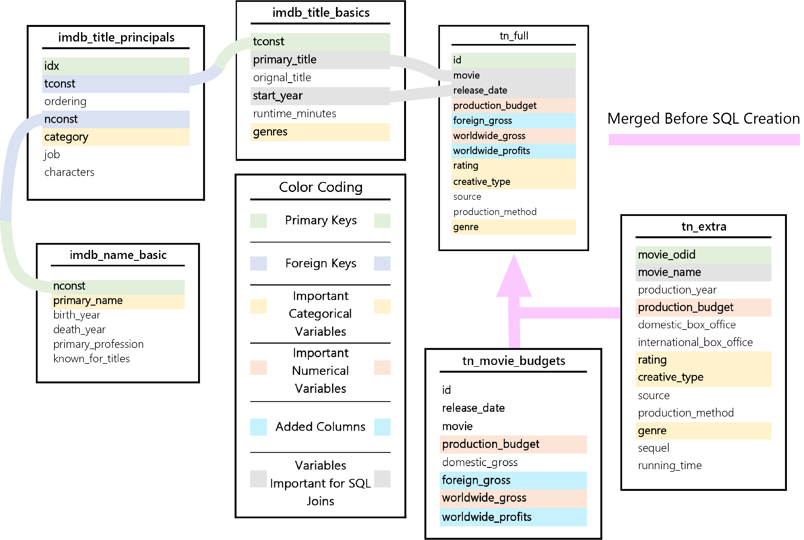

<table style="margin-left:auto;margin-right:auto;">
    <tr>
        <td style="text-align:center">
            <h1><a href="https://github.com/sarnadpy32/microsoft_productions/blob/master/Phase%201%20-%20Project.ipynb">Project</a>
            &ensp;&bull;&ensp;
            <a href="https://github.com/sarnadpy32/microsoft_productions/blob/master/notebook.pdf">Project - PDF Version</a></h1>
        </td>
    </tr>
    <tr>
        <td style="text-align:center">
            <h1><a href="https://github.com/sarnadpy32/microsoft_productions/blob/master/Presentation.pptm">Presentation</a>
                &ensp;&bull;&ensp;
                <a href="https://github.com/sarnadpy32/microsoft_productions/blob/master/pdf_presentation.pdf">Presentation - PDF Version</a></h1>
        </td>
    </tr>
</table>
<hr style="border:1.2px solid black"> </hr>


<hr style="border:1.2px solid #009E25"> </hr>
&nbsp;&nbsp;&nbsp;&nbsp;For my project, I utilized data from the three sources shown below to gain insight into the film industry in order to provide useful recommendations for Microsoft as they prepare to enter the streaming media market.


<hr style="border:1.2px solid #009E25"> </hr>

* **[A Gladiator Wishes to Enter the Arena](#gladiator)**
* **[Exploring and Preparing the Data](#expl_and_prep)**
* **[Functions Created for Visualizations](#visual_funcs)**
* **[Standards for Qualifying as Important](#import_stand)**
* **[Analysis Preparation](#anal_prep)**
* **[IMDb Category Types](#imdb_cat_types)**
* **[OpusData Category Types](#od_cat_types)**
* **[Final Analysis and Recommendations](#final_analysis)**
    * **[Recommendations to Maximize Subscribers](#max_sub_reco)**
    * **[Recommendations to Maximize Profits](#max_prof_reco)**
    * **[Interactive Visualization Feature](#int_viz)**
* **[Markdown Crew Exploration](#markdown_crew)**

<a id='gladiator'></a>

<hr style="border:1.2px solid #009E25"> </hr>


&nbsp;&nbsp;&nbsp;&nbsp;Microsoft is developing their own streaming service that will feature content which they intend to produce in-house.
&ensp;As they are entering into an already crowded and competitive market, it would be advantageous for them to analyze the viewing preferences of moviegoers, and then produce movies and/or television shows based on the insights gained from such an analysis.

&nbsp;&nbsp;&nbsp;&nbsp;I have performed such an analysis based on data from the sources shown above.
&ensp;The data was provided to me by <a href="https://flatironschool.com/">Flatiron School</a> and <a href="https://www.opusdata.com/">OpusData</a>.

&nbsp;&nbsp;&nbsp;&nbsp;I explored the financial performance of movies based on the category types listed below, the sources of which I have included as links and will discuss further in the next section.
* <a href="https://www.imdb.com/">IMDb</a> - Unique Genre Combinations
* <a href="https://www.imdb.com/">IMDb</a> - Individual Genres
* <a href="https://www.opusdata.com/">OpusData</a> - Creative Types
* <a href="https://www.opusdata.com/">OpusData</a> - Genres

&nbsp;&nbsp;&nbsp;&nbsp;For each of the category types listed above, I identified and explored the highest performing categories based on the following metrics, the sources of which I have included as links and will discuss further in the next section:
* <a href="https://www.the-numbers.com/">The Numbers</a> - Total Worldwide Gross Revenue
* <a href="https://www.the-numbers.com/">The Numbers</a> - Total Worldwide Profits
* <a href="https://www.the-numbers.com/">The Numbers</a> - Average Worldwide Gross Revenue
* <a href="https://www.the-numbers.com/">The Numbers</a> - Average Worldwide Profits

&nbsp;&nbsp;&nbsp;&nbsp;I then determined which of the <a href="https://www.motionpictures.org/">Motion Picture Association</a>'s ratings performed the best based on the above metrics for each of the highest performing categories.
&ensp;I also determined the highest performing directors and writers of, as well as the highest performing actors and actresses who performed in, films from those high performing categories.

&nbsp;&nbsp;&nbsp;&nbsp;My analysis will be able to provide the Microsoft team assigned to lead their entry into the streaming market with strategic insights into the viewing tendencies of moviegoers.
&ensp;These insights will guide them as to the type of content they may wish to produce to generate the highest possible levels of financial returns.

<a id='expl_and_prep'></a>

<hr style="border:1.2px solid #009E25"> </hr>
&nbsp;&nbsp;&nbsp;&nbsp;For this project I was provided data from <a href="https://www.imdb.com/">IMDb</a>, <a href="https://www.themoviedb.org/">The Movie DataBase (TMDB)</a>, <a href="https://www.the-numbers.com/">The Numbers</a>, <a href="https://www.boxofficemojo.com/">Box Office Mojo</a>, and <a href="https://www.rottentomatoes.com/">Rotten Tomatoes</a>.
&ensp;I also applied for and received an academic dataset from <a href="https://www.opusdata.com/">OpusData</a>, which is owned and operated by the same company as The Numbers, to which it provides data services.
&ensp;I incorporated data from IMDb, OpusData, and The Numbers.
&ensp;I chose not to use any of the data from TMDB, Box Office Mojo, or Rotten Tomatoes.

&nbsp;&nbsp;&nbsp;&nbsp;The Numbers and Box Office Mojo datasets both contained financial information, but after exploring each of them I determined that The Numbers data was more useful as it contained a column named `production_budget`, which could be used to determine profits, while the Box Office Mojo data did not have such information, diminishing its value and essentially making its use redundant.

&nbsp;&nbsp;&nbsp;&nbsp;While the data from TMDB could have been useful in analyzing the popularity of, or interest in, the categories within the previously mentioned category types, but as that was not the purpose of this project, I decided not to use it.

&nbsp;&nbsp;&nbsp;&nbsp;I was originally planning to use the Rotten Tomatoes data as it did contain useful data.
&ensp;First, it contained a `rating` column with the <a href="https://www.motionpictures.org/">Motion Picture Association</a>'s ratings which could have been a valuable categorical variable.
&ensp;It also contained data on critics’ reviews, specifically if the review was `'fresh'` or `'rotten'` (good or bad, respectively), which could then be used to calculate their `Tomatometer` ranking system, which is based on the percentage of fresh reviews.

&nbsp;&nbsp;&nbsp;&nbsp;However, the number of movies contained within the data from Rotten Tomatoes was much smaller in size by comparison, and an even smaller number of those movies could be directly compared with the insights gained through my financial analysis.
&ensp;This was because there was no column containing the title information for the movies, and any comparison to the financial analysis dataframes I created would have to be performed based purely on the even more limited `theater_date` column.
&ensp;The resulting dataset from such a comparison was about half the length or less when compared with the length of the financial analysis dataset, thereby severely limiting the value of the data, and perhaps even resulting in a misleading analysis.
&ensp;All the reasons stated above led to me to exlude the Rotten Tomatoes data from my final analysis.

&nbsp;&nbsp;&nbsp;&nbsp;Those reasons are also why I decided to use the data I recieved from OpusData.
&ensp;Not only did it have a `rating` column, but it had even more movies than the entire Rotten Tomatoes dataset, all of which were comparable as it contained a `title` column as well as similar columns to those in The Numbers data.
&ensp;It also had the added benefit of providing another category type, Creative Type, upon which to analyze performance.


&nbsp;&nbsp;&nbsp;&nbsp;After importing and investigating the datasets provided to me, I chose to use the data from the tables shown in the image below for my analysis.
&ensp;The image also shows how I used the tables to create an SQL database so that different columns from the various tables could be joined together to build the dataframes that I would need to properly analyze the data and create the appropriate visualizations.
&ensp;Important columns for either joining or analyzing are identified.
&ensp;Also included are any new columns that I created, based on data already in the corresponding table, to enhance my analysis.  

&nbsp;&nbsp;&nbsp;&nbsp;There were three other tables containing data from IMDb that I chose not to include in my database.
&ensp;The first table contained movies with the director(s) and/or writer(s) for each movie.
&ensp;As that information was already present in the `imdb_title_principals` table, it was unnecessary to include.
&ensp;The second table contained data regarding the various translations of titles for specific regions of the world, which did not contribute to my analysis.
&ensp;The third table contained online ratings data similar to the data in the TMDB dataset that I chose not to include, which could similarly prove useful for future analysis, but was not useful in a financial analysis.

&nbsp;&nbsp;&nbsp;&nbsp;I merged the `tn_movie_budgets` and `tn_extra` tables into the `tn_full` table prior to creating the SQL database.




&nbsp;&nbsp;&nbsp;&nbsp;In order to perform my analysis, changes needed to be made to some of the columns within a few of the dataframes created from the tables shown above.
&ensp;I first had to remove punctuation from any column with financial data that was in string form, and then change the data type of that column to a numerical data type.
&ensp;I then could add other financial columns based on those columns that could be of significance to my or future analysis.
&ensp;I also changed any columns containing any date or year data to the same format so that they could be easily compared.
&ensp;Finally, I rearranged the column order of one of the dataframes to make it ready for database construction.


&nbsp;&nbsp;&nbsp;&nbsp;By limiting the year range to the past decade, my analysis would be based on the most relevant date in terms of the current viewing habits of moviegoers.
&ensp;I also did not want any data from the past two years due to the disruptions to the industry caused by COVID-19.


&nbsp;&nbsp;&nbsp;&nbsp;I found it easier to merge the data from The Numbers and OpusData together, and deal with any errors that might occur, prior to creating the SQL database, rather than after.
&ensp;It also made sense to combine them first since they are essentially the same data source.


&nbsp;&nbsp;&nbsp;&nbsp;Once the dataframes were prepared, I created a SQL database file and populated it with the dataframes.
&ensp;I then checked to make sure everything functioned correctly.

<a id='visual_funcs'></a>

<hr style="border:1.2px solid #009E25"> </hr>
&nbsp;&nbsp;&nbsp;&nbsp;In this section, I created and stored all of the functions I wrote that were necessary to create my visualizations.
&ensp;I would come back later and modify them as needed.


&nbsp;&nbsp;&nbsp;&nbsp;I first made some important changes to the default `rcParams` settings in `matplotlib`.
&ensp;I did this so that I could use, what in my opinion were, more aesthetically appealing fonts.
&ensp;I also created lists of the spine sides to easily change their appearance later.


&nbsp;&nbsp;&nbsp;&nbsp;This function allowed me to take one of the hundreds of colors to choose from by name, and turn it into a pastel of itself, so that when that color would be covering large patches, they would not be overwhelming to the viewer.
&ensp;I could also still use the original colors for any lines or markers, as I would want them to stand out as much as possible.


&nbsp;&nbsp;&nbsp;&nbsp;I created a dictionary with a unique color for each of the the MPA ratings to use for any visualizations that analyzed the subcatgory's performance within each of main categories.


&nbsp;&nbsp;&nbsp;&nbsp;These functions are used to control details about the grid, ticks, tick labels, and spines for the main plotting axes, or a twinned axes, depending on what kind of plot I needed to create.


&nbsp;&nbsp;&nbsp;&nbsp;These functions were used to either format ticks or create tick label lists that would be aesthetically appealing and in the right format, as well as functional so that large numbers would not overlap.


&nbsp;&nbsp;&nbsp;&nbsp;These functions were created to find the first possible quantile corresponding to a positive value, based on a set incremental step value, so that matching values (in quantile terms) could be used to find appropriate minimum and maximum tick values for an axes with a twinned axes that needed their scaling to match.
&ensp;If there was no twinned axes, then they were still used as needed to find appropriate minimum and maximum tick values for the axes being plotted.
&ensp;Sometimes no minimum values were necessary, but it was easier to just include that feature in the quantile finder.


&nbsp;&nbsp;&nbsp;&nbsp;This is the only function for creating visualizations that I used for this project, as I used it for every plot that I created.
&ensp;As such, there is a lot of information here.
&ensp;It may seem dense and overwhelming at first, but I think that with the aid of the code comments, it should be understandable.
&ensp;I admit, however, that one might have to view the whole function before realizing just how everything fits together.

&nbsp;&nbsp;&nbsp;&nbsp;I wanted all plotting to run through one function to keep a similar format and style without having to rewrite a slightly different function over and over again.
&ensp;I designed the function so that simple strings could be passed through to be used to determine the necessary plot elements for any type of visualization.

<a id='import_stand'></a>

<hr style="border:1.2px solid #009E25"> </hr>
&nbsp;&nbsp;&nbsp;&nbsp;As I explored the results for each category type, I developed a set of standards for what I would consider to be an important category.
&ensp;Those standards are described below.


<h2 align="center"><strong>Standards for Qualifying as an Important Unique Genre Combination</strong></h2>

* For a unique genre combination to be considered as an ***Important Unique Genre Combination*** for a metric, there had to have been **at least three movies made** with that specific genre combination within the period covered.


* If a genre combination’s value was in the **Top 10** of all of the genre combinations for a metric, it was considered a financially important genre combination for that metric.

<h2 align="center"><strong>Standards for Qualifying as an Important Individual Genre</strong></h2>
    
* For an individual genre to be even be considered as an ***Important Individual Genre***, there had to have been **at least nine movies made** that included that individual genre in their `'genres'` description within the period covered.


* If an individual genre’s value was in the **Top 25%** of all of the individual genres for a metric, it was considered a financially important individual genre for that metric.


<h2 align="center"><strong>Standards for Qualifying as an Important Genre</strong></h2>
    
* For an genre to be even be considered as an ***Important Genre***, there had to have been **at least nine movies made** with that genre within the period covered.


* If a genre’s value was in the **Top 25%** of all of the genres for a metric, it was considered a financially important genre for that metric.

<h2 align="center"><strong>Standards for Qualifying as an Important Creative Type</strong></h2>
    
* For an individual genre to be even be considered as an ***Important Creative Type***, there had to have been **at least nine movies made** with that creative type within the period covered.


* If a creative type’s value was in the **Top <strong><sup>1</sup>/<sub>3</sub><sup>rd</sup></strong>** of all of the creative types for a metric, it was considered a financially important creative type for that metric.

<a id='anal_prep'></a>

<hr style="border:1.2px solid #009E25"> </hr>
&nbsp;&nbsp;&nbsp;&nbsp;I first created a list of strings that I could iterate through to simply create dataframes and visualizations based on each of the financial metrics I previously mentioned.

&nbsp;&nbsp;&nbsp;&nbsp;I then used SQL queries to create a base financial dataframe to use in my analysis, as well as financial dataframes for directors, writers, actors, and actresses.
&ensp;I could then use `pandas` to manipulate, analyze and prepare the dataframes I would create based on each category type and financial metric.


&nbsp;&nbsp;&nbsp;&nbsp;The SQL query I used to create the main financial dataframe is shown below.
```python
"""
SELECT 
    tconst, start_year, primary_title, genre, genres, rating, creative_type, 
    worldwide_gross, worldwide_profits
FROM tn_full
JOIN imdb_title_basics
    ON (primary_title = movie AND (release_date LIKE '%' || start_year || '%'))
WHERE genres NOT Null;"""
```


&nbsp;&nbsp;&nbsp;&nbsp;I inserted the different job titles as I iterate through them into the SQL Query shown below to create the financial dataframe for each of the previously mentioned crew types.
```python
"""
SELECT 
    tconst, nconst, primary_name, start_year, primary_title, genre, genres, rating, 
    creative_type, worldwide_gross, worldwide_profits
FROM imdb_title_basics
JOIN tn_full
    ON (primary_title = movie AND (release_date LIKE '%' || start_year || '%'))
JOIN imdb_title_principals
    USING(tconst)
JOIN imdb_name_basic AS nb
    USING(nconst)
WHERE genres NOT Null AND category = '"""+ crew_str +"""'
ORDER BY start_year, primary_title;"""
```

<a id='imdb_cat_types'></a>  

<hr style="border:1.2px solid #009E25"> </hr>


<details><summary><strong>Click Here to see Example Visualizations.</strong></summary>
<p>

<hr style="border:1.2px solid black"> </hr>

<hr style="border:1.2px solid black"> </hr>

<hr style="border:1.2px solid black"> </hr>

    
</p>
</details>
<hr style="border:1.2px solid black"> </hr>


<details><summary><strong>Click Here to see Example Visualizations.</strong></summary>
<p>

<hr style="border:1.2px solid black"> </hr>

    
</p>
</details>
<hr style="border:1.2px solid black"> </hr>


&nbsp;&nbsp;&nbsp;&nbsp;in order to get data on the performance of each individual genre, I would have to use a custom groupby mapper function in `pandas`.
&ensp;To build such a mapper function, I first had to obtain a list of all of the unique individual genres that make up the multitude of unique genre combinations in the `genres` column.

<details><summary><strong>Click Here to see Example Visualizations.</strong></summary>
<p>

<hr style="border:1.2px solid black"> </hr>

<hr style="border:1.2px solid black"> </hr>

<hr style="border:1.2px solid black"> </hr>

    
</p>
</details>
<hr style="border:1.2px solid black"> </hr>


<details><summary><strong>Click Here to see Example Visualizations.</strong></summary>
<p>

<hr style="border:1.2px solid black"> </hr>

    
</p>
</details>
<hr style="border:1.2px solid black"> </hr>

<a id='od_cat_types'></a>  

<hr style="border:1.2px solid #009E25"> </hr>


<details><summary><strong>Click Here to see Example Visualizations.</strong></summary>
<p>

<hr style="border:1.2px solid black"> </hr>

<hr style="border:1.2px solid black"> </hr>

<hr style="border:1.2px solid black"> </hr>

    
</p>
</details>
<hr style="border:1.2px solid black"> </hr>


<details><summary><strong>Click Here to see Example Visualizations.</strong></summary>
<p>

<hr style="border:1.2px solid black"> </hr>

    
</p>
</details>
<hr style="border:1.2px solid black"> </hr>


<details><summary><strong>Click Here to see Example Visualizations.</strong></summary>
<p>

<hr style="border:1.2px solid black"> </hr>

<hr style="border:1.2px solid black"> </hr>

<hr style="border:1.2px solid black"> </hr>

    
</p>
</details>
<hr style="border:1.2px solid black"> </hr>


<details><summary><strong>Click Here to see Example Visualizations.</strong></summary>
<p>

<hr style="border:1.2px solid black"> </hr>

    
</p>
</details>
<hr style="border:1.2px solid black"> </hr>

<a id='final_analysis'></a>

<hr style="border:1.2px solid #009E25"> </hr>

&nbsp;&nbsp;&nbsp;&nbsp;Any of the categories within each category type that were deemed important for any of the metrics could be considered as a recommendation for that metric.
&ensp;However, I also explored the resulting visualizations to develop my own specific recommendations, based on the features of their boxplots, of the important categories and subcategories for each metric.

&nbsp;&nbsp;&nbsp;&nbsp;I also created a function to easily access all the Important Crew visualizations that were created, as they were also part of my recommendations.
&ensp;They could then use the categories I recommended to guide them, or develop their own if they actually run the code, and fully explore those important categories to see the recommended crew members.
&ensp;By doing so, they will be maximizing the benefits of the critical insights I gained through my analysis.

<a id='max_sub_reco'></a>


&nbsp;&nbsp;&nbsp;&nbsp;Movies with the categories and subcategories shown below have resulted in the highest number of ticket sales, or the highest average number of ticket sales.
&ensp;My first recommendation for Microsoft is to produce content with these categories and subcategories, as they will attract the highest number of subscribers to their new streaming service. 


| **IMDb Catgegory Types** | **Recommended Categories** <br> *(In order of Importance)* | **Recommended MPA Ratings for each Category** <br> *(In order of Importance for each Category)* |
| :---: | :---: | :---: |
| Unique Genre Combinations | Action, Adventure, Sci-Fi <br> Action, Adventure, Animation <br> Adventure, Family, Fantasy <br> Adventure, Animation, Comedy <br> Action, Adventure, Fantasy <br> Action, Adventure, Comedy | PG-13 <br> PG <br> PG-13 &ensp;&bull;&ensp; PG <br> PG &ensp;&bull;&ensp; G <br> PG-13 <br> PG-13 &ensp;&bull;&ensp; R |
| Individual Genres | Sci-Fi <br> Adventure <br> Action <br> Comedy <br> Drama | PG-13 <br> PG-13 &ensp;&bull;&ensp; PG <br> PG-13 &ensp;&bull;&ensp; R &ensp;&bull;&ensp; PG <br> PG &ensp;&bull;&ensp; PG-13 &ensp;&bull;&ensp; R <br> PG-13 &ensp;&bull;&ensp; R |

| **OpusData Catgegory Types** | **Recommended Categories** <br> *(In order of Importance)* | **Recommended MPA Ratings for each Category** <br> *(In order of Importance for each Category)* |
| :---: | :---: | :---: |
| Genres | Adventure <br> Action <br> Drama | PG &ensp;&bull;&ensp; PG-13 <br> PG-13 &ensp;&bull;&ensp; R <br> PG-13 &ensp;&bull;&ensp; R |
| Creative Types | Kids Fiction <br> Science Fiction <br> Contemporary Fiction | PG &ensp;&bull;&ensp; G <br> PG-13 &ensp;&bull;&ensp; R <br> PG-13 &ensp;&bull;&ensp; R |


| **IMDb Catgegory Types** | **Recommended Categories** <br> *(In order of Importance)* | **Recommended MPA Ratings for each Category** <br> *(In order of Importance for each Category)* |
| :---: | :---: | :---: |
| Unique Genre Combinations | Action, Adventure, Sci-Fi <br> Adventure, Fantasy <br> Action, Adventure, Animation <br> Animation, Comedy, Family <br> Adventure, Drama, Fantasy <br> Adventure, Family, Fantasy | PG-13 &ensp;&bull;&ensp; R <br> PG-13 <br> PG <br> PG <br> PG-13 &ensp;&bull;&ensp; PG-13 &ensp;&bull;&ensp; R <br> PG-13 &ensp;&bull;&ensp; PG |
| Individual Genres | Sci-Fi <br> Animation <br> Adventure <br> Fantasy <br> Action | PG-13 &ensp;&bull;&ensp; R <br> G &ensp;&bull;&ensp; PG &ensp;&bull;&ensp; R <br> PG-13 &ensp;&bull;&ensp; G &ensp;&bull;&ensp; PG &ensp;&bull;&ensp; R <br> PG-13 &ensp;&bull;&ensp; PG &ensp;&bull;&ensp; R <br> PG-13 &ensp;&bull;&ensp; PG &ensp;&bull;&ensp; R |

| **OpusData Catgegory Types** | **Recommended Categories** <br> *(In order of Importance)* | **Recommended MPA Ratings for each Category** <br> *(In order of Importance for each Category)* |
| :---: | :---: | :---: |
| Genres | Musical <br> Adventure <br> Action | PG &ensp;&bull;&ensp; PG-13 <br> PG-13 &ensp;&bull;&ensp; G &ensp;&bull;&ensp; PG &ensp;&bull;&ensp; R <br> PG-13 &ensp;&bull;&ensp; PG &ensp;&bull;&ensp; R |
| Creative Types | Super Hero <br> Kids Fiction <br> Science Fiction | PG-13 &ensp;&bull;&ensp; R &ensp;&bull;&ensp; PG <br> G &ensp;&bull;&ensp; PG &ensp;&bull;&ensp; PG-13 <br> PG-13 &ensp;&bull;&ensp; R &ensp;&bull;&ensp; PG |

<a id='max_prof_reco'></a>


&nbsp;&nbsp;&nbsp;&nbsp;Movies with the categories and subcategories shown below have resulted in the highest profits, or the highest average profits.
&ensp;My second recommendation for Microsoft is to produce content with these categories and subcategories, as they can maximize profits and limit their exposure to risk.


| **IMDb Catgegory Types** | **Recommended Categories** <br> *(In order of Importance)* | **Recommended MPA Ratings for each Category** <br> *(In order of Importance for each Category)* |
| :---: | :---: | :---: |
| Unique Genre Combinations | Action, Adventure, Animation <br> Adventure, Animation, Comedy <br> Action, Adventure, Comedy <br> Adventure, Family, Fantasy <br> Action, Adventure, Fantasy <br> Action, Adventure, Sci-Fi | PG <br> PG &ensp;&bull;&ensp; G <br> PG-13 &ensp;&bull;&ensp; R <br> PG-13 &ensp;&bull;&ensp; PG <br> PG-13 <br> PG-13 |
| Individual Genres | Sci-Fi <br> Adventure <br> Action <br> Comedy <br> Drama | PG-13 <br> PG-13 &ensp;&bull;&ensp; PG <br> PG-13 &ensp;&bull;&ensp; R &ensp;&bull;&ensp; PG <br> PG &ensp;&bull;&ensp; PG-13 &ensp;&bull;&ensp; R <br> PG-13 &ensp;&bull;&ensp; R |

| **OpusData Catgegory Types** | **Recommended Categories** <br> *(In order of Importance)* | **Recommended MPA Ratings for each Category** <br> *(In order of Importance for each Category)* |
| :---: | :---: | :---: |
| Genres | Action <br> Adventure <br> Drama | PG-13 &ensp;&bull;&ensp; R <br> PG &ensp;&bull;&ensp; PG-13 <br> PG-13 &ensp;&bull;&ensp; R |
| Creative Types | Super Hero <br> Kids Fiction <br> Contemporary Fiction | PG-13 <br> PG &ensp;&bull;&ensp; G <br> PG-13 &ensp;&bull;&ensp; R |


| **IMDb Catgegory Types** | **Recommended Categories** <br> *(In order of Importance)* | **Recommended MPA Ratings for each Category** <br> *(In order of Importance for each Category)* |
| :---: | :---: | :---: |
| Unique Genre Combinations | Adventure, Drama, Fantasy <br> Adventure, Fantasy <br> Animation, Comedy, Family <br> Drama, Sci-Fi, Thriller <br> Action, Adventure, Animation <br> Adventure, Family, Fantasy <br> Adventure, Animation, Comedy <br> Action, Adventure, Sci-Fi | PG-13 &ensp;&bull;&ensp; PG &ensp;&bull;&ensp; R <br> PG-13 <br> PG <br> PG-13 <br> PG <br> PG-13 &ensp;&bull;&ensp; PG <br> PG &ensp;&bull;&ensp; G &ensp;&bull;&ensp; R <br> PG-13 |
| Individual Genres | Animation <br> Sci-Fi <br> Adventure <br> Fantasy <br> Action | G &ensp;&bull;&ensp; PG &ensp;&bull;&ensp; R <br> PG-13 &ensp;&bull;&ensp; R <br> PG-13 &ensp;&bull;&ensp; G &ensp;&bull;&ensp; PG &ensp;&bull;&ensp; R <br> PG-13 &ensp;&bull;&ensp; PG &ensp;&bull;&ensp; R <br> PG-13 &ensp;&bull;&ensp; PG &ensp;&bull;&ensp; R |

| **OpusData Catgegory Types** | **Recommended Categories** <br> *(In order of Importance)* | **Recommended MPA Ratings for each Category** <br> *(In order of Importance for each Category)* |
| :---: | :---: | :---: |
| Genres | Adventure <br> Action <br> Musical | PG-13 &ensp;&bull;&ensp; G &ensp;&bull;&ensp; PG &ensp;&bull;&ensp; R <br> PG-13 &ensp;&bull;&ensp; PG &ensp;&bull;&ensp; R <br> PG &ensp;&bull;&ensp; PG-13 |
| Creative Types | Super Hero <br> Kids Fiction <br> Science Fiction | R &ensp;&bull;&ensp; PG-13 &ensp;&bull;&ensp; PG <br> G &ensp;&bull;&ensp; PG <br> PG-13 &ensp;&bull;&ensp; R |

<a id='int_viz'></a>


&nbsp;&nbsp;&nbsp;&nbsp;My final recommendation for Microsoft is to use this feature to find the most important crew members who have directed, written, or acted in the recommended categories shown above.

&nbsp;&nbsp;&nbsp;&nbsp;I created this feature, which I have duplicated in VBA in my presentation, to allow anyone running this to easily find those important crew members.

&nbsp;&nbsp;&nbsp;&nbsp;**If you are unable to run the code to use this feature, I recreated the crew-finding capabilities of the feature, for the categories that I recommended at least, in Markdown to make it easier.
&ensp;[Click here to go to that section.](#markdown_crew)**

&nbsp;&nbsp;&nbsp;&nbsp;By using this feature, one could, for example, easily access the visualization of the best directors of Sci-Fi movies ranked by Average Worldwide Profits with just a few selections in the interactive dropdown menus that appear when the cell below is run.

&nbsp;&nbsp;&nbsp;&nbsp;In order to reset the search menus and explore another important genre or genre combination, all one would have to do is just re-run the cell.

&nbsp;&nbsp;&nbsp;&nbsp;By using this feature, Microsoft can take full advantage of the insights gained through my analysis and they will be provided with everything they need to make a forceful entry into the streaming market.

<a id='markdown_crew'></a>

<hr style="border:1.2px solid #009E25"> </hr>

# Important Unique Genre Combinations

<details><summary><strong>Click Here to explore the Important Crew of the Important Unique Genre Combinations based on Total Worldwide Gross.</strong></summary>
<p>

<!--- Directors --->
    
<details><summary><strong>Click Here to explore the Important Directors of the Important Unique Genre Combinations based on Total Worldwide Gross.</strong></summary>
<p>

<details><summary><strong>Action,Adventure,Sci-Fi</strong></summary>
<p>

</p>
</details>
<br>
<details><summary><strong>Action,Adventure,Animation</strong></summary>
<p>

</p>
</details>
<br>
<details><summary><strong>Action,Adventure,Comedy</strong></summary>
<p>

</p>
</details>
<br>
<details><summary><strong>Adventure,Family,Fantasy</strong></summary>
<p>

</p>
</details>
<br>
<details><summary><strong>Adventure,Animation,Comedy</strong></summary>
<p>

</p>
</details>
<br>
<details><summary><strong>Action,Adventure,Fantasy</strong></summary>
<p>

</p>
</details>
    
</p>
</details>

<br>
<!--- Writers --->
    
<details><summary><strong>Click Here to explore the Important Writers of the Important Unique Genre Combinations based on Total Worldwide Gross.</strong></summary>
<p>

<details><summary><strong>Action,Adventure,Sci-Fi</strong></summary>
<p>

</p>
</details>
<br>
<details><summary><strong>Action,Adventure,Animation</strong></summary>
<p>

</p>
</details>
<br>
<details><summary><strong>Action,Adventure,Comedy</strong></summary>
<p>

</p>
</details>
<br>
<details><summary><strong>Adventure,Family,Fantasy</strong></summary>
<p>

</p>
</details>
<br>
<details><summary><strong>Adventure,Animation,Comedy</strong></summary>
<p>

</p>
</details>
<br>
<details><summary><strong>Action,Adventure,Fantasy</strong></summary>
<p>

</p>
</details>
    
</p>
</details>
    
<br>
<!--- Actors --->
    
<details><summary><strong>Click Here to explore the Important Actors of the Important Unique Genre Combinations based on Total Worldwide Gross.</strong></summary>
<p>
    
<details><summary><strong>Action,Adventure,Sci-Fi</strong></summary>
<p>

</p>
</details>
<br>
<details><summary><strong>Action,Adventure,Animation</strong></summary>
<p>

</p>
</details>
<br>
<details><summary><strong>Action,Adventure,Comedy</strong></summary>
<p>

</p>
</details>
<br>
<details><summary><strong>Adventure,Family,Fantasy</strong></summary>
<p>

</p>
</details>
<br>
<details><summary><strong>Adventure,Animation,Comedy</strong></summary>
<p>

</p>
</details>
<br>
<details><summary><strong>Action,Adventure,Fantasy</strong></summary>
<p>

</p>
</details>
    
</p>
</details>
    
<br>
<!--- Actresses --->
    
<details><summary><strong>Click Here to explore the Important Actresses of the Important Unique Genre Combinations based on Total Worldwide Gross.</strong></summary>
<p>

<details><summary><strong>Action,Adventure,Sci-Fi</strong></summary>
<p>

</p>
</details>
<br>
<details><summary><strong>Action,Adventure,Animation</strong></summary>
<p>

</p>
</details>
<br>
<details><summary><strong>Action,Adventure,Comedy</strong></summary>
<p>

</p>
</details>
<br>
<details><summary><strong>Adventure,Family,Fantasy</strong></summary>
<p>

</p>
</details>
<br>
<details><summary><strong>Adventure,Animation,Comedy</strong></summary>
<p>

</p>
</details>
<br>
<details><summary><strong>Action,Adventure,Fantasy</strong></summary>
<p>

</p>
</details>
    
</p>
</details>

</p>
</details>
<hr style="border:1.2px solid black"> </hr>

<details><summary><strong>Click Here to explore the Important Crew of the Important Unique Genre Combinations based on Total Worldwide Profits.</strong></summary>
<p>

<!--- Directors --->
    
<details><summary><strong>Click Here to explore the Important Directors of the Important Unique Genre Combinations based on Total Worldwide Profits.</strong></summary>
<p>

<details><summary><strong>Adventure,Fantasy</strong></summary>
<p>

</p>
</details>
<br>
<details><summary><strong>Action,Adventure,Sci-Fi</strong></summary>
<p>

</p>
</details>
<br>
<details><summary><strong>Adventure,Drama,Fantasy</strong></summary>
<p>

</p>
</details>
<br>
<details><summary><strong>Adventure,Comedy,Family</strong></summary>
<p>

</p>
</details>
<br>
<details><summary><strong>Adventure,Family,Fantasy</strong></summary>
<p>

</p>
</details>
<br>
<details><summary><strong>Adventure,Animation,Comedy</strong></summary>
<p>

</p>
</details>
<br>
<details><summary><strong>Action,Adventure,Fantasy</strong></summary>
<p>

</p>
</details>
    
</p>
</details>

<br>
<!--- Writers --->
    
<details><summary><strong>Click Here to explore the Important Writers of the Important Unique Genre Combinations based on Total Worldwide Profits.</strong></summary>
<p>

<details><summary><strong>Adventure,Fantasy</strong></summary>
<p>

</p>
</details>
<br>
<details><summary><strong>Action,Adventure,Sci-Fi</strong></summary>
<p>

</p>
</details>
<br>
<details><summary><strong>Adventure,Drama,Fantasy</strong></summary>
<p>

</p>
</details>
<br>
<details><summary><strong>Adventure,Comedy,Family</strong></summary>
<p>

</p>
</details>
<br>
<details><summary><strong>Adventure,Family,Fantasy</strong></summary>
<p>

</p>
</details>
<br>
<details><summary><strong>Adventure,Animation,Comedy</strong></summary>
<p>

</p>
</details>
<br>
<details><summary><strong>Action,Adventure,Fantasy</strong></summary>
<p>

</p>
</details>
    
</p>
</details>
    
<br>
<!--- Actors --->
    
<details><summary><strong>Click Here to explore the Important Actors of the Important Unique Genre Combinations based on Total Worldwide Profits.</strong></summary>
<p>

<details><summary><strong>Adventure,Fantasy</strong></summary>
<p>

</p>
</details>
<br>
<details><summary><strong>Action,Adventure,Sci-Fi</strong></summary>
<p>

</p>
</details>
<br>
<details><summary><strong>Adventure,Drama,Fantasy</strong></summary>
<p>

</p>
</details>
<br>
<details><summary><strong>Adventure,Comedy,Family</strong></summary>
<p>

</p>
</details>
<br>
<details><summary><strong>Adventure,Family,Fantasy</strong></summary>
<p>

</p>
</details>
<br>
<details><summary><strong>Adventure,Animation,Comedy</strong></summary>
<p>

</p>
</details>
<br>
<details><summary><strong>Action,Adventure,Fantasy</strong></summary>
<p>

</p>
</details>
    
</p>
</details>
    
<br>
<!--- Actresses --->
    
<details><summary><strong>Click Here to explore the Important Actresses of the Important Unique Genre Combinations based on Total Worldwide Profits.</strong></summary>
<p>

<details><summary><strong>Adventure,Fantasy</strong></summary>
<p>

</p>
</details>
<br>
<details><summary><strong>Action,Adventure,Sci-Fi</strong></summary>
<p>

</p>
</details>
<br>
<details><summary><strong>Adventure,Drama,Fantasy</strong></summary>
<p>

</p>
</details>
<br>
<details><summary><strong>Adventure,Comedy,Family</strong></summary>
<p>

</p>
</details>
<br>
<details><summary><strong>Adventure,Family,Fantasy</strong></summary>
<p>

</p>
</details>
<br>
<details><summary><strong>Adventure,Animation,Comedy</strong></summary>
<p>

</p>
</details>
<br>
<details><summary><strong>Action,Adventure,Fantasy</strong></summary>
<p>

</p>
</details>
    
</p>
</details>

</p>
</details>
<hr style="border:1.2px solid black"> </hr>

<details><summary><strong>Click Here to explore the Important Crew of the Important Unique Genre Combinations based on Average Worldwide Gross.</strong></summary>
<p>

<!--- Directors --->
    
<details><summary><strong>Click Here to explore the Important Directors of the Important Unique Genre Combinations based on Average Worldwide Gross.</strong></summary>
<p>

<details><summary><strong>Adventure,Fantasy</strong></summary>
<p>

</p>
</details>
<br>
<details><summary><strong>Action,Adventure,Animation</strong></summary>
<p>

</p>
</details>
<br>
<details><summary><strong>Action,Adventure,Comedy</strong></summary>
<p>

</p>
</details>
<br>
<details><summary><strong>Adventure,Family,Fantasy</strong></summary>
<p>

</p>
</details>
<br>
<details><summary><strong>Adventure,Animation,Comedy</strong></summary>
<p>

</p>
</details>
<br>
<details><summary><strong>Action,Adventure,Fantasy</strong></summary>
<p>

</p>
</details>
    
</p>
</details>

<br>
<!--- Writers --->
    
<details><summary><strong>Click Here to explore the Important Writers of the Important Unique Genre Combinations based on Average Worldwide Gross.</strong></summary>
<p>

<details><summary><strong>Adventure,Fantasy</strong></summary>
<p>

</p>
</details>
<br>
<details><summary><strong>Action,Adventure,Animation</strong></summary>
<p>

</p>
</details>
<br>
<details><summary><strong>Action,Adventure,Comedy</strong></summary>
<p>

</p>
</details>
<br>
<details><summary><strong>Adventure,Family,Fantasy</strong></summary>
<p>

</p>
</details>
<br>
<details><summary><strong>Adventure,Animation,Comedy</strong></summary>
<p>

</p>
</details>
<br>
<details><summary><strong>Action,Adventure,Fantasy</strong></summary>
<p>

</p>
</details>
    
</p>
</details>
    
<br>
<!--- Actors --->
    
<details><summary><strong>Click Here to explore the Important Actors of the Important Unique Genre Combinations based on Average Worldwide Gross.</strong></summary>
<p>
    
<details><summary><strong>Adventure,Fantasy</strong></summary>
<p>

</p>
</details>
<br>
<details><summary><strong>Action,Adventure,Animation</strong></summary>
<p>

</p>
</details>
<br>
<details><summary><strong>Action,Adventure,Comedy</strong></summary>
<p>

</p>
</details>
<br>
<details><summary><strong>Adventure,Family,Fantasy</strong></summary>
<p>

</p>
</details>
<br>
<details><summary><strong>Adventure,Animation,Comedy</strong></summary>
<p>

</p>
</details>
<br>
<details><summary><strong>Action,Adventure,Fantasy</strong></summary>
<p>

</p>
</details>
    
</p>
</details>
    
<br>
<!--- Actresses --->
    
<details><summary><strong>Click Here to explore the Important Actresses of the Important Unique Genre Combinations based on Average Worldwide Gross.</strong></summary>
<p>

<details><summary><strong>Adventure,Fantasy</strong></summary>
<p>

</p>
</details>
<br>
<details><summary><strong>Action,Adventure,Animation</strong></summary>
<p>

</p>
</details>
<br>
<details><summary><strong>Action,Adventure,Comedy</strong></summary>
<p>

</p>
</details>
<br>
<details><summary><strong>Adventure,Family,Fantasy</strong></summary>
<p>

</p>
</details>
<br>
<details><summary><strong>Adventure,Animation,Comedy</strong></summary>
<p>

</p>
</details>
<br>
<details><summary><strong>Action,Adventure,Fantasy</strong></summary>
<p>

</p>
</details>
    
</p>
</details>

</p>
</details>
<hr style="border:1.2px solid black"> </hr>

<details><summary><strong>Click Here to explore the Important Crew of the Important Unique Genre Combinations based on Average Worldwide Profits.</strong></summary>
<p>

<!--- Directors --->
    
<details><summary><strong>Click Here to explore the Important Directors of the Important Unique Genre Combinations based on Average Worldwide Profits.</strong></summary>
<p>

<details><summary><strong>Action,Adventure,Animation</strong></summary>
<p>

</p>
</details>
<br>
<details><summary><strong>Adventure,Family,Fantasy</strong></summary>
<p>

</p>
</details>
<br>
<details><summary><strong>Adventure,Animation,Comedy</strong></summary>
<p>

</p>
</details>
<br>
<details><summary><strong>Action,Adventure,Thriller</strong></summary>
<p>

</p>
</details>
<br>
<details><summary><strong>Action,Adventure,Fantasy</strong></summary>
<p>

</p>
</details>
<br>
<details><summary><strong>Action,Adventure,Comedy</strong></summary>
<p>

</p>
</details>
<br>
<details><summary><strong>Action,Adventure,Sci-Fi</strong></summary>
<p>

</p>
</details>
    
</p>
</details>

<br>
<!--- Writers --->
    
<details><summary><strong>Click Here to explore the Important Writers of the Important Unique Genre Combinations based on Average Worldwide Profits.</strong></summary>
<p>

<details><summary><strong>Action,Adventure,Animation</strong></summary>
<p>

</p>
</details>
<br>
<details><summary><strong>Adventure,Family,Fantasy</strong></summary>
<p>

</p>
</details>
<br>
<details><summary><strong>Adventure,Animation,Comedy</strong></summary>
<p>

</p>
</details>
<br>
<details><summary><strong>Action,Adventure,Thriller</strong></summary>
<p>

</p>
</details>
<br>
<details><summary><strong>Action,Adventure,Fantasy</strong></summary>
<p>

</p>
</details>
<br>
<details><summary><strong>Action,Adventure,Comedy</strong></summary>
<p>

</p>
</details>
<br>
<details><summary><strong>Action,Adventure,Sci-Fi</strong></summary>
<p>

</p>
</details>
    
</p>
</details>
    
<br>
<!--- Actors --->
    
<details><summary><strong>Click Here to explore the Important Actors of the Important Unique Genre Combinations based on Average Worldwide Profits.</strong></summary>
<p>

<details><summary><strong>Action,Adventure,Animation</strong></summary>
<p>

</p>
</details>
<br>
<details><summary><strong>Adventure,Family,Fantasy</strong></summary>
<p>

</p>
</details>
<br>
<details><summary><strong>Adventure,Animation,Comedy</strong></summary>
<p>

</p>
</details>
<br>
<details><summary><strong>Action,Adventure,Thriller</strong></summary>
<p>

</p>
</details>
<br>
<details><summary><strong>Action,Adventure,Fantasy</strong></summary>
<p>

</p>
</details>
<br>
<details><summary><strong>Action,Adventure,Comedy</strong></summary>
<p>

</p>
</details>
<br>
<details><summary><strong>Action,Adventure,Sci-Fi</strong></summary>
<p>

</p>
</details>
    
</p>
</details>
    
<br>
<!--- Actresses --->
    
<details><summary><strong>Click Here to explore the Important Actresses of the Important Unique Genre Combinations based on Average Worldwide Profits.</strong></summary>
<p>

<details><summary><strong>Action,Adventure,Animation</strong></summary>
<p>

</p>
</details>
<br>
<details><summary><strong>Adventure,Family,Fantasy</strong></summary>
<p>

</p>
</details>
<br>
<details><summary><strong>Adventure,Animation,Comedy</strong></summary>
<p>

</p>
</details>
<br>
<details><summary><strong>Action,Adventure,Thriller</strong></summary>
<p>

</p>
</details>
<br>
<details><summary><strong>Action,Adventure,Fantasy</strong></summary>
<p>

</p>
</details>
<br>
<details><summary><strong>Action,Adventure,Comedy</strong></summary>
<p>

</p>
</details>
<br>
<details><summary><strong>Action,Adventure,Sci-Fi</strong></summary>
<p>

</p>
</details>
    
</p>
</details>

</p>
</details>
<hr style="border:1.2px solid black"> </hr>

# Important Individual Genres

<details><summary><strong>Click Here to explore the Important Crew of the Important Individual Genres based on Total Worldwide Gross.</strong></summary>
<p>

<!--- Directors --->
    
<details><summary><strong>Click Here to explore the Important Directors of the Important Individual Genres based on Total Worldwide Gross.</strong></summary>
<p>

<details><summary><strong>Action</strong></summary>
<p>

</p>
</details>
<br>
<details><summary><strong>Adventure</strong></summary>
<p>

</p>
</details>
<br>
<details><summary><strong>Comedy</strong></summary>
<p>

</p>
</details>
<br>
<details><summary><strong>Drama</strong></summary>
<p>

</p>
</details>
<br>
<details><summary><strong>Sci-Fi</strong></summary>
<p>

</p>
</details>
    
</p>
</details>

<br>
<!--- Writers --->
    
<details><summary><strong>Click Here to explore the Important Writers of the Important Individual Genres based on Total Worldwide Gross.</strong></summary>
<p>

<details><summary><strong>Action</strong></summary>
<p>

</p>
</details>
<br>
<details><summary><strong>Adventure</strong></summary>
<p>

</p>
</details>
<br>
<details><summary><strong>Comedy</strong></summary>
<p>

</p>
</details>
<br>
<details><summary><strong>Drama</strong></summary>
<p>

</p>
</details>
<br>
<details><summary><strong>Sci-Fi</strong></summary>
<p>

</p>
</details>
    
</p>
</details>
    
<br>
<!--- Actors --->
    
<details><summary><strong>Click Here to explore the Important Actors of the Important Individual Genres based on Total Worldwide Gross.</strong></summary>
<p>
    
<details><summary><strong>Action</strong></summary>
<p>

</p>
</details>
<br>
<details><summary><strong>Adventure</strong></summary>
<p>

</p>
</details>
<br>
<details><summary><strong>Comedy</strong></summary>
<p>

</p>
</details>
<br>
<details><summary><strong>Drama</strong></summary>
<p>

</p>
</details>
<br>
<details><summary><strong>Sci-Fi</strong></summary>
<p>

</p>
</details>
    
</p>
</details>
    
<br>
<!--- Actresses --->
    
<details><summary><strong>Click Here to explore the Important Actresses of the Important Individual Genres based on Total Worldwide Gross.</strong></summary>
<p>

<details><summary><strong>Action</strong></summary>
<p>

</p>
</details>
<br>
<details><summary><strong>Adventure</strong></summary>
<p>

</p>
</details>
<br>
<details><summary><strong>Comedy</strong></summary>
<p>

</p>
</details>
<br>
<details><summary><strong>Drama</strong></summary>
<p>

</p>
</details>
<br>
<details><summary><strong>Sci-Fi</strong></summary>
<p>

</p>
</details>
    
</p>
</details>

</p>
</details>
<hr style="border:1.2px solid black"> </hr>

<details><summary><strong>Click Here to explore the Important Crew of the Important Individual Genres based on Total Worldwide Profits.</strong></summary>
<p>

<!--- Directors --->
    
<details><summary><strong>Click Here to explore the Important Directors of the Important Individual Genres based on Total Worldwide Profits.</strong></summary>
<p>

<details><summary><strong>Action</strong></summary>
<p>

</p>
</details>
<br>
<details><summary><strong>Adventure</strong></summary>
<p>

</p>
</details>
<br>
<details><summary><strong>Comedy</strong></summary>
<p>

</p>
</details>
<br>
<details><summary><strong>Drama</strong></summary>
<p>

</p>
</details>
<br>
<details><summary><strong>Sci-Fi</strong></summary>
<p>

</p>
</details>
    
</p>
</details>

<br>
<!--- Writers --->
    
<details><summary><strong>Click Here to explore the Important Writers of the Important Individual Genres based on Total Worldwide Profits.</strong></summary>
<p>

<details><summary><strong>Action</strong></summary>
<p>

</p>
</details>
<br>
<details><summary><strong>Adventure</strong></summary>
<p>

</p>
</details>
<br>
<details><summary><strong>Comedy</strong></summary>
<p>

</p>
</details>
<br>
<details><summary><strong>Drama</strong></summary>
<p>

</p>
</details>
<br>
<details><summary><strong>Sci-Fi</strong></summary>
<p>

</p>
</details>
    
</p>
</details>
    
<br>
<!--- Actors --->
    
<details><summary><strong>Click Here to explore the Important Actors of the Important Individual Genres based on Total Worldwide Profits.</strong></summary>
<p>

<details><summary><strong>Action</strong></summary>
<p>

</p>
</details>
<br>
<details><summary><strong>Adventure</strong></summary>
<p>

</p>
</details>
<br>
<details><summary><strong>Comedy</strong></summary>
<p>

</p>
</details>
<br>
<details><summary><strong>Drama</strong></summary>
<p>

</p>
</details>
<br>
<details><summary><strong>Sci-Fi</strong></summary>
<p>

</p>
</details>
    
</p>
</details>
    
<br>
<!--- Actresses --->
    
<details><summary><strong>Click Here to explore the Important Actresses of the Important Individual Genres based on Total Worldwide Profits.</strong></summary>
<p>

<details><summary><strong>Action</strong></summary>
<p>

</p>
</details>
<br>
<details><summary><strong>Adventure</strong></summary>
<p>

</p>
</details>
<br>
<details><summary><strong>Comedy</strong></summary>
<p>

</p>
</details>
<br>
<details><summary><strong>Drama</strong></summary>
<p>

</p>
</details>
<br>
<details><summary><strong>Sci-Fi</strong></summary>
<p>

</p>
</details>
    
</p>
</details>

</p>
</details>
<hr style="border:1.2px solid black"> </hr>

<details><summary><strong>Click Here to explore the Important Crew of the Important Individual Genres based on Average Worldwide Gross.</strong></summary>
<p>

<!--- Directors --->
    
<details><summary><strong>Click Here to explore the Important Directors of the Important Individual Genres based on Average Worldwide Gross.</strong></summary>
<p>

<details><summary><strong>Action</strong></summary>
<p>

</p>
</details>
<br>
<details><summary><strong>Adventure</strong></summary>
<p>

</p>
</details>
<br>
<details><summary><strong>Animation</strong></summary>
<p>

</p>
</details>
<br>
<details><summary><strong>Fantasy</strong></summary>
<p>

</p>
</details>
<br>
<details><summary><strong>Sci-Fi</strong></summary>
<p>

</p>
</details>
    
</p>
</details>

<br>
<!--- Writers --->
    
<details><summary><strong>Click Here to explore the Important Writers of the Important Individual Genres based on Average Worldwide Gross.</strong></summary>
<p>

<details><summary><strong>Action</strong></summary>
<p>

</p>
</details>
<br>
<details><summary><strong>Adventure</strong></summary>
<p>

</p>
</details>
<br>
<details><summary><strong>Animation</strong></summary>
<p>

</p>
</details>
<br>
<details><summary><strong>Fantasy</strong></summary>
<p>

</p>
</details>
<br>
<details><summary><strong>Sci-Fi</strong></summary>
<p>

</p>
</details>
    
</p>
</details>
    
<br>
<!--- Actors --->
    
<details><summary><strong>Click Here to explore the Important Actors of the Important Individual Genres based on Average Worldwide Gross.</strong></summary>
<p>

<details><summary><strong>Action</strong></summary>
<p>

</p>
</details>
<br>
<details><summary><strong>Adventure</strong></summary>
<p>

</p>
</details>
<br>
<details><summary><strong>Animation</strong></summary>
<p>

</p>
</details>
<br>
<details><summary><strong>Fantasy</strong></summary>
<p>

</p>
</details>
<br>
<details><summary><strong>Sci-Fi</strong></summary>
<p>

</p>
</details>
    
</p>
</details>
    
<br>
<!--- Actresses --->
    
<details><summary><strong>Click Here to explore the Important Actresses of the Important Individual Genres based on Average Worldwide Gross.</strong></summary>
<p>

<details><summary><strong>Action</strong></summary>
<p>

</p>
</details>
<br>
<details><summary><strong>Adventure</strong></summary>
<p>

</p>
</details>
<br>
<details><summary><strong>Animation</strong></summary>
<p>

</p>
</details>
<br>
<details><summary><strong>Fantasy</strong></summary>
<p>

</p>
</details>
<br>
<details><summary><strong>Sci-Fi</strong></summary>
<p>

</p>
</details>
    
</p>
</details>

</p>
</details>
<hr style="border:1.2px solid black"> </hr>

<details><summary><strong>Click Here to explore the Important Crew of the Important Individual Genres based on Average Worldwide Profits.</strong></summary>
<p>

<!--- Directors --->
    
<details><summary><strong>Click Here to explore the Important Directors of the Important Individual Genres based on Average Worldwide Profits.</strong></summary>
<p>

<details><summary><strong>Action</strong></summary>
<p>

</p>
</details>
<br>
<details><summary><strong>Adventure</strong></summary>
<p>

</p>
</details>
<br>
<details><summary><strong>Animation</strong></summary>
<p>

</p>
</details>
<br>
<details><summary><strong>Fantasy</strong></summary>
<p>

</p>
</details>
<br>
<details><summary><strong>Sci-Fi</strong></summary>
<p>

</p>
</details>
    
</p>
</details>

<br>
<!--- Writers --->
    
<details><summary><strong>Click Here to explore the Important Writers of the Important Individual Genres based on Average Worldwide Profits.</strong></summary>
<p>

<details><summary><strong>Action</strong></summary>
<p>

</p>
</details>
<br>
<details><summary><strong>Adventure</strong></summary>
<p>

</p>
</details>
<br>
<details><summary><strong>Animation</strong></summary>
<p>

</p>
</details>
<br>
<details><summary><strong>Fantasy</strong></summary>
<p>

</p>
</details>
<br>
<details><summary><strong>Sci-Fi</strong></summary>
<p>

</p>
</details>
    
</p>
</details>
    
<br>
<!--- Actors --->
    
<details><summary><strong>Click Here to explore the Important Actors of the Important Individual Genres based on Average Worldwide Profits.</strong></summary>
<p>

<details><summary><strong>Action</strong></summary>
<p>

</p>
</details>
<br>
<details><summary><strong>Adventure</strong></summary>
<p>

</p>
</details>
<br>
<details><summary><strong>Animation</strong></summary>
<p>

</p>
</details>
<br>
<details><summary><strong>Fantasy</strong></summary>
<p>

</p>
</details>
<br>
<details><summary><strong>Sci-Fi</strong></summary>
<p>

</p>
</details>
    
</p>
</details>
    
<br>
<!--- Actresses --->
    
<details><summary><strong>Click Here to explore the Important Actresses of the Important Individual Genres based on Average Worldwide Profits.</strong></summary>
<p>

<details><summary><strong>Action</strong></summary>
<p>

</p>
</details>
<br>
<details><summary><strong>Adventure</strong></summary>
<p>

</p>
</details>
<br>
<details><summary><strong>Animation</strong></summary>
<p>

</p>
</details>
<br>
<details><summary><strong>Fantasy</strong></summary>
<p>

</p>
</details>
<br>
<details><summary><strong>Sci-Fi</strong></summary>
<p>

</p>
</details>
    
</p>
</details>

</p>
</details>
<hr style="border:1.2px solid black"> </hr>

# Important Genres

<details><summary><strong>Click Here to explore the Important Crew of the Important Genres based on Total Worldwide Gross.</strong></summary>
<p>

<!--- Directors --->
    
<details><summary><strong>Click Here to explore the Important Directors of the Important Genres based on Total Worldwide Gross.</strong></summary>
<p>

<details><summary><strong>Action</strong></summary>
<p>

</p>
</details>
<br>
<details><summary><strong>Adventure</strong></summary>
<p>

</p>
</details>
<br>
<details><summary><strong>Drama</strong></summary>
<p>

</p>
</details>
    
</p>
</details>

<br>
<!--- Writers --->
    
<details><summary><strong>Click Here to explore the Important Writers of the Important Genres based on Total Worldwide Gross.</strong></summary>
<p>

<details><summary><strong>Action</strong></summary>
<p>

</p>
</details>
<br>
<details><summary><strong>Adventure</strong></summary>
<p>

</p>
</details>
<br>
<details><summary><strong>Drama</strong></summary>
<p>

</p>
</details>
    
</p>
</details>
    
<br>
<!--- Actors --->
    
<details><summary><strong>Click Here to explore the Important Actors of the Important Genres based on Total Worldwide Gross.</strong></summary>
<p>

<details><summary><strong>Action</strong></summary>
<p>

</p>
</details>
<br>
<details><summary><strong>Adventure</strong></summary>
<p>

</p>
</details>
<br>
<details><summary><strong>Drama</strong></summary>
<p>

</p>
</details>
    
</p>
</details>
    
<br>
<!--- Actresses --->
    
<details><summary><strong>Click Here to explore the Important Actresses of the Important Genres based on Total Worldwide Gross.</strong></summary>
<p>

<details><summary><strong>Action</strong></summary>
<p>

</p>
</details>
<br>
<details><summary><strong>Adventure</strong></summary>
<p>

</p>
</details>
<br>
<details><summary><strong>Drama</strong></summary>
<p>

</p>
</details>
    
</p>
</details>

</p>
</details>
<hr style="border:1.2px solid black"> </hr>

<details><summary><strong>Click Here to explore the Important Crew of the Important Genres based on Total Worldwide Profits.</strong></summary>
<p>

<!--- Directors --->
    
<details><summary><strong>Click Here to explore the Important Directors of the Important Genres based on Total Worldwide Profits.</strong></summary>
<p>

<details><summary><strong>Action</strong></summary>
<p>

</p>
</details>
<br>
<details><summary><strong>Adventure</strong></summary>
<p>

</p>
</details>
<br>
<details><summary><strong>Drama</strong></summary>
<p>

</p>
</details>
    
</p>
</details>

<br>
<!--- Writers --->
    
<details><summary><strong>Click Here to explore the Important Writers of the Important Genres based on Total Worldwide Profits.</strong></summary>
<p>

<details><summary><strong>Action</strong></summary>
<p>

</p>
</details>
<br>
<details><summary><strong>Adventure</strong></summary>
<p>

</p>
</details>
<br>
<details><summary><strong>Drama</strong></summary>
<p>

</p>
</details>
    
</p>
</details>
    
<br>
<!--- Actors --->
    
<details><summary><strong>Click Here to explore the Important Actors of the Important Genres based on Total Worldwide Profits.</strong></summary>
<p>

<details><summary><strong>Action</strong></summary>
<p>

</p>
</details>
<br>
<details><summary><strong>Adventure</strong></summary>
<p>

</p>
</details>
<br>
<details><summary><strong>Drama</strong></summary>
<p>

</p>
</details>
    
</p>
</details>
    
<br>
<!--- Actresses --->
    
<details><summary><strong>Click Here to explore the Important Actresses of the Important Genres based on Total Worldwide Profits.</strong></summary>
<p>

<details><summary><strong>Action</strong></summary>
<p>

</p>
</details>
<br>
<details><summary><strong>Adventure</strong></summary>
<p>

</p>
</details>
<br>
<details><summary><strong>Drama</strong></summary>
<p>

</p>
</details>
    
</p>
</details>

</p>
</details>
<hr style="border:1.2px solid black"> </hr>

<details><summary><strong>Click Here to explore the Important Crew of the Important Genres based on Average Worldwide Gross.</strong></summary>
<p>

<!--- Directors --->
    
<details><summary><strong>Click Here to explore the Important Directors of the Important Genres based on Average Worldwide Gross.</strong></summary>
<p>

<details><summary><strong>Action</strong></summary>
<p>

</p>
</details>
<br>
<details><summary><strong>Adventure</strong></summary>
<p>

</p>
</details>
<br>
<details><summary><strong>Musical</strong></summary>
<p>

</p>
</details>
    
</p>
</details>

<br>
<!--- Writers --->
    
<details><summary><strong>Click Here to explore the Important Writers of the Important Genres based on Average Worldwide Gross.</strong></summary>
<p>

<details><summary><strong>Action</strong></summary>
<p>

</p>
</details>
<br>
<details><summary><strong>Adventure</strong></summary>
<p>

</p>
</details>
<br>
<details><summary><strong>Musical</strong></summary>
<p>

</p>
</details>
    
</p>
</details>
    
<br>
<!--- Actors --->
    
<details><summary><strong>Click Here to explore the Important Actors of the Important Genres based on Average Worldwide Gross.</strong></summary>
<p>

<details><summary><strong>Action</strong></summary>
<p>

</p>
</details>
<br>
<details><summary><strong>Adventure</strong></summary>
<p>

</p>
</details>
<br>
<details><summary><strong>Musical</strong></summary>
<p>

</p>
</details>
    
</p>
</details>
    
<br>
<!--- Actresses --->
    
<details><summary><strong>Click Here to explore the Important Actresses of the Important Genres based on Average Worldwide Gross.</strong></summary>
<p>

<details><summary><strong>Action</strong></summary>
<p>

</p>
</details>
<br>
<details><summary><strong>Adventure</strong></summary>
<p>

</p>
</details>
<br>
<details><summary><strong>Musical</strong></summary>
<p>

</p>
</details>
    
</p>
</details>

</p>
</details>
<hr style="border:1.2px solid black"> </hr>

<details><summary><strong>Click Here to explore the Important Crew of the Important Genres based on Average Worldwide Profits.</strong></summary>
<p>

<!--- Directors --->
    
<details><summary><strong>Click Here to explore the Important Directors of the Important Genres based on Average Worldwide Profits.</strong></summary>
<p>

<details><summary><strong>Action</strong></summary>
<p>

</p>
</details>
<br>
<details><summary><strong>Adventure</strong></summary>
<p>

</p>
</details>
<br>
<details><summary><strong>Musical</strong></summary>
<p>

</p>
</details>
    
</p>
</details>

<br>
<!--- Writers --->
    
<details><summary><strong>Click Here to explore the Important Writers of the Important Genres based on Average Worldwide Profits.</strong></summary>
<p>

<details><summary><strong>Action</strong></summary>
<p>

</p>
</details>
<br>
<details><summary><strong>Adventure</strong></summary>
<p>

</p>
</details>
<br>
<details><summary><strong>Musical</strong></summary>
<p>

</p>
</details>
    
</p>
</details>
    
<br>
<!--- Actors --->
    
<details><summary><strong>Click Here to explore the Important Actors of the Important Genres based on Average Worldwide Profits.</strong></summary>
<p>

<details><summary><strong>Action</strong></summary>
<p>

</p>
</details>
<br>
<details><summary><strong>Adventure</strong></summary>
<p>

</p>
</details>
<br>
<details><summary><strong>Musical</strong></summary>
<p>

</p>
</details>
    
</p>
</details>
    
<br>
<!--- Actresses --->
    
<details><summary><strong>Click Here to explore the Important Actresses of the Important Genres based on Average Worldwide Profits.</strong></summary>
<p>

<details><summary><strong>Action</strong></summary>
<p>

</p>
</details>
<br>
<details><summary><strong>Adventure</strong></summary>
<p>

</p>
</details>
<br>
<details><summary><strong>Musical</strong></summary>
<p>

</p>
</details>
    
</p>
</details>

</p>
</details>
<hr style="border:1.2px solid black"> </hr>

# Important CreativeTypes

<details><summary><strong>Click Here to explore the Important Crew of the Important Creative Types based on Total Worldwide Gross.</strong></summary>
<p>

<!--- Directors --->
    
<details><summary><strong>Click Here to explore the Important Directors of the Important Creative Types based on Total Worldwide Gross.</strong></summary>
<p>

<details><summary><strong>Contemporary Fiction</strong></summary>
<p>

</p>
</details>
<br>
<details><summary><strong>Kids Fiction</strong></summary>
<p>

</p>
</details>
<br>
<details><summary><strong>Science Fiction</strong></summary>
<p>

</p>
</details>
    
</p>
</details>

<br>
<!--- Writers --->
    
<details><summary><strong>Click Here to explore the Important Writers of the Important Creative Types based on Total Worldwide Gross.</strong></summary>
<p>

<details><summary><strong>Contemporary Fiction</strong></summary>
<p>

</p>
</details>
<br>
<details><summary><strong>Kids Fiction</strong></summary>
<p>

</p>
</details>
<br>
<details><summary><strong>Science Fiction</strong></summary>
<p>

</p>
</details>
    
</p>
</details>
    
<br>
<!--- Actors --->
    
<details><summary><strong>Click Here to explore the Important Actors of the Important Creative Types based on Total Worldwide Gross.</strong></summary>
<p>

<details><summary><strong>Contemporary Fiction</strong></summary>
<p>

</p>
</details>
<br>
<details><summary><strong>Kids Fiction</strong></summary>
<p>

</p>
</details>
<br>
<details><summary><strong>Science Fiction</strong></summary>
<p>

</p>
</details>
    
</p>
</details>
    
<br>
<!--- Actresses --->
    
<details><summary><strong>Click Here to explore the Important Actresses of the Important Creative Types based on Total Worldwide Gross.</strong></summary>
<p>

<details><summary><strong>Contemporary Fiction</strong></summary>
<p>

</p>
</details>
<br>
<details><summary><strong>Kids Fiction</strong></summary>
<p>

</p>
</details>
<br>
<details><summary><strong>Science Fiction</strong></summary>
<p>

</p>
</details>
    
</p>
</details>

</p>
</details>
<hr style="border:1.2px solid black"> </hr>

<details><summary><strong>Click Here to explore the Important Crew of the Important Creative Types based on Total Worldwide Profits.</strong></summary>
<p>

<!--- Directors --->
    
<details><summary><strong>Click Here to explore the Important Directors of the Important Creative Types based on Total Worldwide Profits.</strong></summary>
<p>

<details><summary><strong>Contemporary Fiction</strong></summary>
<p>

</p>
</details>
<br>
<details><summary><strong>Kids Fiction</strong></summary>
<p>

</p>
</details>
<br>
<details><summary><strong>Super Hero</strong></summary>
<p>

</p>
</details>
    
</p>
</details>

<br>
<!--- Writers --->
    
<details><summary><strong>Click Here to explore the Important Writers of the Important Creative Types based on Total Worldwide Profits.</strong></summary>
<p>

<details><summary><strong>Contemporary Fiction</strong></summary>
<p>

</p>
</details>
<br>
<details><summary><strong>Kids Fiction</strong></summary>
<p>

</p>
</details>
<br>
<details><summary><strong>Super Hero</strong></summary>
<p>

</p>
</details>
    
</p>
</details>
    
<br>
<!--- Actors --->
    
<details><summary><strong>Click Here to explore the Important Actors of the Important Creative Types based on Total Worldwide Profits.</strong></summary>
<p>

<details><summary><strong>Contemporary Fiction</strong></summary>
<p>

</p>
</details>
<br>
<details><summary><strong>Kids Fiction</strong></summary>
<p>

</p>
</details>
<br>
<details><summary><strong>Super Hero</strong></summary>
<p>

</p>
</details>
    
</p>
</details>
    
<br>
<!--- Actresses --->
    
<details><summary><strong>Click Here to explore the Important Actresses of the Important Creative Types based on Total Worldwide Profits.</strong></summary>
<p>

<details><summary><strong>Contemporary Fiction</strong></summary>
<p>

</p>
</details>
<br>
<details><summary><strong>Kids Fiction</strong></summary>
<p>

</p>
</details>
<br>
<details><summary><strong>Super Hero</strong></summary>
<p>

</p>
</details>
    
</p>
</details>

</p>
</details>
<hr style="border:1.2px solid black"> </hr>

<details><summary><strong>Click Here to explore the Important Crew of the Important Creative Types based on Average Worldwide Gross.</strong></summary>
<p>

<!--- Directors --->
    
<details><summary><strong>Click Here to explore the Important Directors of the Important Creative Types based on Average Worldwide Gross.</strong></summary>
<p>

<details><summary><strong>Kids Fiction</strong></summary>
<p>

</p>
</details>
<br>
<details><summary><strong>Science Fiction</strong></summary>
<p>

</p>
</details>
<br>
<details><summary><strong>Super Hero</strong></summary>
<p>

</p>
</details>
    
</p>
</details>

<br>
<!--- Writers --->
    
<details><summary><strong>Click Here to explore the Important Writers of the Important Creative Types based on Average Worldwide Gross.</strong></summary>
<p>

<details><summary><strong>Kids Fiction</strong></summary>
<p>

</p>
</details>
<br>
<details><summary><strong>Science Fiction</strong></summary>
<p>

</p>
</details>
<br>
<details><summary><strong>Super Hero</strong></summary>
<p>

</p>
</details>
    
</p>
</details>
    
<br>
<!--- Actors --->
    
<details><summary><strong>Click Here to explore the Important Actors of the Important Creative Types based on Average Worldwide Gross.</strong></summary>
<p>

<details><summary><strong>Kids Fiction</strong></summary>
<p>

</p>
</details>
<br>
<details><summary><strong>Science Fiction</strong></summary>
<p>

</p>
</details>
<br>
<details><summary><strong>Super Hero</strong></summary>
<p>

</p>
</details>
    
</p>
</details>
    
<br>
<!--- Actresses --->
    
<details><summary><strong>Click Here to explore the Important Actresses of the Important Creative Types based on Average Worldwide Gross.</strong></summary>
<p>

<details><summary><strong>Kids Fiction</strong></summary>
<p>

</p>
</details>
<br>
<details><summary><strong>Science Fiction</strong></summary>
<p>

</p>
</details>
<br>
<details><summary><strong>Super Hero</strong></summary>
<p>

</p>
</details>
    
</p>
</details>

</p>
</details>
<hr style="border:1.2px solid black"> </hr>

<details><summary><strong>Click Here to explore the Important Crew of the Important Creative Types based on Average Worldwide Profits.</strong></summary>
<p>

<!--- Directors --->
    
<details><summary><strong>Click Here to explore the Important Directors of the Important Creative Types based on Average Worldwide Profits.</strong></summary>
<p>

<details><summary><strong>Kids Fiction</strong></summary>
<p>

</p>
</details>
<br>
<details><summary><strong>Science Fiction</strong></summary>
<p>

</p>
</details>
<br>
<details><summary><strong>Super Hero</strong></summary>
<p>

</p>
</details>
    
</p>
</details>

<br>
<!--- Writers --->
    
<details><summary><strong>Click Here to explore the Important Writers of the Important Creative Types based on Average Worldwide Profits.</strong></summary>
<p>

<details><summary><strong>Kids Fiction</strong></summary>
<p>

</p>
</details>
<br>
<details><summary><strong>Science Fiction</strong></summary>
<p>

</p>
</details>
<br>
<details><summary><strong>Super Hero</strong></summary>
<p>

</p>
</details>
    
</p>
</details>
    
<br>
<!--- Actors --->
    
<details><summary><strong>Click Here to explore the Important Actors of the Important Creative Types based on Average Worldwide Profits.</strong></summary>
<p>

<details><summary><strong>Kids Fiction</strong></summary>
<p>

</p>
</details>
<br>
<details><summary><strong>Science Fiction</strong></summary>
<p>

</p>
</details>
<br>
<details><summary><strong>Super Hero</strong></summary>
<p>

</p>
</details>
    
</p>
</details>
    
<br>
<!--- Actresses --->
    
<details><summary><strong>Click Here to explore the Important Actresses of the Important Creative Types based on Average Worldwide Profits.</strong></summary>
<p>

<details><summary><strong>Kids Fiction</strong></summary>
<p>

</p>
</details>
<br>
<details><summary><strong>Science Fiction</strong></summary>
<p>

</p>
</details>
<br>
<details><summary><strong>Super Hero</strong></summary>
<p>

</p>
</details>
    
</p>
</details>

</p>
</details>
<hr style="border:1.2px solid black"> </hr>

# END OF PROJECT
