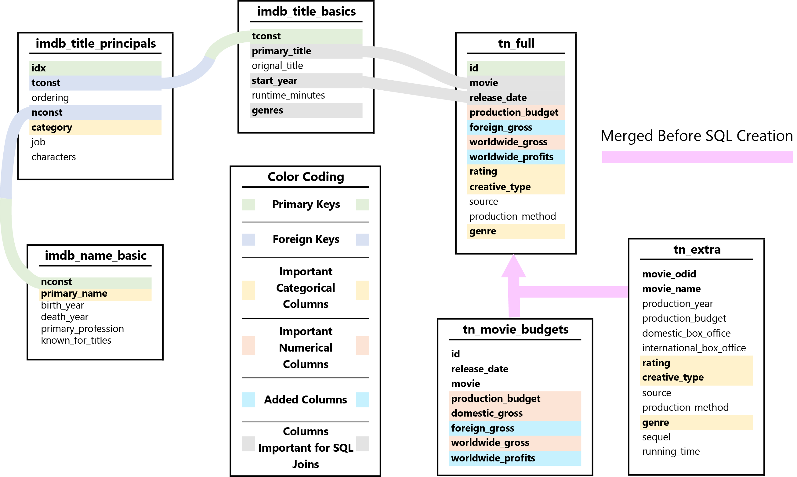

<table align="center" border="0">
  <tr>
    <td>
        
| Main Version | PDF Version |
| :-: | :-: |
| <a href="https://github.com/sarnadpy32/microsoft_productions/blob/master/Phase%201%20-%20Project.ipynb">Analysis</a> | <a href="https://github.com/sarnadpy32/microsoft_productions/blob/master/notebook.pdf">Analysis</a> |
| <a href="https://github.com/sarnadpy32/microsoft_productions/blob/master/Presentation.pptm">Presentation<a> | <a href="https://github.com/sarnadpy32/microsoft_productions/blob/master/pdf_presentation.pdf">Presentation</a> |</td>

  </tr>
</table>


<hr style="border:1.2px solid #009E25"> </hr>
&nbsp;&nbsp;&nbsp;&nbsp;For my project, I utilized data from the three sources shown below to gain insight into the film industry in order to provide useful recommendations for Microsoft as they prepare to enter the streaming media market.
<p align="center">
    
</p>


<hr style="border:1.2px solid #009E25"> </hr>

* **[A Gladiator Wishes to Enter the Arena](#sect_glad)**
* **[Exploring and Preparing the Data](#sect_expl_prep)**
* **[Creating the Financial Analysis DataFrames](#sect_fin_anal_dfs)**
* **[Functions Created for Visualizations](#sect_all_viz_funcs)**
    * **[Main Visualization Function](#sub_sect_main_viz_func)**
* **[Standards for Qualifying as Important](#sect_standards)**
* **[Creating & Plotting the Aggregate DataFrames](#sect_agg_dfs)**
    * **[Financially Important Genres](#sub_sect_import_gs)**
    * **[Financially Important Creative Types](#sub_sect_import_cts)**
    * **[Financially Important Combinations](#sub_sect_import_combos)**
    * **[MPA Ratings Priorities](#sub_sect_rat_priorities)**
* **[Recommendations for Microsoft](#sect_final_reco)**
    * **[Recommendations for PG-13 Content](#sub_sect_pg13_reco)**
    * **[Recommendations for PG Content](#sub_sect_pg_reco)**
    * **[Recommendations for R Content](#sub_sect_r_reco)**
    * **[Recommendations for G Content](#sub_sect_g_reco)**
    * **[Important Subcategories & Crew Interactive Visualization Explorer](#sub_sect_int_viz)**
    * **[Markdown Crew Exploration](#sub_sect_markdown_crew)**
* **[Additional Insights](#sect_add_insights)**

<a id='sect_glad'></a>

<hr style="border:1.2px solid #009E25"> </hr>
<p align="center">
    
<p>

&nbsp;&nbsp;&nbsp;&nbsp;&nbsp;&nbsp;&nbsp;&nbsp;Microsoft is developing their own streaming service that will feature content which they intend to produce in-house.
&ensp;As they are entering into an already crowded and competitive market, it would be advantageous for them to analyze which types of movies perform best at the box office, which would aslo provide insights into the viewing preferences of moviegoers, and then produce movies and/or television shows based on the insights gained from such an analysis.

&nbsp;&nbsp;&nbsp;&nbsp;&nbsp;&nbsp;&nbsp;&nbsp;For this project, I analyzed the financial performance of movies released between 2010 and 2018 based on data from the sources shown above.
&ensp;The data was provided to me by <a href="https://flatironschool.com/">Flatiron School</a> and <a href="https://www.opusdata.com/">OpusData</a>.
&ensp;I explored the performance of the movies based on the category and subcategory types listed below.
* **Primary Category Type**
    * <a href="https://www.motionpictures.org"/>Motion Picture Association</a> (MPA) Ratings    
* **Subcategory Types**
    * Genres
    * Creative Types
    * Genre & Creative Type Combinations

&nbsp;&nbsp;&nbsp;&nbsp;&nbsp;&nbsp;&nbsp;&nbsp;By using the MPA Ratings as the main categories, my analysis will allow Microsoft to target the various age and audience groups accordingly.
&ensp;I identified and explored the highest performing subcategories for each of the MPA Ratings, as well as the highest performing MPA Ratings themselves, based on the metrics shown below.
&ensp;The reason for using each of the metrics is also shown.
* **Financial Metrics**
    * **Total Worldwide Gross Revenue**
        * This metric acts as a measure of overall audience interest, as the movies with the highest gross revenues would be the ones that sold the most tickets.
    * **Total Worldwide Profits**
        * This metric shows which of the categories or subcategories were associated with the largest profit margins overall, which is if obvious interest.
    * **Average Worldwide Gross Revenue**
        * The metric shows which of the categories or subcategories were the most reliable in generating high levels of revenue, which again is a measure of overall audience interest.
    * **Average Worldwide Profits**
        * The metric shows which of the categories or subcategories were the most reliable in generating high levels of profit, again of obvious interest.

&nbsp;&nbsp;&nbsp;&nbsp;&nbsp;&nbsp;&nbsp;&nbsp;I also determined the crew members of the types listed below that worked on the high performing films from the high performing subcategories for each of the MPA Ratings.
* **Crew Member Types**
    * Directors
    * Writers
    * Actors
    * Actresses

&nbsp;&nbsp;&nbsp;&nbsp;&nbsp;&nbsp;&nbsp;&nbsp;My analysis will be able to provide the Microsoft team assigned to lead their entry into the streaming market with strategically valuable insights into the viewing tendencies of moviegoers.
&ensp;These insights will guide them as to the type of content they may wish to produce to attract and retain subscribers while generating high levels of financial returns.

&nbsp;&nbsp;&nbsp;&nbsp;&nbsp;&nbsp;&nbsp;&nbsp;Of course, the insights gained through my analysis will be limited to the financial performance of ***movies*** with the category and subcategory types shown above.
&ensp;However, it is not clear if the financial performance of movies is directly correlated with the viewing habits and preferences of people using streaming services, or televison viewers in genral for that matter.
&ensp;My analysis does not conatin any analysis of the viewing habits of streaming service subscribers or regular television viewers for a number of reasons.
&ensp;First, the other streaming services do not publish data on the viewing habits of their users.
&ensp;Second, the data on the <a href="https://global.nielsen.com/">Nielsen</a> ratings (the standard for televsion viewing figures that has also recently upgraded its data collection for streaming services as well) must be purchased, and I did not see any mention of a free academic dataset.
&ensp;Third, in the data that I was either provided or was able to easily obtain, there were no useful metrics to measure the actual performance of TV shows, only what people online thought of them.

&nbsp;&nbsp;&nbsp;&nbsp;&nbsp;&nbsp;&nbsp;&nbsp;While the lack of data on the viewing habits of streaming service subsribers or regular television viewers are potential blind spots for my analysis, the project assignment was to analyze **movies based on box office performance**, and the analysis I have performed will still provide the Microsoft team with highly useful insights that can at least serve as a starting point for their productions.
&ensp;They could then analyze the viewing habits of their subscribers once their streaming service was launched to adjust their production priorties accordingly if needed.

<a id='sect_expl_prep'></a>

<hr style="border:1.2px solid #009E25"> </hr>
&nbsp;&nbsp;&nbsp;&nbsp;&nbsp;&nbsp;&nbsp;&nbsp;For this project I used data provided to me from <a href="https://www.imdb.com/">IMDb</a> and <a href="https://www.the-numbers.com/">The Numbers</a>, by <a href="https://flatironschool.com/">Flatiron School</a>.
I also applied for and received an academic dataset from <a href="https://www.opusdata.com/">OpusData</a>, which is owned and operated by the same company as The Numbers, for which it provides data services.
<br>

<br>

<hr style="border:1.2px solid #2222FF"> </hr>

&nbsp;&nbsp;&nbsp;&nbsp;&nbsp;&nbsp;&nbsp;&nbsp;I imported the necessary modules and functions to explore the data, coming back and adding additional modules as needed.
&ensp;I also created a mapping function to handle SQL queries, and enabled inline plotting for building the visualization functions.

&nbsp;&nbsp;&nbsp;&nbsp;&nbsp;&nbsp;&nbsp;&nbsp;I used `pandas` to import the data into dataframes.
&ensp;I then created lists of the dataframes and their names to iterate through and explore the data with ease.

&nbsp;&nbsp;&nbsp;&nbsp;&nbsp;&nbsp;&nbsp;&nbsp;I decided to use the categorical data from the OpusData data, the financial data from the The Numbers data, and the crew information from the IMDb data.

&nbsp;&nbsp;&nbsp;&nbsp;&nbsp;&nbsp;&nbsp;&nbsp;The OpusData data was best suited as a source of categorical data as it contained multiple category types to analyze.
&ensp;Even though the data from OpusData contained financial data, the fact that it contained a `'production_year'` column instead of a `'release_date'` column that the The Numbers data contained meant that it could not be used alone with the IMDb data, which contained a `'start_year'` column, as there would be no way of knowing if I was combining data from movies from different years.
&ensp;I therefore decided to use the financial data from the The Numbers data.

&nbsp;&nbsp;&nbsp;&nbsp;&nbsp;&nbsp;&nbsp;&nbsp;As I previously mentioned, the crew data was used after finding the financially important subcategories within each MPA Rating.
&ensp;The crew members who worked on the highest performing films with those subcategories could then be identified.
&ensp;Microsoft will therefore be provided with all of the data necessary to begin producing their own streaming content.


<hr style="border:1.2px solid #2222FF"> </hr>

&nbsp;&nbsp;&nbsp;&nbsp;In order to perform my analysis, changes needed to be made to some of the columns within several dataframes.
&ensp;I first had to remove punctuation from any column with financial data that was in string form, and then change the data type of that column to a numerical data type.

&nbsp;&nbsp;&nbsp;&nbsp;&nbsp;&nbsp;&nbsp;&nbsp;I then could add other financial columns based on those columns that could be of significance to my analysis.

&nbsp;&nbsp;&nbsp;&nbsp;&nbsp;&nbsp;&nbsp;&nbsp;I also changed any columns containing any date or year data to the datetime format so that they could be easily compared and used to control the period of time covered by my analysis.

&nbsp;&nbsp;&nbsp;&nbsp;&nbsp;&nbsp;&nbsp;&nbsp;Finally, I rearranged the column order of one of the dataframes to make it ready for database construction.


<hr style="border:1.2px solid #2222FF"> </hr>

&nbsp;&nbsp;&nbsp;&nbsp;&nbsp;&nbsp;&nbsp;&nbsp;The data from OpusData, which contained the categorical data that I would analayze for performance, only contained data from 2006 to 2018.
&ensp;I felt that going back to 2006 was unecessary and that by limiting the year range to the past decade, my analysis would be based on the most relevant data in terms of the current viewing habits of moviegoers.
&ensp;It would have been advantageous to obtain data for 2019 as well, but I would have excluded any data from the past two years anyway due to the disruptions to the industry caused by COVID-19 so the loss of data, and with it any potentially valuable insights, is minimal.


<hr style="border:1.2px solid #2222FF"> </hr>

&nbsp;&nbsp;&nbsp;&nbsp;&nbsp;&nbsp;&nbsp;&nbsp;I found it easier to merge the data from The Numbers and OpusData together, and deal with any errors that might occur, prior to creating the SQL database, rather than after.
&ensp;It also made sense to combine them first since they are essentially the same data source.


<hr style="border:1.2px solid #2222FF"> </hr>

&nbsp;&nbsp;&nbsp;&nbsp;&nbsp;&nbsp;&nbsp;&nbsp;I chose to use the dataframes shown in the image below to create an SQL database for my analysis as it would allow me to create new dataframes with the desired data with ease.
&ensp;The image also shows how I used the database to take different columns from the dataframes and join them together to build the new dataframes.
&ensp;The important columns for either joining or analyzing are color coded.
&ensp;Any new columns that I created, based on the data already in the corresponding table, to enhance my analysis, were also given an identifying color.

&nbsp;&nbsp;&nbsp;&nbsp;&nbsp;&nbsp;&nbsp;&nbsp;As previously discussed, I combined the `tn_movie_budgets` and `tn_extra` dataframes into the `tn_full` dataframe prior to creating the SQL database.
<p align="center">
    
</p>

&nbsp;&nbsp;&nbsp;&nbsp;&nbsp;&nbsp;&nbsp;&nbsp;In order to create the database, I first updated the lists of the dataframes and their names to iterate through to create the database.

&nbsp;&nbsp;&nbsp;&nbsp;&nbsp;&nbsp;&nbsp;&nbsp;I then created a new database and a connection to it via the `sqlite3` module.

&nbsp;&nbsp;&nbsp;&nbsp;&nbsp;&nbsp;&nbsp;&nbsp;I could then populate the database with the dataframes I needed.
&ensp;If a dataframe did not have a unique identifier column, I reset the index to create one.

&nbsp;&nbsp;&nbsp;&nbsp;&nbsp;&nbsp;&nbsp;&nbsp;I then checked to make sure everything worked.

<a id='sect_fin_anal_dfs'></a>

<hr style="border:1.2px solid #009E25"> </hr>

&nbsp;&nbsp;&nbsp;&nbsp;&nbsp;&nbsp;&nbsp;&nbsp;I created five different financial dataframes that I would use to create my aggregate dataframes.
&ensp;For each of the dataframes, I would first create the dataframe with a SQL query and then use `pandas` to manipulate it.
&ensp;Although I decided to use the categorical data from the OpusData data, I found the `'genres'` column from the `imdb_title_basics` dataframe ueseful in weeding out data that was mistakenly duplicated by being joined to mulitple titles and I did not want to simply drop the titles with the same name from the same year.
&ensp;The more data I could retain the more value my analysis would have.


<hr style="border:1.2px solid #2222FF"> </hr>

&nbsp;&nbsp;&nbsp;&nbsp;&nbsp;&nbsp;&nbsp;&nbsp;The SQL query I used to create the main financial dataframe is shown below.
```python
"""
SELECT 
    tconst, start_year, primary_title, genre, genres, rating, creative_type, 
    worldwide_gross, worldwide_profits
FROM tn_full
JOIN imdb_title_basics
    ON (primary_title = movie AND (release_date LIKE '%' || start_year || '%'))
WHERE genres NOT Null;"""
```


<hr style="border:1.2px solid #2222FF"> </hr>

&nbsp;&nbsp;&nbsp;&nbsp;&nbsp;&nbsp;&nbsp;&nbsp;I created tables in markdown format to be displayed in the README file on GitHub, and later in HTML for the notebook markdown on GitHub, that show the details of the main category type and each subcategory type.
&ensp;To do so, I first created functions to format the numerical values accordingly.

<p align="center">The table below shows the number of categories within the main category type.</p>

<table align="center" border="0">
  <tr>
    <td>

| Main Category Type | Number of Categories |
| :-: | :-: |
| Ratings | 5 |</td>

  </tr>
</table>

<p align="center">The table below shows the number of subcategories within each subcategory type.</p>

<table align="center" border="0">
  <tr>
    <td>

| Subcategory Types | Number of Subcategories |
| :-: | :-: |
| Genres | 11 |
| Creative Types | 9 |
| Genre & Creative Type<br>Combinations | 56 |</td>

  </tr>
</table>

<a id="extra_details"></a>

<details align="center"><summary><strong>Click Here to see more details for the Rating category type and Genre and Creative Type subcategory types.</strong></summary>
<p>
    
<hr style="border:1.2px solid #2222FF"> </hr>

<details align="center"><summary><strong>Click Here to see the explore the Rating category type.</strong></summary>
<p>
    
<hr style="border:1.2px solid #2222FF"> </hr>

<details align="center"><summary><strong>Click Here to see the number of Movies with each Rating category.</strong></summary>
<p>
    
<table align="center" border="0">
  <tr>
    <td>

|  Ratings  |  Count  |
|:---------:|:-------:|
|   PG-13   |   411   |
|     R     |   382   |
|    PG     |   161   |
|     G     |   11    |
| Not Rated |   10    |</td>

  </tr>
</table>
    
</p>
</details>
    
<br>
    
<details align="center"><summary><strong>Click Here to see the extended details tables for the Rating categories.</strong></summary>
<p>
    
<table align="center" border="0">
  <tr>
    <td>
    
|  Worldwide Gross<br><br>Rating  |  count  |         mean          |          std          |          min           |         25%          |          50%          |          75%          |          max          |
|:-------------------------------:|:-------:|:---------------------:|:---------------------:|:----------------------:|:--------------------:|:---------------------:|:---------------------:|:---------------------:|
|                G                |   11    | &dollar;369.03&nbsp;M | &dollar;331.65&nbsp;M |  &dollar;27.47&nbsp;M  | &dollar;74.59&nbsp;M | &dollar;349.09&nbsp;M | &dollar;526.50&nbsp;M |  &dollar;1.07&nbsp;B  |
|            Not Rated            |   10    | &dollar;54.75&nbsp;M  | &dollar;82.57&nbsp;M  | &dollar;247.56&nbsp;Th | &dollar;10.77&nbsp;M | &dollar;19.81&nbsp;M  | &dollar;61.43&nbsp;M  | &dollar;263.50&nbsp;M |
|               PG                |   161   | &dollar;282.71&nbsp;M | &dollar;288.30&nbsp;M | &dollar;73.71&nbsp;Th  | &dollar;77.23&nbsp;M | &dollar;183.35&nbsp;M | &dollar;373.99&nbsp;M |  &dollar;1.27&nbsp;B  |
|              PG-13              |   411   | &dollar;246.15&nbsp;M | &dollar;308.96&nbsp;M | &dollar;94.81&nbsp;Th  | &dollar;58.25&nbsp;M | &dollar;126.93&nbsp;M | &dollar;290.79&nbsp;M |  &dollar;2.05&nbsp;B  |
|                R                |   382   | &dollar;99.36&nbsp;M  | &dollar;123.27&nbsp;M |  &dollar;3.47&nbsp;Th  | &dollar;20.80&nbsp;M | &dollar;59.91&nbsp;M  | &dollar;127.59&nbsp;M | &dollar;801.03&nbsp;M |</td>

  </tr>
</table>


<table align="center" border="0">
  <tr>
    <td>

|  Worldwide Profits<br><br>Rating  |  count  |         mean          |          std          |           min           |          25%           |          50%          |          75%          |          max          |
|:---------------------------------:|:-------:|:---------------------:|:---------------------:|:-----------------------:|:----------------------:|:---------------------:|:---------------------:|:---------------------:|
|                 G                 |   11    | &dollar;263.39&nbsp;M | &dollar;263.74&nbsp;M |  &dollar;12.47&nbsp;M   |  &dollar;53.09&nbsp;M  | &dollar;208.54&nbsp;M | &dollar;361.50&nbsp;M | &dollar;868.88&nbsp;M |
|             Not Rated             |   10    | &dollar;35.02&nbsp;M  | &dollar;80.99&nbsp;M  | - &dollar;19.52&nbsp;M  | - &dollar;13.02&nbsp;M | - &dollar;1.93&nbsp;M | &dollar;48.65&nbsp;M  | &dollar;233.50&nbsp;M |
|                PG                 |   161   | &dollar;201.01&nbsp;M | &dollar;256.86&nbsp;M | - &dollar;110.45&nbsp;M |  &dollar;29.16&nbsp;M  | &dollar;96.86&nbsp;M  | &dollar;290.36&nbsp;M |  &dollar;1.12&nbsp;B  |
|               PG-13               |   411   | &dollar;169.15&nbsp;M | &dollar;256.16&nbsp;M | - &dollar;50.92&nbsp;M  |  &dollar;17.89&nbsp;M  | &dollar;70.94&nbsp;M  | &dollar;189.64&nbsp;M |  &dollar;1.75&nbsp;B  |
|                 R                 |   382   | &dollar;63.79&nbsp;M  | &dollar;110.82&nbsp;M | - &dollar;50.33&nbsp;M  | - &dollar;3.95&nbsp;M  | &dollar;26.37&nbsp;M  | &dollar;82.58&nbsp;M  | &dollar;743.03&nbsp;M |</td>

  </tr>
</table>

</p>
</details>

</p>
</details>

<hr style="border:1.2px solid #2222FF"> </hr>

<details align="center"><summary><strong>Click Here to see the explore the Genre subcategory type.</strong></summary>
<p>
    
<hr style="border:1.2px solid #2222FF"> </hr>

<details align="center"><summary><strong>Click Here to see the number of Movies with each Genre subcategory.</strong></summary>
<p>

<table align="center" border="0">
  <tr>
    <td>
    
|       Genres        |  Count  |
|:-------------------:|:-------:|
|        Drama        |   219   |
|       Action        |   174   |
|      Adventure      |   171   |
|       Comedy        |   151   |
|  Thriller/Suspense  |   131   |
|       Horror        |   49    |
|   Romantic Comedy   |   39    |
|    Black Comedy     |   14    |
|       Musical       |   13    |
|       Western       |   10    |
| Concert/Performance |    4    |</td>

  </tr>
</table>

</p>
</details>

<br>
    
<details align="center"><summary><strong>Click Here to see the extended details tables for the Genre subcategories.</strong></summary>
<p>

<table align="center" border="0">
  <tr>
    <td>
    
|  Worldwide Gross<br><br>Genre  |  count  |         mean          |          std          |          min           |          25%          |          50%          |          75%          |          max          |
|:------------------------------:|:-------:|:---------------------:|:---------------------:|:----------------------:|:---------------------:|:---------------------:|:---------------------:|:---------------------:|
|             Action             |   174   | &dollar;341.79&nbsp;M | &dollar;383.57&nbsp;M |  &dollar;3.47&nbsp;Th  | &dollar;73.71&nbsp;M  | &dollar;194.68&nbsp;M | &dollar;492.31&nbsp;M |  &dollar;2.05&nbsp;B  |
|           Adventure            |   171   | &dollar;363.68&nbsp;M | &dollar;296.49&nbsp;M | &dollar;73.71&nbsp;Th  | &dollar;124.66&nbsp;M | &dollar;282.78&nbsp;M | &dollar;530.01&nbsp;M |  &dollar;1.24&nbsp;B  |
|          Black Comedy          |   14    | &dollar;111.90&nbsp;M | &dollar;111.62&nbsp;M | &dollar;70.96&nbsp;Th  | &dollar;47.82&nbsp;M  | &dollar;60.69&nbsp;M  | &dollar;145.95&nbsp;M | &dollar;389.87&nbsp;M |
|             Comedy             |   151   | &dollar;96.55&nbsp;M  | &dollar;87.39&nbsp;M  | &dollar;135.44&nbsp;Th | &dollar;32.02&nbsp;M  | &dollar;76.00&nbsp;M  | &dollar;134.30&nbsp;M | &dollar;586.46&nbsp;M |
|      Concert/Performance       |    4    | &dollar;41.10&nbsp;M  | &dollar;39.83&nbsp;M  |  &dollar;9.08&nbsp;M   | &dollar;19.96&nbsp;M  | &dollar;28.15&nbsp;M  | &dollar;49.28&nbsp;M  | &dollar;99.03&nbsp;M  |
|             Drama              |   219   | &dollar;87.38&nbsp;M  | &dollar;108.32&nbsp;M | &dollar;14.62&nbsp;Th  | &dollar;16.81&nbsp;M  | &dollar;54.88&nbsp;M  | &dollar;115.89&nbsp;M | &dollar;706.10&nbsp;M |
|             Horror             |   49    | &dollar;113.87&nbsp;M | &dollar;120.06&nbsp;M | &dollar;94.95&nbsp;Th  | &dollar;41.64&nbsp;M  | &dollar;83.66&nbsp;M  | &dollar;137.49&nbsp;M | &dollar;697.46&nbsp;M |
|            Musical             |   13    | &dollar;392.66&nbsp;M | &dollar;443.11&nbsp;M |  &dollar;7.29&nbsp;M   | &dollar;61.03&nbsp;M  | &dollar;213.12&nbsp;M | &dollar;586.48&nbsp;M |  &dollar;1.27&nbsp;B  |
|        Romantic Comedy         |   39    | &dollar;86.00&nbsp;M  | &dollar;59.62&nbsp;M  | &dollar;94.81&nbsp;Th  | &dollar;41.65&nbsp;M  | &dollar;74.33&nbsp;M  | &dollar;130.54&nbsp;M | &dollar;238.10&nbsp;M |
|       Thriller/Suspense        |   131   | &dollar;127.08&nbsp;M | &dollar;160.76&nbsp;M | &dollar;261.36&nbsp;Th | &dollar;31.04&nbsp;M  | &dollar;67.26&nbsp;M  | &dollar;154.26&nbsp;M | &dollar;835.52&nbsp;M |
|            Western             |   10    | &dollar;145.35&nbsp;M | &dollar;143.49&nbsp;M |  &dollar;8.22&nbsp;M   | &dollar;19.25&nbsp;M  | &dollar;130.66&nbsp;M | &dollar;229.84&nbsp;M | &dollar;449.95&nbsp;M |</td>

  </tr>
</table>


<table align="center" border="0">
  <tr>
    <td>

|  Worldwide Profits<br><br>Genre  |  count  |         mean          |          std          |           min           |          25%           |          50%          |          75%          |          max          |
|:--------------------------------:|:-------:|:---------------------:|:---------------------:|:-----------------------:|:----------------------:|:---------------------:|:---------------------:|:---------------------:|
|              Action              |   174   | &dollar;240.04&nbsp;M | &dollar;327.44&nbsp;M | - &dollar;50.92&nbsp;M  |  &dollar;21.06&nbsp;M  | &dollar;111.13&nbsp;M | &dollar;347.76&nbsp;M |  &dollar;1.75&nbsp;B  |
|            Adventure             |   171   | &dollar;253.74&nbsp;M | &dollar;260.91&nbsp;M | - &dollar;110.45&nbsp;M |  &dollar;47.89&nbsp;M  | &dollar;159.52&nbsp;M | &dollar;393.51&nbsp;M |  &dollar;1.09&nbsp;B  |
|           Black Comedy           |   14    | &dollar;72.05&nbsp;M  | &dollar;90.88&nbsp;M  | - &dollar;32.93&nbsp;M  |  &dollar;13.63&nbsp;M  | &dollar;44.79&nbsp;M  | &dollar;87.46&nbsp;M  | &dollar;289.87&nbsp;M |
|              Comedy              |   151   | &dollar;61.62&nbsp;M  | &dollar;78.12&nbsp;M  | - &dollar;33.32&nbsp;M  |  &dollar;3.56&nbsp;M   | &dollar;42.16&nbsp;M  | &dollar;92.30&nbsp;M  | &dollar;506.46&nbsp;M |
|       Concert/Performance        |    4    | &dollar;27.85&nbsp;M  | &dollar;40.79&nbsp;M  |  - &dollar;8.92&nbsp;M  |  &dollar;7.96&nbsp;M   | &dollar;17.15&nbsp;M  | &dollar;37.03&nbsp;M  | &dollar;86.03&nbsp;M  |
|              Drama               |   219   | &dollar;55.15&nbsp;M  | &dollar;97.90&nbsp;M  | - &dollar;43.23&nbsp;M  | - &dollar;5.89&nbsp;M  | &dollar;24.24&nbsp;M  | &dollar;72.16&nbsp;M  | &dollar;638.10&nbsp;M |
|              Horror              |   49    | &dollar;84.61&nbsp;M  | &dollar;118.33&nbsp;M | - &dollar;17.91&nbsp;M  |  &dollar;11.48&nbsp;M  | &dollar;58.22&nbsp;M  | &dollar;100.91&nbsp;M | &dollar;662.46&nbsp;M |
|             Musical              |   13    | &dollar;302.34&nbsp;M | &dollar;399.76&nbsp;M | - &dollar;69.53&nbsp;M  |  &dollar;3.66&nbsp;M   | &dollar;156.92&nbsp;M | &dollar;406.35&nbsp;M |  &dollar;1.12&nbsp;B  |
|         Romantic Comedy          |   39    | &dollar;56.80&nbsp;M  | &dollar;51.25&nbsp;M  | - &dollar;23.61&nbsp;M  |  &dollar;17.81&nbsp;M  | &dollar;46.03&nbsp;M  | &dollar;90.81&nbsp;M  | &dollar;208.10&nbsp;M |
|        Thriller/Suspense         |   131   | &dollar;82.63&nbsp;M  | &dollar;137.60&nbsp;M | - &dollar;50.33&nbsp;M  |  &dollar;4.69&nbsp;M   | &dollar;36.74&nbsp;M  | &dollar;110.06&nbsp;M | &dollar;675.52&nbsp;M |
|             Western              |   10    | &dollar;72.35&nbsp;M  | &dollar;122.70&nbsp;M | - &dollar;33.49&nbsp;M  | - &dollar;13.19&nbsp;M | &dollar;39.52&nbsp;M  | &dollar;82.53&nbsp;M  | &dollar;349.95&nbsp;M |</td>

  </tr>
</table>
    
</p>
</details>

</p>
</details>

<hr style="border:1.2px solid #2222FF"> </hr>

<details align="center"><summary><strong>Click Here to see the explore the Creative Type subcategory type.</strong></summary>
<p>
    
<hr style="border:1.2px solid #2222FF"> </hr>

<details align="center"><summary><strong>Click Here to see the number of Movies with each Creative Type subcategory.</strong></summary>
<p>
    
<table align="center" border="0">
  <tr>
    <td>

|     Creative Types      |  Count  |
|:-----------------------:|:-------:|
|  Contemporary Fiction   |   432   |
|     Science Fiction     |   110   |
|      Dramatization      |   102   |
|         Fantasy         |   97    |
|      Kids Fiction       |   94    |
|   Historical Fiction    |   91    |
|       Super Hero        |   39    |
|         Factual         |    5    |
| Multiple Creative Types |    2    |</td>

  </tr>
</table>
    
</p>
</details>

<br>

<details align="center"><summary><strong>Click Here to see the extended details tables for the Creative Type subcategories.</strong></summary>
<p>

<table align="center" border="0">
  <tr>
    <td>
    
|  Worldwide Gross<br><br>Creative_Type  |  count  |         mean          |          std          |          min           |          25%          |          50%          |          75%          |          max          |
|:--------------------------------------:|:-------:|:---------------------:|:---------------------:|:----------------------:|:---------------------:|:---------------------:|:---------------------:|:---------------------:|
|          Contemporary Fiction          |   432   | &dollar;112.99&nbsp;M | &dollar;149.50&nbsp;M |  &dollar;3.47&nbsp;Th  | &dollar;33.95&nbsp;M  | &dollar;70.62&nbsp;M  | &dollar;141.22&nbsp;M |  &dollar;1.52&nbsp;B  |
|             Dramatization              |   102   | &dollar;96.65&nbsp;M  | &dollar;114.00&nbsp;M | &dollar;14.62&nbsp;Th  | &dollar;14.87&nbsp;M  | &dollar;56.05&nbsp;M  | &dollar;133.27&nbsp;M | &dollar;547.33&nbsp;M |
|                Factual                 |    5    | &dollar;67.22&nbsp;M  | &dollar;67.82&nbsp;M  |  &dollar;9.08&nbsp;M   | &dollar;23.59&nbsp;M  | &dollar;32.70&nbsp;M  | &dollar;99.03&nbsp;M  | &dollar;171.69&nbsp;M |
|                Fantasy                 |   97    | &dollar;258.44&nbsp;M | &dollar;291.31&nbsp;M | &dollar;70.96&nbsp;Th  | &dollar;74.58&nbsp;M  | &dollar;141.34&nbsp;M | &dollar;318.00&nbsp;M |  &dollar;1.26&nbsp;B  |
|           Historical Fiction           |   91    | &dollar;116.15&nbsp;M | &dollar;137.00&nbsp;M | &dollar;476.62&nbsp;Th | &dollar;16.79&nbsp;M  | &dollar;62.08&nbsp;M  | &dollar;168.08&nbsp;M | &dollar;697.46&nbsp;M |
|              Kids Fiction              |   94    | &dollar;361.38&nbsp;M | &dollar;310.95&nbsp;M | &dollar;73.71&nbsp;Th  | &dollar;115.40&nbsp;M | &dollar;280.64&nbsp;M | &dollar;524.71&nbsp;M |  &dollar;1.27&nbsp;B  |
|        Multiple Creative Types         |    2    | &dollar;80.92&nbsp;M  | &dollar;70.36&nbsp;M  |  &dollar;31.16&nbsp;M  | &dollar;56.04&nbsp;M  | &dollar;80.92&nbsp;M  | &dollar;105.80&nbsp;M | &dollar;130.67&nbsp;M |
|            Science Fiction             |   110   | &dollar;283.91&nbsp;M | &dollar;301.49&nbsp;M | &dollar;261.36&nbsp;Th | &dollar;67.12&nbsp;M  | &dollar;192.56&nbsp;M | &dollar;397.88&nbsp;M |  &dollar;1.65&nbsp;B  |
|               Super Hero               |   39    | &dollar;749.16&nbsp;M | &dollar;380.79&nbsp;M | &dollar;167.85&nbsp;M  | &dollar;530.70&nbsp;M | &dollar;709.00&nbsp;M | &dollar;850.30&nbsp;M |  &dollar;2.05&nbsp;B  |</td>

  </tr>
</table>


<table align="center" border="0">
  <tr>
    <td>

|  Worldwide Profits<br><br>Creative_Type  |  count  |         mean          |          std          |           min           |          25%           |          50%          |          75%          |          max          |
|:----------------------------------------:|:-------:|:---------------------:|:---------------------:|:-----------------------:|:----------------------:|:---------------------:|:---------------------:|:---------------------:|
|           Contemporary Fiction           |   432   | &dollar;75.22&nbsp;M  | &dollar;127.55&nbsp;M | - &dollar;50.33&nbsp;M  |  &dollar;7.77&nbsp;M   | &dollar;40.67&nbsp;M  | &dollar;96.96&nbsp;M  |  &dollar;1.33&nbsp;B  |
|              Dramatization               |   102   | &dollar;59.95&nbsp;M  | &dollar;98.71&nbsp;M  | - &dollar;38.34&nbsp;M  | - &dollar;9.28&nbsp;M  | &dollar;25.75&nbsp;M  | &dollar;84.71&nbsp;M  | &dollar;489.33&nbsp;M |
|                 Factual                  |    5    | &dollar;52.62&nbsp;M  | &dollar;65.69&nbsp;M  |  - &dollar;8.92&nbsp;M  |  &dollar;13.59&nbsp;M  | &dollar;20.70&nbsp;M  | &dollar;86.03&nbsp;M  | &dollar;151.69&nbsp;M |
|                 Fantasy                  |   97    | &dollar;168.47&nbsp;M | &dollar;243.02&nbsp;M | - &dollar;35.37&nbsp;M  |  &dollar;15.25&nbsp;M  | &dollar;68.93&nbsp;M  | &dollar;169.71&nbsp;M |  &dollar;1.10&nbsp;B  |
|            Historical Fiction            |   91    | &dollar;64.58&nbsp;M  | &dollar;112.88&nbsp;M | - &dollar;43.23&nbsp;M  | - &dollar;10.52&nbsp;M | &dollar;22.00&nbsp;M  | &dollar;117.32&nbsp;M | &dollar;662.46&nbsp;M |
|               Kids Fiction               |   94    | &dollar;266.61&nbsp;M | &dollar;280.36&nbsp;M | - &dollar;69.53&nbsp;M  |  &dollar;53.36&nbsp;M  | &dollar;162.35&nbsp;M | &dollar;388.59&nbsp;M |  &dollar;1.12&nbsp;B  |
|         Multiple Creative Types          |    2    | &dollar;24.92&nbsp;M  |  &dollar;5.31&nbsp;M  |  &dollar;21.16&nbsp;M   |  &dollar;23.04&nbsp;M  | &dollar;24.92&nbsp;M  | &dollar;26.80&nbsp;M  | &dollar;28.67&nbsp;M  |
|             Science Fiction              |   110   | &dollar;191.38&nbsp;M | &dollar;260.18&nbsp;M | - &dollar;110.45&nbsp;M |  &dollar;21.98&nbsp;M  | &dollar;97.83&nbsp;M  | &dollar;270.43&nbsp;M |  &dollar;1.43&nbsp;B  |
|                Super Hero                |   39    | &dollar;570.97&nbsp;M | &dollar;347.43&nbsp;M |  &dollar;19.54&nbsp;M   | &dollar;362.27&nbsp;M  | &dollar;511.40&nbsp;M | &dollar;690.92&nbsp;M |  &dollar;1.75&nbsp;B  |</td>

  </tr>
</table>

</p>
</details>

</p>
</details>
    
</p>
</details>
<hr style="border:1.2px solid #2222FF"> </hr>


<hr style="border:1.2px solid #2222FF"> </hr>

&nbsp;&nbsp;&nbsp;&nbsp;&nbsp;&nbsp;&nbsp;&nbsp;I inserted the different job titles into the SQL query shown below as I iterated through them to create the financial dataframe for each of the previously mentioned crew types.
```python
"""
SELECT 
    tconst, nconst, primary_name, start_year, primary_title, genre, genres, rating, 
    creative_type, worldwide_gross, worldwide_profits
FROM imdb_title_basics
JOIN tn_full
    ON (primary_title = movie AND (release_date LIKE '%' || start_year || '%'))
JOIN imdb_title_principals
    USING(tconst)
JOIN imdb_name_basic AS nb
    USING(nconst)
WHERE genres NOT Null AND category = '"""+ crew_str +"""'
ORDER BY start_year, primary_title;"""
```


<hr style="border:1.2px solid #2222FF"> </hr>

&nbsp;&nbsp;&nbsp;&nbsp;&nbsp;&nbsp;&nbsp;&nbsp;I created more tables in markdown format for the details on the crew member types.

<p align="center">The table below shows the number of movies that had data for each crew member type, <br> as well as the number of crew members that were in each each crew dataframe.</p>

<table align="center" border="0">
  <tr>
    <td>
        
| Crew Member Types | Number of Movies<br>with data for each<br>Crew Member Type | Number of Crew Members<br>for each<br>Crew Member Type |
| :-: | :-: | :-: |
| Directors | 954 | 678 |
| Writers | 882 | 1491 |
| Actors | 951 | 1096 |
| Actresses | 855 | 700 |</td>

  </tr>
</table>

&nbsp;&nbsp;&nbsp;&nbsp;&nbsp;&nbsp;&nbsp;&nbsp;I closed the SQL query after it was no longer needed.
&ensp;As this was an academic project meant to be run from start to finish, there was no reason to commit and save the changes to the database.

<a id='sect_all_viz_funcs'></a>

<hr style="border:1.2px solid #009E25"> </hr>
&nbsp;&nbsp;&nbsp;&nbsp;&nbsp;&nbsp;&nbsp;&nbsp;In this section, I created and stored all of the functions I wrote that were necessary to create my visualizations.
&ensp;I would come back later and modify them as needed.


<hr style="border:1.2px solid #2222FF"> </hr>

&nbsp;&nbsp;&nbsp;&nbsp;&nbsp;&nbsp;&nbsp;&nbsp;I first made some important changes to the default `rcParams` settings in `matplotlib`.
&ensp;I did this so that I could use, what in my opinion were, more aesthetically appealing fonts.
&ensp;I also created lists of the spine sides to easily change their appearance later.


<hr style="border:1.2px solid #2222FF"> </hr>

&nbsp;&nbsp;&nbsp;&nbsp;&nbsp;&nbsp;&nbsp;&nbsp;This function allowed me to take one of the hundreds of colors to choose from by name, and turn it into a pastel of itself, so that when that color would be covering large patches, they would not be overwhelming to the viewer.
&ensp;I could also still use the original colors for any lines or markers, as I would want them to stand out as much as possible.

&nbsp;&nbsp;&nbsp;&nbsp;&nbsp;&nbsp;&nbsp;&nbsp;The function returns a color between a given color and pure white based on a number between 0 and 1.  The higher the number, the lighter the color.


<hr style="border:1.2px solid #2222FF"> </hr>

&nbsp;&nbsp;&nbsp;&nbsp;&nbsp;&nbsp;&nbsp;&nbsp;I created a dictionary with a unique color for each of the the MPA ratings to use for their corresponding visualizations.


<hr style="border:1.2px solid #2222FF"> </hr>

&nbsp;&nbsp;&nbsp;&nbsp;&nbsp;&nbsp;&nbsp;&nbsp;These functions were used to control details about the grid, ticks, tick labels, and spines for the main plotting axes, or a twinned axes, depending on what kind of visualization I needed to create.


<hr style="border:1.2px solid #2222FF"> </hr>

&nbsp;&nbsp;&nbsp;&nbsp;&nbsp;&nbsp;&nbsp;&nbsp;These functions were used to either format ticks or create tick label lists that would be aesthetically appealing and in the right format, as well as functional so that large numbers would not overlap.


<hr style="border:1.2px solid #2222FF"> </hr>

&nbsp;&nbsp;&nbsp;&nbsp;&nbsp;&nbsp;&nbsp;&nbsp;These functions were created to find the first possible quantile corresponding to a positive value, based on a set incremental step value, so that matching values (in quantile terms) could be used to find appropriate minimum and maximum tick values for an axes with a twinned axes that needed their scaling to match.
&ensp;If there was no twinned axes, then they were still used as needed to find appropriate minimum and maximum tick values for the axes being plotted.
&ensp;Sometimes no minimum values were necessary, but it was easier to just include that feature in the quantile finder.

<a id="sub_sect_main_viz_func"></a>

<hr style="border:1.2px solid #2222FF"> </hr>

&nbsp;&nbsp;&nbsp;&nbsp;&nbsp;&nbsp;&nbsp;&nbsp;I used the function below to create all of my visualizations.
&ensp;As such, there is a lot of information here.
&ensp;It may seem dense and overwhelming at first, but I think that with the aid of the code comments, it should be understandable.
&ensp;I admit, however, that one might have to view the whole function before realizing just how everything fits together.

&nbsp;&nbsp;&nbsp;&nbsp;&nbsp;&nbsp;&nbsp;&nbsp;I wanted to run all plotting through one function to keep a similar format and style without having to rewrite a slightly different function over and over again.
&ensp;I designed the function so that simple strings could be passed through to be used to determine the necessary plot elements for any type of visualization.

<a id='sect_standards'></a>

<hr style="border:1.2px solid #009E25"> </hr>
&nbsp;&nbsp;&nbsp;&nbsp;&nbsp;&nbsp;&nbsp;&nbsp;As I explored the results for each subcategory type, I developed a set of standards for what I would consider to be an important subcategory.
&ensp;Those standards are described below.

<h2 align="center"><strong>Standards for Qualifying as an Important Subcategory</strong></h2>
    
* For a subcategory to even be considered as important, there had to have been **at least nine movies made** with that subcategory within the period covered.


* For each metric, only the **Top 3** subcategories within each subcategory type were considered as financially important subcategories for that metric.


* If there were **less than nine movies made** with a subcategory, but that subcategory's value for a metric was **greater than the maximum value of the Top 3** for that metric, it was added to the [Additional Insights](#sect_add_insights) section. 

<a id='sect_agg_dfs'></a>

<hr style="border:1.2px solid #009E25"> </hr>
&nbsp;&nbsp;&nbsp;&nbsp;&nbsp;&nbsp;&nbsp;&nbsp;I first created a list of strings that corresponded to each fianncial metric to terate through to create the appropriate aggregate dataframes.
&ensp;I created those aggregate dataframes for each of the subcategory types previously mentioned, as well as the main category type itself.

&nbsp;&nbsp;&nbsp;&nbsp;&nbsp;&nbsp;&nbsp;&nbsp;I also created the dataframe to hold all of the [Additional Insights](#sect_add_insights) section data to be processed later.

<a id="sub_sect_import_gs"></a>


&nbsp;&nbsp;&nbsp;&nbsp;&nbsp;&nbsp;&nbsp;&nbsp;I used the visualizations created in this section to determine my Genres recommendations for each MPA Rating.

<br>
<details align="center"><summary><strong>Click here to see example visualizations.</strong></summary>
<p>

<hr style="border:1.2px solid #2222FF"> </hr>

<hr style="border:1.2px solid #2222FF"> </hr>

    
</p>
</details>
<hr style="border:1.2px solid #2222FF"> </hr>

<a id="sub_sect_import_cts"></a>


&nbsp;&nbsp;&nbsp;&nbsp;&nbsp;&nbsp;&nbsp;&nbsp;I used the visualizations created in this section to determine my Creative Types recommendations for each MPA Rating.

<br>
<details align="center"><summary><strong>Click here to see example visualizations.</strong></summary>
<p>

<hr style="border:1.2px solid #2222FF"> </hr>

<hr style="border:1.2px solid #2222FF"> </hr>


</p>
</details>
<hr style="border:1.2px solid #2222FF"> </hr>

<a id="sub_sect_import_combos"></a>


&nbsp;&nbsp;&nbsp;&nbsp;&nbsp;&nbsp;&nbsp;&nbsp;I used the visualizations created in this section to determine my Genre & Creative Type Combinations recommendations for each MPA Rating.

<br>
<details align="center"><summary><strong>Click here to see example visualizations.</strong></summary>
<p>

<hr style="border:1.2px solid #2222FF"> </hr>

<hr style="border:1.2px solid #2222FF"> </hr>

    
</p>
</details>
<hr style="border:1.2px solid #2222FF"> </hr>

<a id="sub_sect_rat_priorities"></a>


&nbsp;&nbsp;&nbsp;&nbsp;&nbsp;&nbsp;&nbsp;&nbsp;I used the visualizations created in this section to determine the financial importance of the MPA Ratings to order my recommendations accordingly.

<br>
<details align="center"><summary><strong>Click here to see the MPA Ratings visualizations.</strong></summary>
<p>

<hr style="border:1.2px solid #2222FF"> </hr>
    
<table width="99%" border=0 cellspacing="0" cellpadding="0">

<tr>
    <th colspan="2"><center>MPA Ratings Visualizations</center></th>
</tr>
<tr><td>


</td><td>


</td></tr>
<tr><td>


</td><td>


</td></tr>
</table>

</p>
</details>

<hr style="border:1.2px solid #2222FF"> </hr>

<a id='sect_final_reco'></a>

<hr style="border:1.2px solid #009E25"> </hr>

&nbsp;&nbsp;&nbsp;&nbsp;&nbsp;&nbsp;&nbsp;&nbsp;Based on my analysis of the financially important categories and subcategories, Microsoft should produce content with the genres, creative types, or specific genre and creative combinations shown, in the order of priority, for each MPA Rating in this section.
&ensp;The ratings themselves are shown in the order of priority that I recommend.
&ensp;By breaking my recommendations down by MPA Rating, my analysis will allow Microsoft to target the various age and audience groups accordingly.

&nbsp;&nbsp;&nbsp;&nbsp;&nbsp;&nbsp;&nbsp;&nbsp;I also created a function to easily access all the Important Crew visualizations that were created, as they were also part of my recommendations.
&ensp;They can use it to find the recommended crew members for the subcategories shown below for each MPA Rating, or those simply deemed important by my analysis.
&ensp;By doing so, they will be maximizing the benefits of the critical insights I gained through my analysis.

<a id="sub_sect_pg13_reco"></a>

<hr style="border:1.2px solid #2222FF"> </hr>

<table align="center">

<tr><th colspan="3"><center>PG-13</center></th></tr>

<tr><td>

| Priority | Genres |
| :---: | :---: |
| 1. | Action |
| 2. | Adventure |
| 3. | Thriller / Suspense |

</td><td>

| Priority | Creative Types |
| :---: | :---: |
| 1. | Super Hero |
| 2. | Science Fiction |
| 3. | Fantasy |

</td><td>
    
| Priority | Genre & Creative Type <br> Combinations |
| :---: | :---: |
| 1. | Action & Super Hero |
| 2. | Adventure & Science Fiction |
| 3. | Adventure & Fantasy |
| 4. | Action & Science Fiction |
| 5. | Action & Contemporary Fiction | 
    
</td></tr>  
</table>

<details align="center"><summary><strong>Click here to view the visualizations on which I based the PG-13 recommendations.</strong></summary>
<p>
    
<hr style="border:1.2px solid #2222FF"> </hr>

<details align="center"><summary><strong>Click here to view the visualizations on which I based my recommendations for the PG-13 Important Genres.</strong></summary>
<p>

<table width="99%" border=0 cellspacing="0" cellpadding="0">

<tr>
    <th colspan="2"><center>Important Genres</center></th>
</tr>
<tr><td>


</td><td>


</td></tr>
<tr><td>


</td><td>


</td></tr>
</table>

<hr style="border:1.2px solid #2222FF"> </hr>
    
</p>
</details>

<br>

<details align="center"><summary><strong>Click here to view the visualizations on which I based my recommendations for the PG-13 Important Creative Types.</strong></summary>
<p>

<table width="99%" border=0 cellspacing="0" cellpadding="0">

<tr>
    <th colspan="2"><center>Important Creative Types</center></th>
</tr>
<tr><td>


</td><td>


</td></tr>
<tr><td>


</td><td>


</td></tr>
</table>

<hr style="border:1.2px solid #2222FF"> </hr>
    
</p>
</details>

<br>

<details align="center"><summary><strong>Click here to view the visualizations on which I based my recommendations for the PG-13 Important Genre & Creative Type Combinations.</strong></summary>
<p>

<table width="99%" border=0 cellspacing="0" cellpadding="0">

<tr>
    <th colspan="2"><center>Important Genre & Creative Type Combinations</center></th>
</tr>
<tr><td>


</td><td>


</td></tr>
<tr><td>


</td><td>


</td></tr>
</table>
    
</p>
</details>   
    
</p>
</details>

<hr style="border:1.2px solid #2222FF"> </hr>

<a id="sub_sect_pg_reco"></a>

<hr style="border:1.2px solid #2222FF"> </hr>

<table align="center">
    
<tr><th colspan="3"><center>PG</center></th></tr>

<tr><td>

| Priority | Genres |
| :---: | :---: |
| 1. | Musical |
| 2. | Adventure |

</td><td>

| Priority | Creative Types |
| :---: | :---: |
| 1. | Kids Fiction |
| 2. | Fantasy |

</td><td>
    
| Priority | Genre & Creative Type <br> Combinations |
| :---: | :---: |
| 1. | Adventure & Kids Fiction |
| 2. | Adventure & Fantasy |
    
</td></tr> 
</table>

<details align="center"><summary><strong>Click here to view the visualizations on which I based the PG recommendations.</strong></summary>
<p>
    
<hr style="border:1.2px solid #2222FF"> </hr>

<details align="center"><summary><strong>Click here to view the visualizations on which I based my recommendations for the PG Important Genres.</strong></summary>
<p>

<table width="99%" border=0 cellspacing="0" cellpadding="0">

<tr>
    <th colspan="2"><center>Important Genres</center></th>
</tr>
<tr><td>


</td><td>


</td></tr>
<tr><td>


</td><td>


</td></tr>
</table>
    
<hr style="border:1.2px solid #2222FF"> </hr>

</p>
</details>  

<br>

<details align="center"><summary><strong>Click here to view the visualizations on which I based my recommendations for the PG Important Creative Types.</strong></summary>
<p>

<table width="99%" border=0 cellspacing="0" cellpadding="0">

<tr>
    <th colspan="2"><center>Important Creative Types</center></th>
</tr>
<tr><td>


</td><td>


</td></tr>
<tr><td>


</td><td>


</td></tr>
</table>

<hr style="border:1.2px solid #2222FF"> </hr>

</p>
</details>

<br>

<details align="center"><summary><strong>Click here to view the visualizations on which I based my recommendations for the PG Important Genre & Creative Type Combinations.</strong></summary>
<p>

<table width="99%" border=0 cellspacing="0" cellpadding="0">

<tr>
    <th colspan="2"><center>Important Genre & Creative Type Combinations</center></th>
</tr>
<tr><td>


</td><td>


</td></tr>
<tr><td>


</td><td>


</td></tr>
</table>
    
</p>
</details>      

</p>
</details>  

<hr style="border:1.2px solid #2222FF"> </hr>

<a id="sub_sect_r_reco"></a>

<hr style="border:1.2px solid #2222FF"> </hr>

<table align="center">
    
<tr><th colspan="3"><center>R</center></th></tr>

<tr><td>

| Priority | Genres |
| :---: | :---: |
| 1. | Horror |
| 2. | Black Comedy |
| 3. | Action |
| 4. | Comedy |

</td><td>

| Priority | Creative Types |
| :---: | :---: |
| 1. | Science Fiction |
| 2. | Contemporary Fiction |

</td><td>
    
| Priority | Genre & Creative Type <br> Combinations |
| :---: | :---: |
| 1. | Action & Science Fiction |
| 2. | Comedy & Contemporary Fiction |
| 3. | Horror & Fantasy |
| 4. | Action & Contemporary Fiction | 
    
</td></tr> 
</table>

<details align="center"><summary><strong>Click here to view the visualizations on which I based the R recommendations.</strong></summary>
<p>

<hr style="border:1.2px solid #2222FF"> </hr>

<details align="center"><summary><strong>Click here to view the visualizations on which I based my recommendations for the R Important Genres.</strong></summary>
<p>

<table width="99%" border=0 cellspacing="0" cellpadding="0">

<tr>
    <th colspan="2"><center>Important Genres</center></th>
</tr>
<tr><td>


</td><td>


</td></tr>
<tr><td>


</td><td>


</td></tr>
</table>

<hr style="border:1.2px solid #2222FF"> </hr>

</p>
</details>   

<br>

<details align="center"><summary><strong>Click here to view the visualizations on which I based my recommendations for the R Important Creative Types.</strong></summary>
<p>

<table width="99%" border=0 cellspacing="0" cellpadding="0">

<tr>
    <th colspan="2"><center>Important Creative Types</center></th>
</tr>
<tr><td>


</td><td>


</td></tr>
<tr><td>


</td><td>


</td></tr>
</table>

<hr style="border:1.2px solid #2222FF"> </hr>

</p>
</details>

<br>

<details align="center"><summary><strong>Click here to view the visualizations on which I based my recommendations for the R Important Genre & Creative Type Combinations.</strong></summary>
<p>

<table width="99%" border=0 cellspacing="0" cellpadding="0">

<tr>
    <th colspan="2"><center>Important Genre & Creative Type Combinations</center></th>
</tr>
<tr><td>


</td><td>


</td></tr>
<tr><td>


</td><td>


</td></tr>
</table>
    
</p>
</details>

</p>
</details>

<hr style="border:1.2px solid #2222FF"> </hr>

<a id="sub_sect_g_reco"></a>

<hr style="border:1.2px solid #2222FF"> </hr>

<table align="center">
    
<tr><th colspan="3"><center>G</center></th></tr>

<tr><td>

| | Genres |
| :---: | :---: |
| 1. | Adventure |

</td><td>

| | Creative Types |
| :---: | :---: |
| 1. | Kids Fiction |

</td><td>
    
| | Genre & Creative Type <br> Combinations |
| :---: | :---: |
| 1. | Adventure & Kids Fiction |
    
</td></tr> 
</table>

<p align="center"><strong>There was only one important subcategory for each subcategory type, <br> and therefore no need for exploratory visualizations.</strong></p>

<a id='sub_sect_int_viz'></a>

<hr style="border:1.2px solid #2222FF"> </hr>

&nbsp;&nbsp;&nbsp;&nbsp;&nbsp;&nbsp;&nbsp;&nbsp;My final recommendation for Microsoft is to use this feature to find the most important crew members who have directed, written, or acted in the recommended subcategories for each of MPA Ratings shown above.

&nbsp;&nbsp;&nbsp;&nbsp;&nbsp;&nbsp;&nbsp;&nbsp;I created this feature, which I have duplicated in VBA in my presentation, to allow anyone running this to easily find those important crew members.
&ensp;In order to reset the search menus and explore another important category, subcategory, or crew member type, all one would have to do is just re-run the cell.

&nbsp;&nbsp;&nbsp;&nbsp;&nbsp;&nbsp;&nbsp;&nbsp;**If you are unable to run the code or open the presentation to use this feature, I recreated the crew-finding capabilities of the feature, for the categories that I recommended at least, in the section below to make it easier.
&ensp;[Click here to go to that section now.](#sect_markdown_crew)**

&nbsp;&nbsp;&nbsp;&nbsp;&nbsp;&nbsp;&nbsp;&nbsp;By using this feature, Microsoft can take full advantage of the insights gained through my analysis and they will be provided with all of the information necessary to make a forceful entry into the streaming market.

<a id='sub_sect_markdown_crew'></a>

<hr style="border:1.2px solid #2222FF"> </hr>

**NOTE :**&ensp;This version of the explorer only allows you to access the recommended crew visualizations of the subcategories I specifically recommended for each Rating.

<h2 align="center"><strong>PG-13</strong></h2>
<br>
<!--- PG-13 --->

<details align="center"><summary><strong>Click here to explore the Important Crew of the Recommended Subcategories for the PG-13 Rating.</strong></summary>
<p>
    
<hr style="border:1.2px solid #2222FF"> </hr>
    
<!--- PG-13 - Important Genres --->

<details align="center"><summary><strong>Click here to explore the Important Crew of the Important Genres.</strong></summary>
<p>
    
<hr style="border:1.2px solid #2222FF"> </hr>
    
<!--- PG-13 - Important Genres - Total Worldwide Gross --->
   
<details align="center"><summary><strong>Click here to explore the Important Crew of the Important Genres based on Total Worldwide Gross.</strong></summary>
<p>
    
<!--- PG-13 - Important Genres - Total Worldwide Gross - Directors --->
    
<details align="center"><summary><strong>Click here to explore the Important Directors.</strong></summary>
<p>

<details align="center"><summary><strong>Action</strong></summary>
<p>

</p>
</details>
<br>
<details align="center"><summary><strong>Adventure</strong></summary>
<p>

</p>
</details>
<br>
<details align="center"><summary><strong>Thriller / Suspense</strong></summary>
<p>

</p>
</details>
    
</p>
</details>
    
<!--- PG-13 - Important Genres - Total Worldwide Gross - Writers --->
    
<details align="center"><summary><strong>Click here to explore the Important Writers.</strong></summary>
<p>

<details align="center"><summary><strong>Action</strong></summary>
<p>

</p>
</details>
<br>
<details align="center"><summary><strong>Adventure</strong></summary>
<p>

</p>
</details>
<br>
<details align="center"><summary><strong>Thriller / Suspense</strong></summary>
<p>

</p>
</details>
    
</p>
</details>
    
<!--- PG-13 - Important Genres - Total Worldwide Gross - Actors --->
    
<details align="center"><summary><strong>Click here to explore the Important Actors.</strong></summary>
<p>

<details align="center"><summary><strong>Action</strong></summary>
<p>

</p>
</details>
<br>
<details align="center"><summary><strong>Adventure</strong></summary>
<p>

</p>
</details>
<br>
<details align="center"><summary><strong>Thriller / Suspense</strong></summary>
<p>

</p>
</details>
    
</p>
</details>
    
<!--- PG-13 - Important Genres - Total Worldwide Gross - Actresses --->
    
<details align="center"><summary><strong>Click here to explore the Important Actresses.</strong></summary>
<p>

<details align="center"><summary><strong>Action</strong></summary>
<p>

</p>
</details>
<br>
<details align="center"><summary><strong>Adventure</strong></summary>
<p>

</p>
</details>
<br>
<details align="center"><summary><strong>Thriller / Suspense</strong></summary>
<p>

</p>
</details>
    
</p>
</details>
    
<hr style="border:1.2px solid #2222FF"> </hr>
    
</p>
</details>

<center>&bigotimes;</center> <br>   <br>
    
<!--- PG-13 - Important Genres - Total Worldwide Profits --->
   
<details align="center"><summary><strong>Click here to explore the Important Crew of the Important Genres based on Total Worldwide Profits.</strong></summary>
<p>
    
<!--- PG-13 - Important Genres - Total Worldwide Profits - Directors --->
    
<details align="center"><summary><strong>Click here to explore the Important Directors.</strong></summary>
<p>

<details align="center"><summary><strong>Action</strong></summary>
<p>

</p>
</details>
<br>
<details align="center"><summary><strong>Adventure</strong></summary>
<p>

</p>
</details>
<br>
<details align="center"><summary><strong>Thriller / Suspense</strong></summary>
<p>

</p>
</details>
    
</p>
</details>
    
<!--- PG-13 - Important Genres - Total Worldwide Profits - Writers --->
    
<details align="center"><summary><strong>Click here to explore the Important Writers.</strong></summary>
<p>

<details align="center"><summary><strong>Action</strong></summary>
<p>

</p>
</details>
<br>
<details align="center"><summary><strong>Adventure</strong></summary>
<p>

</p>
</details>
<br>
<details align="center"><summary><strong>Thriller / Suspense</strong></summary>
<p>

</p>
</details>
    
</p>
</details>
    
<!--- PG-13 - Important Genres - Total Worldwide Profits - Actors --->
    
<details align="center"><summary><strong>Click here to explore the Important Actors.</strong></summary>
<p>

<details align="center"><summary><strong>Action</strong></summary>
<p>

</p>
</details>
<br>
<details align="center"><summary><strong>Adventure</strong></summary>
<p>

</p>
</details>
<br>
<details align="center"><summary><strong>Thriller / Suspense</strong></summary>
<p>

</p>
</details>
    
</p>
</details>
    
<!--- PG-13 - Important Genres - Total Worldwide Profits - Actresses --->
    
<details align="center"><summary><strong>Click here to explore the Important Actresses.</strong></summary>
<p>

<details align="center"><summary><strong>Action</strong></summary>
<p>

</p>
</details>
<br>
<details align="center"><summary><strong>Adventure</strong></summary>
<p>

</p>
</details>
<br>
<details align="center"><summary><strong>Thriller / Suspense</strong></summary>
<p>

</p>
</details>
    
</p>
</details>
    
<hr style="border:1.2px solid #2222FF"> </hr>
    
</p>
</details>

<center>&bigotimes;</center> <br>   <br>
    
<!--- PG-13 - Important Genres - Average Worldwide Gross --->
   
<details align="center"><summary><strong>Click here to explore the Important Crew of the Important Genres based on Average Worldwide Gross.</strong></summary>
<p>
    
<!--- PG-13 - Important Genres - Average Worldwide Gross - Directors --->
    
<details align="center"><summary><strong>Click here to explore the Important Directors.</strong></summary>
<p>

<details align="center"><summary><strong>Action</strong></summary>
<p>

</p>
</details>
<br>
<details align="center"><summary><strong>Adventure</strong></summary>
<p>

</p>
</details>
<br>
<details align="center"><summary><strong>Thriller / Suspense</strong></summary>
<p>

</p>
</details>
    
</p>
</details>
    
<!--- PG-13 - Important Genres - Average Worldwide Gross - Writers --->
    
<details align="center"><summary><strong>Click here to explore the Important Writers.</strong></summary>
<p>

<details align="center"><summary><strong>Action</strong></summary>
<p>

</p>
</details>
<br>
<details align="center"><summary><strong>Adventure</strong></summary>
<p>

</p>
</details>
<br>
<details align="center"><summary><strong>Thriller / Suspense</strong></summary>
<p>

</p>
</details>
    
</p>
</details>
    
<!--- PG-13 - Important Genres - Average Worldwide Gross - Actors --->
    
<details align="center"><summary><strong>Click here to explore the Important Actors.</strong></summary>
<p>

<details align="center"><summary><strong>Action</strong></summary>
<p>

</p>
</details>
<br>
<details align="center"><summary><strong>Adventure</strong></summary>
<p>

</p>
</details>
<br>
<details align="center"><summary><strong>Thriller / Suspense</strong></summary>
<p>

</p>
</details>
    
</p>
</details>
    
<!--- PG-13 - Important Genres - Average Worldwide Gross - Actresses --->
    
<details align="center"><summary><strong>Click here to explore the Important Actresses.</strong></summary>
<p>

<details align="center"><summary><strong>Action</strong></summary>
<p>

</p>
</details>
<br>
<details align="center"><summary><strong>Adventure</strong></summary>
<p>

</p>
</details>
<br>
<details align="center"><summary><strong>Thriller / Suspense</strong></summary>
<p>

</p>
</details>
    
</p>
</details>
    
<hr style="border:1.2px solid #2222FF"> </hr>
    
</p>
</details>

<center>&bigotimes;</center> <br>   <br>
    
<!--- PG-13 - Important Genres - Average Worldwide Profits --->
   
<details align="center"><summary><strong>Click here to explore the Important Crew of the Important Genres based on Average Worldwide Profits.</strong></summary>
<p>
    
<!--- PG-13 - Important Genres - Average Worldwide Profits - Directors --->
    
<details align="center"><summary><strong>Click here to explore the Important Directors.</strong></summary>
<p>

<details align="center"><summary><strong>Action</strong></summary>
<p>

</p>
</details>
<br>
<details align="center"><summary><strong>Adventure</strong></summary>
<p>

</p>
</details>
<br>
<details align="center"><summary><strong>Thriller / Suspense</strong></summary>
<p>

</p>
</details>
    
</p>
</details>
    
<!--- PG-13 - Important Genres - Average Worldwide Profits - Writers --->
    
<details align="center"><summary><strong>Click here to explore the Important Writers.</strong></summary>
<p>

<details align="center"><summary><strong>Action</strong></summary>
<p>

</p>
</details>
<br>
<details align="center"><summary><strong>Adventure</strong></summary>
<p>

</p>
</details>
<br>
<details align="center"><summary><strong>Thriller / Suspense</strong></summary>
<p>

</p>
</details>
    
</p>
</details>
    
<!--- PG-13 - Important Genres - Average Worldwide Profits - Actors --->
    
<details align="center"><summary><strong>Click here to explore the Important Actors.</strong></summary>
<p>

<details align="center"><summary><strong>Action</strong></summary>
<p>

</p>
</details>
<br>
<details align="center"><summary><strong>Adventure</strong></summary>
<p>

</p>
</details>
<br>
<details align="center"><summary><strong>Thriller / Suspense</strong></summary>
<p>

</p>
</details>
    
</p>
</details>
    
<!--- PG-13 - Important Genres - Average Worldwide Profits - Actresses --->
    
<details align="center"><summary><strong>Click here to explore the Important Actresses.</strong></summary>
<p>

<details align="center"><summary><strong>Action</strong></summary>
<p>

</p>
</details>
<br>
<details align="center"><summary><strong>Adventure</strong></summary>
<p>

</p>
</details>
<br>
<details align="center"><summary><strong>Thriller / Suspense</strong></summary>
<p>

</p>
</details>
    
</p>
</details>   
 
</p>
</details>
    
<hr style="border:1.2px solid #2222FF"> </hr>
    
</p>
</details>

<hr style="border:1.2px solid #2222FF"> </hr>
    
<!--- PG-13 - Important Creative Types --->

<details align="center"><summary><strong>Click here to explore the Important Crew of the Important Creative Types.</strong></summary>
<p>
    
<hr style="border:1.2px solid #2222FF"> </hr>
    
<!--- PG-13 - Important Creative Types - Total Worldwide Gross --->
   
<details align="center"><summary><strong>Click here to explore the Important Crew of the Important Creative Types based on Total Worldwide Gross.</strong></summary>
<p>
    
<!--- PG-13 - Important Creative Types - Total Worldwide Gross - Directors --->
    
<details align="center"><summary><strong>Click here to explore the Important Directors.</strong></summary>
<p>

<details align="center"><summary><strong>Super Hero</strong></summary>
<p>

</p>
</details>
<br>
<details align="center"><summary><strong>Science Fiction</strong></summary>
<p>

</p>
</details>
    
</p>
</details>
    
<!--- PG-13 - Important Creative Types - Total Worldwide Gross - Writers --->
    
<details align="center"><summary><strong>Click here to explore the Important Writers.</strong></summary>
<p>

<details align="center"><summary><strong>Super Hero</strong></summary>
<p>

</p>
</details>
<br>
<details align="center"><summary><strong>Science Fiction</strong></summary>
<p>

</p>
</details>
    
</p>
</details>
    
<!--- PG-13 - Important Creative Types - Total Worldwide Gross - Actors --->
    
<details align="center"><summary><strong>Click here to explore the Important Actors.</strong></summary>
<p>

<details align="center"><summary><strong>Super Hero</strong></summary>
<p>

</p>
</details>
<br>
<details align="center"><summary><strong>Science Fiction</strong></summary>
<p>

</p>
</details>
    
</p>
</details>
    
<!--- PG-13 - Important Creative Types - Total Worldwide Gross - Actresses --->
    
<details align="center"><summary><strong>Click here to explore the Important Actresses.</strong></summary>
<p>

<details align="center"><summary><strong>Super Hero</strong></summary>
<p>

</p>
</details>
<br>
<details align="center"><summary><strong>Science Fiction</strong></summary>
<p>

</p>
</details>
    
</p>
</details>
    
<hr style="border:1.2px solid #2222FF"> </hr>
    
</p>
</details>

<center>&bigotimes;</center> <br>   <br>
    
<!--- PG-13 - Important Creative Types - Total Worldwide Profits --->
   
<details align="center"><summary><strong>Click here to explore the Important Crew of the Important Creative Types based on Total Worldwide Profits.</strong></summary>
<p>
    
<!--- PG-13 - Important Creative Types - Total Worldwide Profits - Directors --->
    
<details align="center"><summary><strong>Click here to explore the Important Directors.</strong></summary>
<p>

<details align="center"><summary><strong>Super Hero</strong></summary>
<p>

</p>
</details>
<br>
<details align="center"><summary><strong>Science Fiction</strong></summary>
<p>

</p>
</details>
    
</p>
</details>
    
<!--- PG-13 - Important Creative Types - Total Worldwide Profits - Writers --->
    
<details align="center"><summary><strong>Click here to explore the Important Writers.</strong></summary>
<p>

<details align="center"><summary><strong>Super Hero</strong></summary>
<p>

</p>
</details>
<br>
<details align="center"><summary><strong>Science Fiction</strong></summary>
<p>

</p>
</details>
    
</p>
</details>
    
<!--- PG-13 - Important Creative Types - Total Worldwide Profits - Actors --->
    
<details align="center"><summary><strong>Click here to explore the Important Actors.</strong></summary>
<p>

<details align="center"><summary><strong>Super Hero</strong></summary>
<p>

</p>
</details>
<br>
<details align="center"><summary><strong>Science Fiction</strong></summary>
<p>

</p>
</details>
    
</p>
</details>
    
<!--- PG-13 - Important Creative Types - Total Worldwide Profits - Actresses --->
    
<details align="center"><summary><strong>Click here to explore the Important Actresses.</strong></summary>
<p>

<details align="center"><summary><strong>Super Hero</strong></summary>
<p>

</p>
</details>
<br>
<details align="center"><summary><strong>Science Fiction</strong></summary>
<p>

</p>
</details>
    
</p>
</details>
    
<hr style="border:1.2px solid #2222FF"> </hr>
    
</p>
</details>

<center>&bigotimes;</center> <br>   <br>
    
<!--- PG-13 - Important Creative Types - Average Worldwide Gross --->
   
<details align="center"><summary><strong>Click here to explore the Important Crew of the Important Creative Types based on Average Worldwide Gross.</strong></summary>
<p>
    
<!--- PG-13 - Important Creative Types - Average Worldwide Gross - Directors --->
    
<details align="center"><summary><strong>Click here to explore the Important Directors.</strong></summary>
<p>

<details align="center"><summary><strong>Super Hero</strong></summary>
<p>

</p>
</details>
<br>
<details align="center"><summary><strong>Science Fiction</strong></summary>
<p>

</p>
</details>
<br>
<details align="center"><summary><strong>Fantasy</strong></summary>
<p>

</p>
</details>
    
</p>
</details>
    
<!--- PG-13 - Important Creative Types - Average Worldwide Gross - Writers --->
    
<details align="center"><summary><strong>Click here to explore the Important Writers.</strong></summary>
<p>

<details align="center"><summary><strong>Super Hero</strong></summary>
<p>

</p>
</details>
<br>
<details align="center"><summary><strong>Science Fiction</strong></summary>
<p>

</p>
</details>
<br>
<details align="center"><summary><strong>Fantasy</strong></summary>
<p>

</p>
</details>
    
</p>
</details>
    
<!--- PG-13 - Important Creative Types - Average Worldwide Gross - Actors --->
    
<details align="center"><summary><strong>Click here to explore the Important Actors.</strong></summary>
<p>

<details align="center"><summary><strong>Super Hero</strong></summary>
<p>

</p>
</details>
<br>
<details align="center"><summary><strong>Science Fiction</strong></summary>
<p>

</p>
</details>
<br>
<details align="center"><summary><strong>Fantasy</strong></summary>
<p>

</p>
</details>
    
</p>
</details>
    
<!--- PG-13 - Important Creative Types - Average Worldwide Gross - Actresses --->
    
<details align="center"><summary><strong>Click here to explore the Important Actresses.</strong></summary>
<p>

<details align="center"><summary><strong>Super Hero</strong></summary>
<p>

</p>
</details>
<br>
<details align="center"><summary><strong>Science Fiction</strong></summary>
<p>

</p>
</details>
<br>
<details align="center"><summary><strong>Fantasy</strong></summary>
<p>

</p>
</details>
    
</p>
</details>
    
<hr style="border:1.2px solid #2222FF"> </hr>
    
</p>
</details>

<center>&bigotimes;</center> <br>   <br>
    
<!--- PG-13 - Important Creative Types - Average Worldwide Profits --->
   
<details align="center"><summary><strong>Click here to explore the Important Crew of the Important Creative Types based on Average Worldwide Profits.</strong></summary>
<p>
    
<!--- PG-13 - Important Creative Types - Average Worldwide Profits - Directors --->
    
<details align="center"><summary><strong>Click here to explore the Important Directors.</strong></summary>
<p>

<details align="center"><summary><strong>Super Hero</strong></summary>
<p>

</p>
</details>
<br>
<details align="center"><summary><strong>Science Fiction</strong></summary>
<p>

</p>
</details>
<br>
<details align="center"><summary><strong>Fantasy</strong></summary>
<p>

</p>
</details>
    
</p>
</details>
    
<!--- PG-13 - Important Creative Types - Average Worldwide Profits - Writers --->
    
<details align="center"><summary><strong>Click here to explore the Important Writers.</strong></summary>
<p>

<details align="center"><summary><strong>Super Hero</strong></summary>
<p>

</p>
</details>
<br>
<details align="center"><summary><strong>Science Fiction</strong></summary>
<p>

</p>
</details>
<br>
<details align="center"><summary><strong>Fantasy</strong></summary>
<p>

</p>
</details>
    
</p>
</details>
    
<!--- PG-13 - Important Creative Types - Average Worldwide Profits - Actors --->
    
<details align="center"><summary><strong>Click here to explore the Important Actors.</strong></summary>
<p>

<details align="center"><summary><strong>Super Hero</strong></summary>
<p>

</p>
</details>
<br>
<details align="center"><summary><strong>Science Fiction</strong></summary>
<p>

</p>
</details>
<br>
<details align="center"><summary><strong>Fantasy</strong></summary>
<p>

</p>
</details>
    
</p>
</details>
    
<!--- PG-13 - Important Creative Types - Average Worldwide Profits - Actresses --->
    
<details align="center"><summary><strong>Click here to explore the Important Actresses.</strong></summary>
<p>

<details align="center"><summary><strong>Super Hero</strong></summary>
<p>

</p>
</details>
<br>
<details align="center"><summary><strong>Science Fiction</strong></summary>
<p>

</p>
</details>
<br>
<details align="center"><summary><strong>Fantasy</strong></summary>
<p>

</p>
</details>
    
</p>
</details>   
 
</p>
</details>
    
<hr style="border:1.2px solid #2222FF"> </hr>
    
</p>
</details>

<hr style="border:1.2px solid #2222FF"> </hr>
    
<!--- PG-13 - Important Combinations --->

<details align="center"><summary><strong>Click here to explore the Important Crew of the Important Genre & Creative Type Combinations.</strong></summary>
<p>
    
<hr style="border:1.2px solid #2222FF"> </hr>
    
<!--- PG-13 - Important Combinations - Total Worldwide Gross --->
   
<details align="center"><summary><strong>Click here to explore the Important Crew of the Important Genre & Creative Type Combinations based on Total Worldwide Gross.</strong></summary>
<p>
    
<!--- PG-13 - Important Combinations - Total Worldwide Gross - Directors --->
    
<details align="center"><summary><strong>Click here to explore the Important Directors.</strong></summary>
<p>

<details align="center"><summary><strong>Action & Super Hero</strong></summary>
<p>

</p>
</details>
<br>
<details align="center"><summary><strong>Action & Science Fiction</strong></summary>
<p>

</p>
</details>
<br>
<details align="center"><summary><strong>Action & Contemporary Fiction</strong></summary>
<p>

</p>
</details>
    
</p>
</details>
    
<!--- PG-13 - Important Combinations - Total Worldwide Gross - Writers --->
    
<details align="center"><summary><strong>Click here to explore the Important Writers.</strong></summary>
<p>

<details align="center"><summary><strong>Action & Super Hero</strong></summary>
<p>

</p>
</details>
<br>
<details align="center"><summary><strong>Action & Science Fiction</strong></summary>
<p>

</p>
</details>
<br>
<details align="center"><summary><strong>Action & Contemporary Fiction</strong></summary>
<p>

</p>
</details>
    
</p>
</details>
    
<!--- PG-13 - Important Combinations - Total Worldwide Gross - Actors --->
    
<details align="center"><summary><strong>Click here to explore the Important Actors.</strong></summary>
<p>

<details align="center"><summary><strong>Action & Super Hero</strong></summary>
<p>

</p>
</details>
<br>
<details align="center"><summary><strong>Action & Science Fiction</strong></summary>
<p>

</p>
</details>
<br>
<details align="center"><summary><strong>Action & Contemporary Fiction</strong></summary>
<p>

</p>
</details>
    
</p>
</details>
    
<!--- PG-13 - Important Combinations - Total Worldwide Gross - Actresses --->
    
<details align="center"><summary><strong>Click here to explore the Important Actresses.</strong></summary>
<p>

<details align="center"><summary><strong>Action & Super Hero</strong></summary>
<p>

</p>
</details>
<br>
<details align="center"><summary><strong>Action & Science Fiction</strong></summary>
<p>

</p>
</details>
<br>
<details align="center"><summary><strong>Action & Contemporary Fiction</strong></summary>
<p>

</p>
</details>
    
</p>
</details>
    
<hr style="border:1.2px solid #2222FF"> </hr>
    
</p>
</details>

<center>&bigotimes;</center> <br>   <br>
    
<!--- PG-13 - Important Combinations - Total Worldwide Profits --->
   
<details align="center"><summary><strong>Click here to explore the Important Crew of the Important Genre & Creative Type Combinations based on Total Worldwide Profits.</strong></summary>
<p>
    
<!--- PG-13 - Important Combinations - Total Worldwide Profits - Directors --->
    
<details align="center"><summary><strong>Click here to explore the Important Directors.</strong></summary>
<p>

<details align="center"><summary><strong>Action & Super Hero</strong></summary>
<p>

</p>
</details>
<br>
<details align="center"><summary><strong>Action & Science Fiction</strong></summary>
<p>

</p>
</details>
<br>
<details align="center"><summary><strong>Action & Contemporary Fiction</strong></summary>
<p>

</p>
</details>
    
</p>
</details>
    
<!--- PG-13 - Important Combinations - Total Worldwide Profits - Writers --->
    
<details align="center"><summary><strong>Click here to explore the Important Writers.</strong></summary>
<p>

<details align="center"><summary><strong>Action & Super Hero</strong></summary>
<p>

</p>
</details>
<br>
<details align="center"><summary><strong>Action & Science Fiction</strong></summary>
<p>

</p>
</details>
<br>
<details align="center"><summary><strong>Action & Contemporary Fiction</strong></summary>
<p>

</p>
</details>
    
</p>
</details>
    
<!--- PG-13 - Important Combinations - Total Worldwide Profits - Actors --->
    
<details align="center"><summary><strong>Click here to explore the Important Actors.</strong></summary>
<p>

<details align="center"><summary><strong>Action & Super Hero</strong></summary>
<p>

</p>
</details>
<br>
<details align="center"><summary><strong>Action & Science Fiction</strong></summary>
<p>

</p>
</details>
<br>
<details align="center"><summary><strong>Action & Contemporary Fiction</strong></summary>
<p>

</p>
</details>
    
</p>
</details>
    
<!--- PG-13 - Important Combinations - Total Worldwide Profits - Actresses --->
    
<details align="center"><summary><strong>Click here to explore the Important Actresses.</strong></summary>
<p>

<details align="center"><summary><strong>Action & Super Hero</strong></summary>
<p>

</p>
</details>
<br>
<details align="center"><summary><strong>Action & Science Fiction</strong></summary>
<p>

</p>
</details>
<br>
<details align="center"><summary><strong>Action & Contemporary Fiction</strong></summary>
<p>

</p>
</details>
    
</p>
</details>
    
<hr style="border:1.2px solid #2222FF"> </hr>
    
</p>
</details>

<center>&bigotimes;</center> <br>   <br>
    
<!--- PG-13 - Important Combinations - Average Worldwide Gross --->
   
<details align="center"><summary><strong>Click here to explore the Important Crew of the Important Genre & Creative Type Combinations based on Average Worldwide Gross.</strong></summary>
<p>
    
<!--- PG-13 - Important Combinations - Average Worldwide Gross - Directors --->
    
<details align="center"><summary><strong>Click here to explore the Important Directors.</strong></summary>
<p>

<details align="center"><summary><strong>Action & Super Hero</strong></summary>
<p>

</p>
</details>
<br>
<details align="center"><summary><strong>Adventure & Science Fiction</strong></summary>
<p>

</p>
</details>
<br>
<details align="center"><summary><strong>Adventure & Fantasy</strong></summary>
<p>

</p>
</details>
    
</p>
</details>
    
<!--- PG-13 - Important Combinations - Average Worldwide Gross - Writers --->
    
<details align="center"><summary><strong>Click here to explore the Important Writers.</strong></summary>
<p>

<details align="center"><summary><strong>Action & Super Hero</strong></summary>
<p>

</p>
</details>
<br>
<details align="center"><summary><strong>Adventure & Science Fiction</strong></summary>
<p>

</p>
</details>
<br>
<details align="center"><summary><strong>Adventure & Fantasy</strong></summary>
<p>

</p>
</details>
    
</p>
</details>
    
<!--- PG-13 - Important Combinations - Average Worldwide Gross - Actors --->
    
<details align="center"><summary><strong>Click here to explore the Important Actors.</strong></summary>
<p>

<details align="center"><summary><strong>Action & Super Hero</strong></summary>
<p>

</p>
</details>
<br>
<details align="center"><summary><strong>Adventure & Science Fiction</strong></summary>
<p>

</p>
</details>
<br>
<details align="center"><summary><strong>Adventure & Fantasy</strong></summary>
<p>

</p>
</details>
    
</p>
</details>
    
<!--- PG-13 - Important Combinations - Average Worldwide Gross - Actresses --->
    
<details align="center"><summary><strong>Click here to explore the Important Actresses.</strong></summary>
<p>

<details align="center"><summary><strong>Action & Super Hero</strong></summary>
<p>

</p>
</details>
<br>
<details align="center"><summary><strong>Adventure & Science Fiction</strong></summary>
<p>

</p>
</details>
<br>
<details align="center"><summary><strong>Adventure & Fantasy</strong></summary>
<p>

</p>
</details>
    
</p>
</details>
    
<hr style="border:1.2px solid #2222FF"> </hr>
    
</p>
</details>

<center>&bigotimes;</center> <br>   <br>
    
<!--- PG-13 - Important Combinations - Average Worldwide Profits --->
   
<details align="center"><summary><strong>Click here to explore the Important Crew of the Important Genre & Creative Type Combinations based on Average Worldwide Profits.</strong></summary>
<p>
    
<!--- PG-13 - Important Combinations - Average Worldwide Profits - Directors --->
    
<details align="center"><summary><strong>Click here to explore the Important Directors.</strong></summary>
<p>

<details align="center"><summary><strong>Action & Super Hero</strong></summary>
<p>

</p>
</details>
<br>
<details align="center"><summary><strong>Adventure & Science Fiction</strong></summary>
<p>

</p>
</details>
<br>
<details align="center"><summary><strong>Adventure & Fantasy</strong></summary>
<p>

</p>
</details>
    
</p>
</details>
    
<!--- PG-13 - Important Combinations - Average Worldwide Profits - Writers --->
    
<details align="center"><summary><strong>Click here to explore the Important Writers.</strong></summary>
<p>

<details align="center"><summary><strong>Action & Super Hero</strong></summary>
<p>

</p>
</details>
<br>
<details align="center"><summary><strong>Adventure & Science Fiction</strong></summary>
<p>

</p>
</details>
<br>
<details align="center"><summary><strong>Adventure & Fantasy</strong></summary>
<p>

</p>
</details>
    
</p>
</details>
    
<!--- PG-13 - Important Combinations - Average Worldwide Profits - Actors --->
    
<details align="center"><summary><strong>Click here to explore the Important Actors.</strong></summary>
<p>

<details align="center"><summary><strong>Action & Super Hero</strong></summary>
<p>

</p>
</details>
<br>
<details align="center"><summary><strong>Adventure & Science Fiction</strong></summary>
<p>

</p>
</details>
<br>
<details align="center"><summary><strong>Adventure & Fantasy</strong></summary>
<p>

</p>
</details>
    
</p>
</details>
    
<!--- PG-13 - Important Combinations - Average Worldwide Profits - Actresses --->
    
<details align="center"><summary><strong>Click here to explore the Important Actresses.</strong></summary>
<p>

<details align="center"><summary><strong>Action & Super Hero</strong></summary>
<p>

</p>
</details>
<br>
<details align="center"><summary><strong>Adventure & Science Fiction</strong></summary>
<p>

</p>
</details>
<br>
<details align="center"><summary><strong>Adventure & Fantasy</strong></summary>
<p>

</p>
</details>
    
</p>
</details>
    
</p>
</details>
    
</p>
</details>
    
</p>
</details>
<hr style="border:1.2px solid #2222FF"> </hr>

<h2 align="center"><strong>PG</strong></h2>
<br>
<!--- PG --->

<details align="center"><summary><strong>Click here to explore the Important Crew of the Recommended Subcategories for the PG Rating.</strong></summary>
<p>
    
<hr style="border:1.2px solid #2222FF"> </hr>
    
<!--- PG - Important Genres --->

<details align="center"><summary><strong>Click here to explore the Important Crew of the Important Genres.</strong></summary>
<p>
    
<hr style="border:1.2px solid #2222FF"> </hr>
    
<!--- PG - Important Genres - Total Worldwide Gross --->
   
<details align="center"><summary><strong>Click here to explore the Important Crew of the Important Genres based on Total Worldwide Gross.</strong></summary>
<p>
    
<!--- PG - Important Genres - Total Worldwide Gross - Directors --->
    
<details align="center"><summary><strong>Click here to explore the Important Directors.</strong></summary>
<p>

<details align="center"><summary><strong>Musical</strong></summary>
<p>

</p>
</details>
<br>
<details align="center"><summary><strong>Adventure</strong></summary>
<p>

</p>
</details>
    
</p>
</details>
    
<!--- PG - Important Genres - Total Worldwide Gross - Writers --->
    
<details align="center"><summary><strong>Click here to explore the Important Writers.</strong></summary>
<p>

<details align="center"><summary><strong>Musical</strong></summary>
<p>

</p>
</details>
<br>
<details align="center"><summary><strong>Adventure</strong></summary>
<p>

</p>
</details>
    
</p>
</details>
    
<!--- PG - Important Genres - Total Worldwide Gross - Actors --->
    
<details align="center"><summary><strong>Click here to explore the Important Actors.</strong></summary>
<p>

<details align="center"><summary><strong>Musical</strong></summary>
<p>

</p>
</details>
<br>
<details align="center"><summary><strong>Adventure</strong></summary>
<p>

</p>
</details>
    
</p>
</details>
    
<!--- PG - Important Genres - Total Worldwide Gross - Actresses --->
    
<details align="center"><summary><strong>Click here to explore the Important Actresses.</strong></summary>
<p>

<details align="center"><summary><strong>Musical</strong></summary>
<p>

</p>
</details>
<br>
<details align="center"><summary><strong>Adventure</strong></summary>
<p>

</p>
</details>
    
</p>
</details>
    
<hr style="border:1.2px solid #2222FF"> </hr>
    
</p>
</details>

<center>&bigotimes;</center> <br>  <br>
    
<!--- PG - Important Genres - Total Worldwide Profits --->
   
<details align="center"><summary><strong>Click here to explore the Important Crew of the Important Genres based on Total Worldwide Profits.</strong></summary>
<p>
    
<!--- PG - Important Genres - Total Worldwide Profits - Directors --->
    
<details align="center"><summary><strong>Click here to explore the Important Directors.</strong></summary>
<p>

<details align="center"><summary><strong>Musical</strong></summary>
<p>

</p>
</details>
<br>
<details align="center"><summary><strong>Adventure</strong></summary>
<p>

</p>
</details>
    
</p>
</details>
    
<!--- PG - Important Genres - Total Worldwide Profits - Writers --->
    
<details align="center"><summary><strong>Click here to explore the Important Writers.</strong></summary>
<p>

<details align="center"><summary><strong>Musical</strong></summary>
<p>

</p>
</details>
<br>
<details align="center"><summary><strong>Adventure</strong></summary>
<p>

</p>
</details>
    
</p>
</details>
    
<!--- PG - Important Genres - Total Worldwide Profits - Actors --->
    
<details align="center"><summary><strong>Click here to explore the Important Actors.</strong></summary>
<p>

<details align="center"><summary><strong>Musical</strong></summary>
<p>

</p>
</details>
<br>
<details align="center"><summary><strong>Adventure</strong></summary>
<p>

</p>
</details>
    
</p>
</details>
    
<!--- PG - Important Genres - Total Worldwide Profits - Actresses --->
    
<details align="center"><summary><strong>Click here to explore the Important Actresses.</strong></summary>
<p>

<details align="center"><summary><strong>Musical</strong></summary>
<p>

</p>
</details>
<br>
<details align="center"><summary><strong>Adventure</strong></summary>
<p>

</p>
</details>
    
</p>
</details>
    
<hr style="border:1.2px solid #2222FF"> </hr>
    
</p>
</details>

<center>&bigotimes;</center> <br>  <br>
    
<!--- PG - Important Genres - Average Worldwide Gross --->
   
<details align="center"><summary><strong>Click here to explore the Important Crew of the Important Genres based on Average Worldwide Gross.</strong></summary>
<p>
    
<!--- PG - Important Genres - Average Worldwide Gross - Directors --->
    
<details align="center"><summary><strong>Click here to explore the Important Directors.</strong></summary>
<p>

<details align="center"><summary><strong>Musical</strong></summary>
<p>

</p>
</details>
<br>
<details align="center"><summary><strong>Adventure</strong></summary>
<p>

</p>
</details>
<br>
    
</p>
</details>
    
<!--- PG - Important Genres - Average Worldwide Gross - Writers --->
    
<details align="center"><summary><strong>Click here to explore the Important Writers.</strong></summary>
<p>

<details align="center"><summary><strong>Musical</strong></summary>
<p>

</p>
</details>
<br>
<details align="center"><summary><strong>Adventure</strong></summary>
<p>

</p>
</details>
    
</p>
</details>
    
<!--- PG - Important Genres - Average Worldwide Gross - Actors --->
    
<details align="center"><summary><strong>Click here to explore the Important Actors.</strong></summary>
<p>

<details align="center"><summary><strong>Musical</strong></summary>
<p>

</p>
</details>
<br>
<details align="center"><summary><strong>Adventure</strong></summary>
<p>

</p>
</details>
    
</p>
</details>
    
<!--- PG - Important Genres - Average Worldwide Gross - Actresses --->
    
<details align="center"><summary><strong>Click here to explore the Important Actresses.</strong></summary>
<p>

<details align="center"><summary><strong>Musical</strong></summary>
<p>

</p>
</details>
<br>
<details align="center"><summary><strong>Adventure</strong></summary>
<p>

</p>
</details>
    
</p>
</details>
    
<hr style="border:1.2px solid #2222FF"> </hr>
    
</p>
</details>

<center>&bigotimes;</center> <br>  <br>
    
<!--- PG - Important Genres - Average Worldwide Profits --->
   
<details align="center"><summary><strong>Click here to explore the Important Crew of the Important Genres based on Average Worldwide Profits.</strong></summary>
<p>
    
<!--- PG - Important Genres - Average Worldwide Profits - Directors --->
    
<details align="center"><summary><strong>Click here to explore the Important Directors.</strong></summary>
<p>

<details align="center"><summary><strong>Musical</strong></summary>
<p>

</p>
</details>
<br>
<details align="center"><summary><strong>Adventure</strong></summary>
<p>

</p>
</details>
    
</p>
</details>
    
<!--- PG - Important Genres - Average Worldwide Profits - Writers --->
    
<details align="center"><summary><strong>Click here to explore the Important Writers.</strong></summary>
<p>

<details align="center"><summary><strong>Musical</strong></summary>
<p>

</p>
</details>
<br>
<details align="center"><summary><strong>Adventure</strong></summary>
<p>

</p>
</details>
    
</p>
</details>
    
<!--- PG - Important Genres - Average Worldwide Profits - Actors --->
    
<details align="center"><summary><strong>Click here to explore the Important Actors.</strong></summary>
<p>

<details align="center"><summary><strong>Musical</strong></summary>
<p>

</p>
</details>
<br>
<details align="center"><summary><strong>Adventure</strong></summary>
<p>

</p>
</details>
    
</p>
</details>
    
<!--- PG - Important Genres - Average Worldwide Profits - Actresses --->
    
<details align="center"><summary><strong>Click here to explore the Important Actresses.</strong></summary>
<p>

<details align="center"><summary><strong>Musical</strong></summary>
<p>

</p>
</details>
<br>
<details align="center"><summary><strong>Adventure</strong></summary>
<p>

</p>
</details>
    
</p>
</details>   
 
</p>
</details>
    
<hr style="border:1.2px solid #2222FF"> </hr>
    
</p>
</details>

<hr style="border:1.2px solid #2222FF"> </hr>
    
<!--- PG - Important Creative Types --->

<details align="center"><summary><strong>Click here to explore the Important Crew of the Important Creative Types.</strong></summary>
<p>
    
<hr style="border:1.2px solid #2222FF"> </hr>
    
<!--- PG - Important Creative Types - Total Worldwide Gross --->
   
<details align="center"><summary><strong>Click here to explore the Important Crew of the Important Creative Types based on Total Worldwide Gross.</strong></summary>
<p>
    
<!--- PG - Important Creative Types - Total Worldwide Gross - Directors --->
    
<details align="center"><summary><strong>Click here to explore the Important Directors.</strong></summary>
<p>

<details align="center"><summary><strong>Kids Fiction</strong></summary>
<p>

</p>
</details>
<br>
<details align="center"><summary><strong>Fantasy</strong></summary>
<p>

</p>
</details>
    
</p>
</details>
    
<!--- PG - Important Creative Types - Total Worldwide Gross - Writers --->
    
<details align="center"><summary><strong>Click here to explore the Important Writers.</strong></summary>
<p>

<details align="center"><summary><strong>Kids Fiction</strong></summary>
<p>

</p>
</details>
<br>
<details align="center"><summary><strong>Fantasy</strong></summary>
<p>

</p>
</details>
    
</p>
</details>
    
<!--- PG - Important Creative Types - Total Worldwide Gross - Actors --->
    
<details align="center"><summary><strong>Click here to explore the Important Actors.</strong></summary>
<p>

<details align="center"><summary><strong>Kids Fiction</strong></summary>
<p>

</p>
</details>
<br>
<details align="center"><summary><strong>Fantasy</strong></summary>
<p>

</p>
</details>
    
</p>
</details>
    
<!--- PG - Important Creative Types - Total Worldwide Gross - Actresses --->
    
<details align="center"><summary><strong>Click here to explore the Important Actresses.</strong></summary>
<p>

<details align="center"><summary><strong>Kids Fiction</strong></summary>
<p>

</p>
</details>
<br>
<details align="center"><summary><strong>Fantasy</strong></summary>
<p>

</p>
</details>
    
</p>
</details>
    
<hr style="border:1.2px solid #2222FF"> </hr>
    
</p>
</details>

<center>&bigotimes;</center> <br>  <br>
    
<!--- PG - Important Creative Types - Total Worldwide Profits --->
   
<details align="center"><summary><strong>Click here to explore the Important Crew of the Important Creative Types based on Total Worldwide Profits.</strong></summary>
<p>
    
<!--- PG - Important Creative Types - Total Worldwide Profits - Directors --->
    
<details align="center"><summary><strong>Click here to explore the Important Directors.</strong></summary>
<p>

<details align="center"><summary><strong>Kids Fiction</strong></summary>
<p>

</p>
</details>
<br>
<details align="center"><summary><strong>Fantasy</strong></summary>
<p>

</p>
</details>
    
</p>
</details>
    
<!--- PG - Important Creative Types - Total Worldwide Profits - Writers --->
    
<details align="center"><summary><strong>Click here to explore the Important Writers.</strong></summary>
<p>

<details align="center"><summary><strong>Kids Fiction</strong></summary>
<p>

</p>
</details>
<br>
<details align="center"><summary><strong>Fantasy</strong></summary>
<p>

</p>
</details>
    
</p>
</details>
    
<!--- PG - Important Creative Types - Total Worldwide Profits - Actors --->
    
<details align="center"><summary><strong>Click here to explore the Important Actors.</strong></summary>
<p>

<details align="center"><summary><strong>Kids Fiction</strong></summary>
<p>

</p>
</details>
<br>
<details align="center"><summary><strong>Fantasy</strong></summary>
<p>

</p>
</details>
    
</p>
</details>
    
<!--- PG - Important Creative Types - Total Worldwide Profits - Actresses --->
    
<details align="center"><summary><strong>Click here to explore the Important Actresses.</strong></summary>
<p>

<details align="center"><summary><strong>Kids Fiction</strong></summary>
<p>

</p>
</details>
<br>
<details align="center"><summary><strong>Fantasy</strong></summary>
<p>

</p>
</details>
    
</p>
</details>
    
<hr style="border:1.2px solid #2222FF"> </hr>
    
</p>
</details>

<center>&bigotimes;</center> <br>  <br>
    
<!--- PG - Important Creative Types - Average Worldwide Gross --->
   
<details align="center"><summary><strong>Click here to explore the Important Crew of the Important Creative Types based on Average Worldwide Gross.</strong></summary>
<p>
    
<!--- PG - Important Creative Types - Average Worldwide Gross - Directors --->
    
<details align="center"><summary><strong>Click here to explore the Important Directors.</strong></summary>
<p>

<details align="center"><summary><strong>Kids Fiction</strong></summary>
<p>

</p>
</details>
<br>
<details align="center"><summary><strong>Fantasy</strong></summary>
<p>

</p>
</details>
    
</p>
</details>
    
<!--- PG - Important Creative Types - Average Worldwide Gross - Writers --->
    
<details align="center"><summary><strong>Click here to explore the Important Writers.</strong></summary>
<p>

<details align="center"><summary><strong>Kids Fiction</strong></summary>
<p>

</p>
</details>
<br>
<details align="center"><summary><strong>Fantasy</strong></summary>
<p>

</p>
</details>
    
</p>
</details>
    
<!--- PG - Important Creative Types - Average Worldwide Gross - Actors --->
    
<details align="center"><summary><strong>Click here to explore the Important Actors.</strong></summary>
<p>

<details align="center"><summary><strong>Kids Fiction</strong></summary>
<p>

</p>
</details>
<br>
<details align="center"><summary><strong>Fantasy</strong></summary>
<p>

</p>
</details>
    
</p>
</details>
    
<!--- PG - Important Creative Types - Average Worldwide Gross - Actresses --->
    
<details align="center"><summary><strong>Click here to explore the Important Actresses.</strong></summary>
<p>

<details align="center"><summary><strong>Kids Fiction</strong></summary>
<p>

</p>
</details>
<br>
<details align="center"><summary><strong>Fantasy</strong></summary>
<p>

</p>
</details>
    
</p>
</details>
    
<hr style="border:1.2px solid #2222FF"> </hr>
    
</p>
</details>

<center>&bigotimes;</center> <br>  <br>
    
<!--- PG - Important Creative Types - Average Worldwide Profits --->
   
<details align="center"><summary><strong>Click here to explore the Important Crew of the Important Creative Types based on Average Worldwide Profits.</strong></summary>
<p>
    
<!--- PG - Important Creative Types - Average Worldwide Profits - Directors --->
    
<details align="center"><summary><strong>Click here to explore the Important Directors.</strong></summary>
<p>

<details align="center"><summary><strong>Kids Fiction</strong></summary>
<p>

</p>
</details>
<br>
<details align="center"><summary><strong>Fantasy</strong></summary>
<p>

</p>
</details>
    
</p>
</details>
    
<!--- PG - Important Creative Types - Average Worldwide Profits - Writers --->
    
<details align="center"><summary><strong>Click here to explore the Important Writers.</strong></summary>
<p>

<details align="center"><summary><strong>Kids Fiction</strong></summary>
<p>

</p>
</details>
<br>
<details align="center"><summary><strong>Fantasy</strong></summary>
<p>

</p>
</details>
    
</p>
</details>
    
<!--- PG - Important Creative Types - Average Worldwide Profits - Actors --->
    
<details align="center"><summary><strong>Click here to explore the Important Actors.</strong></summary>
<p>

<details align="center"><summary><strong>Kids Fiction</strong></summary>
<p>

</p>
</details>
<br>
<details align="center"><summary><strong>Fantasy</strong></summary>
<p>

</p>
</details>
    
</p>
</details>
    
<!--- PG - Important Creative Types - Average Worldwide Profits - Actresses --->
    
<details align="center"><summary><strong>Click here to explore the Important Actresses.</strong></summary>
<p>

<details align="center"><summary><strong>Kids Fiction</strong></summary>
<p>

</p>
</details>
<br>
<details align="center"><summary><strong>Fantasy</strong></summary>
<p>

</p>
</details>
<br>

</p>
</details>
    
</p>
</details>   
    
<hr style="border:1.2px solid #2222FF"> </hr>
 
</p>
</details>

<hr style="border:1.2px solid #2222FF"> </hr>   
    
<!--- PG - Important Combinations --->

<details align="center"><summary><strong>Click here to explore the Important Crew of the Important Genre & Creative Type Combinations.</strong></summary>
<p>
    
<hr style="border:1.2px solid #2222FF"> </hr>
    
<!--- PG - Important Combinations - Total Worldwide Gross --->
   
<details align="center"><summary><strong>Click here to explore the Important Crew of the Important Genre & Creative Type Combinations based on Total Worldwide Gross.</strong></summary>
<p>
    
<!--- PG - Important Combinations - Total Worldwide Gross - Directors --->
    
<details align="center"><summary><strong>Click here to explore the Important Directors.</strong></summary>
<p>

<details align="center"><summary><strong>Adventure & Kids Fiction</strong></summary>
<p>

</p>
</details>
<br>
<details align="center"><summary><strong>Adventure & Fantasy</strong></summary>
<p>

</p>
</details>
    
</p>
</details>
    
<!--- PG - Important Combinations - Total Worldwide Gross - Writers --->
    
<details align="center"><summary><strong>Click here to explore the Important Writers.</strong></summary>
<p>

<details align="center"><summary><strong>Adventure & Kids Fiction</strong></summary>
<p>

</p>
</details>
<br>
<details align="center"><summary><strong>Adventure & Fantasy</strong></summary>
<p>

</p>
</details>
    
</p>
</details>
    
<!--- PG - Important Combinations - Total Worldwide Gross - Actors --->
    
<details align="center"><summary><strong>Click here to explore the Important Actors.</strong></summary>
<p>

<details align="center"><summary><strong>Adventure & Kids Fiction</strong></summary>
<p>

</p>
</details>
<br>
<details align="center"><summary><strong>Adventure & Fantasy</strong></summary>
<p>

</p>
</details>
    
</p>
</details>
    
<!--- PG - Important Combinations - Total Worldwide Gross - Actresses --->
    
<details align="center"><summary><strong>Click here to explore the Important Actresses.</strong></summary>
<p>

<details align="center"><summary><strong>Adventure & Kids Fiction</strong></summary>
<p>

</p>
</details>
<br>
<details align="center"><summary><strong>Adventure & Fantasy</strong></summary>
<p>

</p>
</details>
    
</p>
</details>
    
<hr style="border:1.2px solid #2222FF"> </hr>
    
</p>
</details>

<center>&bigotimes;</center> <br>  <br>
    
<!--- PG - Important Combinations - Total Worldwide Profits --->
   
<details align="center"><summary><strong>Click here to explore the Important Crew of the Important Genre & Creative Type Combinations based on Total Worldwide Profits.</strong></summary>
<p>
    
<!--- PG - Important Combinations - Total Worldwide Profits - Directors --->
    
<details align="center"><summary><strong>Click here to explore the Important Directors.</strong></summary>
<p>

<details align="center"><summary><strong>Adventure & Kids Fiction</strong></summary>
<p>

</p>
</details>
<br>
<details align="center"><summary><strong>Adventure & Fantasy</strong></summary>
<p>

</p>
</details>
    
</p>
</details>
    
<!--- PG - Important Combinations - Total Worldwide Profits - Writers --->
    
<details align="center"><summary><strong>Click here to explore the Important Writers.</strong></summary>
<p>

<details align="center"><summary><strong>Adventure & Kids Fiction</strong></summary>
<p>

</p>
</details>
<br>
<details align="center"><summary><strong>Adventure & Fantasy</strong></summary>
<p>

</p>
</details>
    
</p>
</details>
    
<!--- PG - Important Combinations - Total Worldwide Profits - Actors --->
    
<details align="center"><summary><strong>Click here to explore the Important Actors.</strong></summary>
<p>

<details align="center"><summary><strong>Adventure & Kids Fiction</strong></summary>
<p>

</p>
</details>
<br>
<details align="center"><summary><strong>Adventure & Fantasy</strong></summary>
<p>

</p>
</details>
    
</p>
</details>
    
<!--- PG - Important Combinations - Total Worldwide Profits - Actresses --->
    
<details align="center"><summary><strong>Click here to explore the Important Actresses.</strong></summary>
<p>

<details align="center"><summary><strong>Adventure & Kids Fiction</strong></summary>
<p>

</p>
</details>
<br>
<details align="center"><summary><strong>Adventure & Fantasy</strong></summary>
<p>

</p>
</details>
    
</p>
</details>
    
<hr style="border:1.2px solid #2222FF"> </hr>
    
</p>
</details>

<center>&bigotimes;</center> <br>  <br>
    
<!--- PG - Important Combinations - Average Worldwide Gross --->
   
<details align="center"><summary><strong>Click here to explore the Important Crew of the Important Genre & Creative Type Combinations based on Average Worldwide Gross.</strong></summary>
<p>
    
<!--- PG - Important Combinations - Average Worldwide Gross - Directors --->
    
<details align="center"><summary><strong>Click here to explore the Important Directors.</strong></summary>
<p>

<details align="center"><summary><strong>Adventure & Kids Fiction</strong></summary>
<p>

</p>
</details>
<br>
<details align="center"><summary><strong>Adventure & Fantasy</strong></summary>
<p>

</p>
</details>
    
</p>
</details>
    
<!--- PG - Important Combinations - Average Worldwide Gross - Writers --->
    
<details align="center"><summary><strong>Click here to explore the Important Writers.</strong></summary>
<p>

<details align="center"><summary><strong>Adventure & Kids Fiction</strong></summary>
<p>

</p>
</details>
<br>
<details align="center"><summary><strong>Adventure & Fantasy</strong></summary>
<p>

</p>
</details>
    
</p>
</details>
    
<!--- PG - Important Combinations - Average Worldwide Gross - Actors --->
    
<details align="center"><summary><strong>Click here to explore the Important Actors.</strong></summary>
<p>

<details align="center"><summary><strong>Adventure & Kids Fiction</strong></summary>
<p>

</p>
</details>
<br>
<details align="center"><summary><strong>Adventure & Fantasy</strong></summary>
<p>

</p>
</details>
    
</p>
</details>
    
<!--- PG - Important Combinations - Average Worldwide Gross - Actresses --->
    
<details align="center"><summary><strong>Click here to explore the Important Actresses.</strong></summary>
<p>

<details align="center"><summary><strong>Adventure & Kids Fiction</strong></summary>
<p>

</p>
</details>
<br>
<details align="center"><summary><strong>Adventure & Fantasy</strong></summary>
<p>

</p>
</details>
    
</p>
</details>
    
<hr style="border:1.2px solid #2222FF"> </hr>
    
</p>
</details>

<center>&bigotimes;</center> <br>  <br>
    
<!--- PG - Important Combinations - Average Worldwide Profits --->
   
<details align="center"><summary><strong>Click here to explore the Important Crew of the Important Genre & Creative Type Combinations based on Average Worldwide Profits.</strong></summary>
<p>
    
<!--- PG - Important Combinations - Average Worldwide Profits - Directors --->
    
<details align="center"><summary><strong>Click here to explore the Important Directors.</strong></summary>
<p>

<details align="center"><summary><strong>Adventure & Kids Fiction</strong></summary>
<p>

</p>
</details>
<br>
<details align="center"><summary><strong>Adventure & Fantasy</strong></summary>
<p>

</p>
</details>
    
</p>
</details>
    
<!--- PG - Important Combinations - Average Worldwide Profits - Writers --->
    
<details align="center"><summary><strong>Click here to explore the Important Writers.</strong></summary>
<p>

<details align="center"><summary><strong>Adventure & Kids Fiction</strong></summary>
<p>

</p>
</details>
<br>
<details align="center"><summary><strong>Adventure & Fantasy</strong></summary>
<p>

</p>
</details>
    
</p>
</details>
    
<!--- PG - Important Combinations - Average Worldwide Profits - Actors --->
    
<details align="center"><summary><strong>Click here to explore the Important Actors.</strong></summary>
<p>

<details align="center"><summary><strong>Adventure & Kids Fiction</strong></summary>
<p>

</p>
</details>
<br>
<details align="center"><summary><strong>Adventure & Fantasy</strong></summary>
<p>

</p>
</details>
    
</p>
</details>
    
<!--- PG - Important Combinations - Average Worldwide Profits - Actresses --->
    
<details align="center"><summary><strong>Click here to explore the Important Actresses.</strong></summary>
<p>

<details align="center"><summary><strong>Adventure & Kids Fiction</strong></summary>
<p>

</p>
</details>
<br>
<details align="center"><summary><strong>Adventure & Fantasy</strong></summary>
<p>

</p>
</details>
    
</p>
</details>
    
</p>
</details>
    
</p>
</details>
    
</p>
</details>
<hr style="border:1.2px solid #2222FF"> </hr>

<h2 align="center"><strong>R</strong></h2>
<br>
<!--- R --->

<details align="center"><summary><strong>Click here to explore the Important Crew of the Recommended Subcategories for the R Rating.</strong></summary>
<p>
    
<hr style="border:1.2px solid #2222FF"> </hr>
    
<!--- R - Important Genres --->

<details align="center"><summary><strong>Click here to explore the Important Crew of the Important Genres.</strong></summary>
<p>
    
<hr style="border:1.2px solid #2222FF"> </hr>
    
<!--- R - Important Genres - Total Worldwide Gross --->
   
<details align="center"><summary><strong>Click here to explore the Important Crew of the Important Genres based on Total Worldwide Gross.</strong></summary>
<p>
    
<!--- R - Important Genres - Total Worldwide Gross - Directors --->
    
<details align="center"><summary><strong>Click here to explore the Important Directors.</strong></summary>
<p>

<details align="center"><summary><strong>Action</strong></summary>
<p>

</p>
</details>
<br>
<details align="center"><summary><strong>Comedy</strong></summary>
<p>

</p>
</details>  
    
</p>
</details>
    
<!--- R - Important Genres - Total Worldwide Gross - Writers --->
    
<details align="center"><summary><strong>Click here to explore the Important Writers.</strong></summary>
<p>

<details align="center"><summary><strong>Action</strong></summary>
<p>

</p>
</details>
<br>
<details align="center"><summary><strong>Comedy</strong></summary>
<p>

</p>
</details>
    
</p>
</details>
    
<!--- R - Important Genres - Total Worldwide Gross - Actors --->
    
<details align="center"><summary><strong>Click here to explore the Important Actors.</strong></summary>
<p>

<details align="center"><summary><strong>Action</strong></summary>
<p>

</p>
</details>
<br>
<details align="center"><summary><strong>Comedy</strong></summary>
<p>

</p>
</details>
    
</p>
</details>
    
<!--- R - Important Genres - Total Worldwide Gross - Actresses --->
    
<details align="center"><summary><strong>Click here to explore the Important Actresses.</strong></summary>
<p>

<details align="center"><summary><strong>Action</strong></summary>
<p>

</p>
</details>
<br>
<details align="center"><summary><strong>Comedy</strong></summary>
<p>

</p>
</details>
    
</p>
</details>
    
</p>
</details>
    
<center>&bigotimes;</center> <br>  <br>
    
<!--- R - Important Genres - Total Worldwide Profits --->
   
<details align="center"><summary><strong>Click here to explore the Important Crew of the Important Genres based on Total Worldwide Profits.</strong></summary>
<p>
    
<!--- R - Important Genres - Total Worldwide Profits - Directors --->
    
<details align="center"><summary><strong>Click here to explore the Important Directors.</strong></summary>
<p>

<details align="center"><summary><strong>Action</strong></summary>
<p>

</p>
</details>
<br>
<details align="center"><summary><strong>Comedy</strong></summary>
<p>

</p>
</details>
    
</p>
</details>
    
<!--- R - Important Genres - Total Worldwide Profits - Writers --->
    
<details align="center"><summary><strong>Click here to explore the Important Writers.</strong></summary>
<p>

<details align="center"><summary><strong>Action</strong></summary>
<p>

</p>
</details>
<br>
<details align="center"><summary><strong>Comedy</strong></summary>
<p>

</p>
</details>
    
</p>
</details>
    
<!--- R - Important Genres - Total Worldwide Profits - Actors --->
    
<details align="center"><summary><strong>Click here to explore the Important Actors.</strong></summary>
<p>

<details align="center"><summary><strong>Action</strong></summary>
<p>

</p>
</details>
<br>
<details align="center"><summary><strong>Comedy</strong></summary>
<p>

</p>
</details>
    
</p>
</details>
    
<!--- R - Important Genres - Total Worldwide Profits - Actresses --->
    
<details align="center"><summary><strong>Click here to explore the Important Actresses.</strong></summary>
<p>

<details align="center"><summary><strong>Action</strong></summary>
<p>

</p>
</details>
<br>
<details align="center"><summary><strong>Comedy</strong></summary>
<p>

</p>
</details>
    
</p>
</details>
    
</p>
</details>
    
<center>&bigotimes;</center> <br>  <br>
    
<!--- R - Important Genres - Average Worldwide Gross --->
   
<details align="center"><summary><strong>Click here to explore the Important Crew of the Important Genres based on Average Worldwide Gross.</strong></summary>
<p>
    
<!--- R - Important Genres - Average Worldwide Gross - Directors --->
    
<details align="center"><summary><strong>Click here to explore the Important Directors.</strong></summary>
<p>

<details align="center"><summary><strong>Horror</strong></summary>
<p>

</p>
</details>
<br>
<details align="center"><summary><strong>Black Comedy</strong></summary>
<p>

</p>
</details>
<br>
<details align="center"><summary><strong>Action</strong></summary>
<p>

</p>
</details>
    
</p>
</details>
    
<!--- R - Important Genres - Average Worldwide Gross - Writers --->
    
<details align="center"><summary><strong>Click here to explore the Important Writers.</strong></summary>
<p>

<details align="center"><summary><strong>Horror</strong></summary>
<p>

</p>
</details>
<br>
<details align="center"><summary><strong>Black Comedy</strong></summary>
<p>

</p>
</details>
<br>
<details align="center"><summary><strong>Action</strong></summary>
<p>

</p>
</details>
    
</p>
</details>
    
<!--- R - Important Genres - Average Worldwide Gross - Actors --->
    
<details align="center"><summary><strong>Click here to explore the Important Actors.</strong></summary>
<p>

<details align="center"><summary><strong>Horror</strong></summary>
<p>

</p>
</details>
<br>
<details align="center"><summary><strong>Black Comedy</strong></summary>
<p>

</p>
</details>
<br>
<details align="center"><summary><strong>Action</strong></summary>
<p>

</p>
</details>
    
</p>
</details>
    
<!--- R - Important Genres - Average Worldwide Gross - Actresses --->
    
<details align="center"><summary><strong>Click here to explore the Important Actresses.</strong></summary>
<p>

<details align="center"><summary><strong>Horror</strong></summary>
<p>

</p>
</details>
<br>
<details align="center"><summary><strong>Black Comedy</strong></summary>
<p>

</p>
</details>
<br>
<details align="center"><summary><strong>Action</strong></summary>
<p>

</p>
</details>
    
</p>
</details>
    
</p>
</details>
    
<center>&bigotimes;</center> <br>  <br>
    
<!--- R - Important Genres - Average Worldwide Profits --->
   
<details align="center"><summary><strong>Click here to explore the Important Crew of the Important Genres based on Average Worldwide Profits.</strong></summary>
<p>
    
<!--- R - Important Genres - Average Worldwide Profits - Directors --->
    
<details align="center"><summary><strong>Click here to explore the Important Directors.</strong></summary>
<p>

<details align="center"><summary><strong>Horror</strong></summary>
<p>

</p>
</details>
<br>
<details align="center"><summary><strong>Black Comedy</strong></summary>
<p>

</p>
</details>
<br>
<details align="center"><summary><strong>Action</strong></summary>
<p>

</p>
</details>
    
</p>
</details>
    
<!--- R - Important Genres - Average Worldwide Profits - Writers --->
    
<details align="center"><summary><strong>Click here to explore the Important Writers.</strong></summary>
<p>

<details align="center"><summary><strong>Horror</strong></summary>
<p>

</p>
</details>
<br>
<details align="center"><summary><strong>Black Comedy</strong></summary>
<p>

</p>
</details>
<br>
<details align="center"><summary><strong>Action</strong></summary>
<p>

</p>
</details>
    
</p>
</details>
    
<!--- R - Important Genres - Average Worldwide Profits - Actors --->
    
<details align="center"><summary><strong>Click here to explore the Important Actors.</strong></summary>
<p>

<details align="center"><summary><strong>Horror</strong></summary>
<p>

</p>
</details>
<br>
<details align="center"><summary><strong>Black Comedy</strong></summary>
<p>

</p>
</details>
<br>
<details align="center"><summary><strong>Action</strong></summary>
<p>

</p>
</details>
    
</p>
</details>
    
<!--- R - Important Genres - Average Worldwide Profits - Actresses --->
    
<details align="center"><summary><strong>Click here to explore the Important Actresses.</strong></summary>
<p>

<details align="center"><summary><strong>Horror</strong></summary>
<p>

</p>
</details>
<br>
<details align="center"><summary><strong>Black Comedy</strong></summary>
<p>

</p>
</details>
<br>
<details align="center"><summary><strong>Action</strong></summary>
<p>

</p>
</details>
    
</p>
</details>   
 
</p>
</details>
    
<hr style="border:1.2px solid #2222FF"> </hr>
    
</p>
</details>

<hr style="border:1.2px solid #2222FF"> </hr>
    
<!--- R - Important Creative Types --->

<details align="center"><summary><strong>Click here to explore the Important Crew of the Important Creative Types.</strong></summary>
<p>
    
<hr style="border:1.2px solid #2222FF"> </hr>
    
<!--- R - Important Creative Types - Total Worldwide Gross --->
   
<details align="center"><summary><strong>Click here to explore the Important Crew of the Important Creative Types based on Total Worldwide Gross.</strong></summary>
<p>
    
<!--- R - Important Creative Types - Total Worldwide Gross - Directors --->
    
<details align="center"><summary><strong>Click here to explore the Important Directors.</strong></summary>
<p>

<details align="center"><summary><strong>Science Fiction</strong></summary>
<p>

</p>
</details>
<br>
<details align="center"><summary><strong>Contemporary Fiction</strong></summary>
<p>

</p>
</details>
    
</p>
</details>
    
<!--- R - Important Creative Types - Total Worldwide Gross - Writers --->
    
<details align="center"><summary><strong>Click here to explore the Important Writers.</strong></summary>
<p>

<details align="center"><summary><strong>Science Fiction</strong></summary>
<p>

</p>
</details>
<br>
<details align="center"><summary><strong>Contemporary Fiction</strong></summary>
<p>

</p>
</details>
    
</p>
</details>
    
<!--- R - Important Creative Types - Total Worldwide Gross - Actors --->
    
<details align="center"><summary><strong>Click here to explore the Important Actors.</strong></summary>
<p>

<details align="center"><summary><strong>Science Fiction</strong></summary>
<p>

</p>
</details>
<br>
<details align="center"><summary><strong>Contemporary Fiction</strong></summary>
<p>

</p>
</details>
    
</p>
</details>
    
<!--- R - Important Creative Types - Total Worldwide Gross - Actresses --->
    
<details align="center"><summary><strong>Click here to explore the Important Actresses.</strong></summary>
<p>

<details align="center"><summary><strong>Science Fiction</strong></summary>
<p>

</p>
</details>
<br>
<details align="center"><summary><strong>Contemporary Fiction</strong></summary>
<p>

</p>
</details>
    
</p>
</details>
    
</p>
</details>

<center>&bigotimes;</center> <br>  <br>
    
<!--- R - Important Creative Types - Total Worldwide Profits --->
   
<details align="center"><summary><strong>Click here to explore the Important Crew of the Important Creative Types based on Total Worldwide Profits.</strong></summary>
<p>
    
<!--- R - Important Creative Types - Total Worldwide Profits - Directors --->
    
<details align="center"><summary><strong>Click here to explore the Important Directors.</strong></summary>
<p>

<details align="center"><summary><strong>Science Fiction</strong></summary>
<p>

</p>
</details>
<br>
<details align="center"><summary><strong>Contemporary Fiction</strong></summary>
<p>

</p>
</details>
    
</p>
</details>
    
<!--- R - Important Creative Types - Total Worldwide Profits - Writers --->
    
<details align="center"><summary><strong>Click here to explore the Important Writers.</strong></summary>
<p>

<details align="center"><summary><strong>Science Fiction</strong></summary>
<p>

</p>
</details>
<br>
<details align="center"><summary><strong>Contemporary Fiction</strong></summary>
<p>

</p>
</details>
    
</p>
</details>
    
<!--- R - Important Creative Types - Total Worldwide Profits - Actors --->
    
<details align="center"><summary><strong>Click here to explore the Important Actors.</strong></summary>
<p>

<details align="center"><summary><strong>Science Fiction</strong></summary>
<p>

</p>
</details>
<br>
<details align="center"><summary><strong>Contemporary Fiction</strong></summary>
<p>

</p>
</details>
    
</p>
</details>
    
<!--- R - Important Creative Types - Total Worldwide Profits - Actresses --->
    
<details align="center"><summary><strong>Click here to explore the Important Actresses.</strong></summary>
<p>

<details align="center"><summary><strong>Science Fiction</strong></summary>
<p>

</p>
</details>
<br>
<details align="center"><summary><strong>Contemporary Fiction</strong></summary>
<p>

</p>
</details>
    
</p>
</details>
    
</p>
</details>

<center>&bigotimes;</center> <br>  <br>
    
<!--- R - Important Creative Types - Average Worldwide Gross --->
   
<details align="center"><summary><strong>Click here to explore the Important Crew of the Important Creative Types based on Average Worldwide Gross.</strong></summary>
<p>
    
<!--- R - Important Creative Types - Average Worldwide Gross - Directors --->
    
<details align="center"><summary><strong>Click here to explore the Important Directors.</strong></summary>
<p>
    
<details align="center"><summary><strong>Science Fiction</strong></summary>
<p>

</p>
</details>
<br>
<details align="center"><summary><strong>Contemporary Fiction</strong></summary>
<p>

</p>
</details>
    
</p>
</details>
    
<!--- R - Important Creative Types - Average Worldwide Gross - Writers --->
    
<details align="center"><summary><strong>Click here to explore the Important Writers.</strong></summary>
<p>

<details align="center"><summary><strong>Science Fiction</strong></summary>
<p>

</p>
</details>
<br>
<details align="center"><summary><strong>Contemporary Fiction</strong></summary>
<p>

</p>
</details>

</p>
</details>
    
<!--- R - Important Creative Types - Average Worldwide Gross - Actors --->
    
<details align="center"><summary><strong>Click here to explore the Important Actors.</strong></summary>
<p>

<details align="center"><summary><strong>Science Fiction</strong></summary>
<p>

</p>
</details>
<br>
<details align="center"><summary><strong>Contemporary Fiction</strong></summary>
<p>

</p>
</details>
    
</p>
</details>
    
<!--- R - Important Creative Types - Average Worldwide Gross - Actresses --->
    
<details align="center"><summary><strong>Click here to explore the Important Actresses.</strong></summary>
<p>

<details align="center"><summary><strong>Science Fiction</strong></summary>
<p>

</p>
</details>
<br>
<details align="center"><summary><strong>Contemporary Fiction</strong></summary>
<p>

</p>
</details>
    
</p>
</details>
    
</p>
</details>

<center>&bigotimes;</center> <br>  <br>
    
<!--- R - Important Creative Types - Average Worldwide Profits --->
   
<details align="center"><summary><strong>Click here to explore the Important Crew of the Important Creative Types based on Average Worldwide Profits.</strong></summary>
<p>
    
<!--- R - Important Creative Types - Average Worldwide Profits - Directors --->
    
<details align="center"><summary><strong>Click here to explore the Important Directors.</strong></summary>
<p>
    
<details align="center"><summary><strong>Science Fiction</strong></summary>
<p>

</p>
</details>
<br>
<details align="center"><summary><strong>Contemporary Fiction</strong></summary>
<p>

</p>
</details>
    
</p>
</details>
    
<!--- R - Important Creative Types - Average Worldwide Profits - Writers --->
    
<details align="center"><summary><strong>Click here to explore the Important Writers.</strong></summary>
<p>

<details align="center"><summary><strong>Science Fiction</strong></summary>
<p>

</p>
</details>
<br>
<details align="center"><summary><strong>Contemporary Fiction</strong></summary>
<p>

</p>
</details>
    
</p>
</details>
    
<!--- R - Important Creative Types - Average Worldwide Profits - Actors --->
    
<details align="center"><summary><strong>Click here to explore the Important Actors.</strong></summary>
<p>

<details align="center"><summary><strong>Science Fiction</strong></summary>
<p>

</p>
</details>
<br>
<details align="center"><summary><strong>Contemporary Fiction</strong></summary>
<p>

</p>
</details>
    
</p>
</details>
    
<!--- R - Important Creative Types - Average Worldwide Profits - Actresses --->
    
<details align="center"><summary><strong>Click here to explore the Important Actresses.</strong></summary>
<p>

<details align="center"><summary><strong>Science Fiction</strong></summary>
<p>

</p>
</details>
<br>
<details align="center"><summary><strong>Contemporary Fiction</strong></summary>
<p>

</p>
</details>

</p>
</details>
    
</p>
</details>   

<hr style="border:1.2px solid #2222FF"> </hr>
 
</p>
</details>

<hr style="border:1.2px solid #2222FF"> </hr>
    
<!--- R - Important Combinations --->

<details align="center"><summary><strong>Click here to explore the Important Crew of the Important Genre & Creative Type Combinations.</strong></summary>
<p>
    
<hr style="border:1.2px solid #2222FF"> </hr>
    
<!--- R - Important Combinations - Total Worldwide Gross --->
   
<details align="center"><summary><strong>Click here to explore the Important Crew of the Important Genre & Creative Type Combinations based on Total Worldwide Gross.</strong></summary>
<p>
    
<!--- R - Important Combinations - Total Worldwide Gross - Directors --->
    
<details align="center"><summary><strong>Click here to explore the Important Directors.</strong></summary>
<p>

<details align="center"><summary><strong>Comedy & Contemporary Fiction</strong></summary>
<p>

</p>
</details>
<br>
<details align="center"><summary><strong>Action & Contemporary Fiction</strong></summary>
<p>

</p>
</details>
    
</p>
</details>
    
<!--- R - Important Combinations - Total Worldwide Gross - Writers --->
    
<details align="center"><summary><strong>Click here to explore the Important Writers.</strong></summary>
<p>

<details align="center"><summary><strong>Comedy & Contemporary Fiction</strong></summary>
<p>

</p>
</details>
<br>
<details align="center"><summary><strong>Action & Contemporary Fiction</strong></summary>
<p>

</p>
</details>
    
</p>
</details>
    
<!--- R - Important Combinations - Total Worldwide Gross - Actors --->
    
<details align="center"><summary><strong>Click here to explore the Important Actors.</strong></summary>
<p>

<details align="center"><summary><strong>Comedy & Contemporary Fiction</strong></summary>
<p>

</p>
</details>
<br>
<details align="center"><summary><strong>Action & Contemporary Fiction</strong></summary>
<p>

</p>
</details>
    
</p>
</details>
    
<!--- R - Important Combinations - Total Worldwide Gross - Actresses --->
    
<details align="center"><summary><strong>Click here to explore the Important Actresses.</strong></summary>
<p>

<details align="center"><summary><strong>Comedy & Contemporary Fiction</strong></summary>
<p>

</p>
</details>
<br>
<details align="center"><summary><strong>Action & Contemporary Fiction</strong></summary>
<p>

</p>
</details>
    
</p>
</details>
    
</p>
</details>

<center>&bigotimes;</center> <br>  <br>
    
<!--- R - Important Combinations - Total Worldwide Profits --->
   
<details align="center"><summary><strong>Click here to explore the Important Crew of the Important Genre & Creative Type Combinations based on Total Worldwide Profits.</strong></summary>
<p>
    
<!--- R - Important Combinations - Total Worldwide Profits - Directors --->
    
<details align="center"><summary><strong>Click here to explore the Important Directors.</strong></summary>
<p>

<details align="center"><summary><strong>Comedy & Contemporary Fiction</strong></summary>
<p>

</p>
</details>
<br>
<details align="center"><summary><strong>Action & Contemporary Fiction</strong></summary>
<p>

</p>
</details>
    
</p>
</details>
    
<!--- R - Important Combinations - Total Worldwide Profits - Writers --->
    
<details align="center"><summary><strong>Click here to explore the Important Writers.</strong></summary>
<p>

<details align="center"><summary><strong>Comedy & Contemporary Fiction</strong></summary>
<p>

</p>
</details>
<br>
<details align="center"><summary><strong>Action & Contemporary Fiction</strong></summary>
<p>

</p>
</details>
    
</p>
</details>
    
<!--- R - Important Combinations - Total Worldwide Profits - Actors --->
    
<details align="center"><summary><strong>Click here to explore the Important Actors.</strong></summary>
<p>

<details align="center"><summary><strong>Comedy & Contemporary Fiction</strong></summary>
<p>

</p>
</details>
<br>
<details align="center"><summary><strong>Action & Contemporary Fiction</strong></summary>
<p>

</p>
</details>
    
</p>
</details>
    
<!--- R - Important Combinations - Total Worldwide Profits - Actresses --->
    
<details align="center"><summary><strong>Click here to explore the Important Actresses.</strong></summary>
<p>

<details align="center"><summary><strong>Comedy & Contemporary Fiction</strong></summary>
<p>

</p>
</details>
<br>
<details align="center"><summary><strong>Action & Contemporary Fiction</strong></summary>
<p>

</p>
</details>
    
</p>
</details>
    
</p>
</details>

<center>&bigotimes;</center> <br>  <br>
    
<!--- R - Important Combinations - Average Worldwide Gross --->
   
<details align="center"><summary><strong>Click here to explore the Important Crew of the Important Genre & Creative Type Combinations based on Average Worldwide Gross.</strong></summary>
<p>
    
<!--- R - Important Combinations - Average Worldwide Gross - Directors --->
    
<details align="center"><summary><strong>Click here to explore the Important Directors.</strong></summary>
<p>

<details align="center"><summary><strong>Action & Science Fiction</strong></summary>
<p>

</p>
</details>
<br>
<details align="center"><summary><strong>Comedy & Contemporary Fiction</strong></summary>
<p>

</p>
</details>
<br>
<details align="center"><summary><strong>Horror & Fantasy</strong></summary>
<p>

</p>
</details>
    
</p>
</details>
    
<!--- R - Important Combinations - Average Worldwide Gross - Writers --->
    
<details align="center"><summary><strong>Click here to explore the Important Writers.</strong></summary>
<p>

<details align="center"><summary><strong>Action & Science Fiction</strong></summary>
<p>

</p>
</details>
<br>
<details align="center"><summary><strong>Comedy & Contemporary Fiction</strong></summary>
<p>

</p>
</details>
<br>
<details align="center"><summary><strong>Horror & Fantasy</strong></summary>
<p>

</p>
</details>
    
</p>
</details>
    
<!--- R - Important Combinations - Average Worldwide Gross - Actors --->
    
<details align="center"><summary><strong>Click here to explore the Important Actors.</strong></summary>
<p>

<details align="center"><summary><strong>Action & Science Fiction</strong></summary>
<p>

</p>
</details>
<br>
<details align="center"><summary><strong>Comedy & Contemporary Fiction</strong></summary>
<p>

</p>
</details>
<br>
<details align="center"><summary><strong>Horror & Fantasy</strong></summary>
<p>

</p>
</details>
    
</p>
</details>
    
<!--- R - Important Combinations - Average Worldwide Gross - Actresses --->
    
<details align="center"><summary><strong>Click here to explore the Important Actresses.</strong></summary>
<p>

<details align="center"><summary><strong>Action & Science Fiction</strong></summary>
<p>

</p>
</details>
<br>
<details align="center"><summary><strong>Comedy & Contemporary Fiction</strong></summary>
<p>

</p>
</details>
<br>
<details align="center"><summary><strong>Horror & Fantasy</strong></summary>
<p>

</p>
</details>
    
</p>
</details>
    
</p>
</details>

<center>&bigotimes;</center> <br>  <br>
    
<!--- R - Important Combinations - Average Worldwide Profits --->
   
<details align="center"><summary><strong>Click here to explore the Important Crew of the Important Genre & Creative Type Combinations based on Average Worldwide Profits.</strong></summary>
<p>
    
<!--- R - Important Combinations - Average Worldwide Profits - Directors --->
    
<details align="center"><summary><strong>Click here to explore the Important Directors.</strong></summary>
<p>

<details align="center"><summary><strong>Action & Science Fiction</strong></summary>
<p>

</p>
</details>
<br>
<details align="center"><summary><strong>Comedy & Contemporary Fiction</strong></summary>
<p>

</p>
</details>
<br>
<details align="center"><summary><strong>Horror & Fantasy</strong></summary>
<p>

</p>
</details>
    
</p>
</details>
    
<!--- R - Important Combinations - Average Worldwide Profits - Writers --->
    
<details align="center"><summary><strong>Click here to explore the Important Writers.</strong></summary>
<p>

<details align="center"><summary><strong>Action & Science Fiction</strong></summary>
<p>

</p>
</details>
<br>
<details align="center"><summary><strong>Comedy & Contemporary Fiction</strong></summary>
<p>

</p>
</details>
<br>
<details align="center"><summary><strong>Horror & Fantasy</strong></summary>
<p>

</p>
</details>
    
</p>
</details>
    
<!--- R - Important Combinations - Average Worldwide Profits - Actors --->
    
<details align="center"><summary><strong>Click here to explore the Important Actors.</strong></summary>
<p>

<details align="center"><summary><strong>Action & Science Fiction</strong></summary>
<p>

</p>
</details>
<br>
<details align="center"><summary><strong>Comedy & Contemporary Fiction</strong></summary>
<p>

</p>
</details>
<br>
<details align="center"><summary><strong>Horror & Fantasy</strong></summary>
<p>

</p>
</details>
    
</p>
</details>
    
<!--- R - Important Combinations - Average Worldwide Profits - Actresses --->
    
<details align="center"><summary><strong>Click here to explore the Important Actresses.</strong></summary>
<p>

<details align="center"><summary><strong>Action & Science Fiction</strong></summary>
<p>

</p>
</details>
<br>
<details align="center"><summary><strong>Comedy & Contemporary Fiction</strong></summary>
<p>

</p>
</details>
<br>
<details align="center"><summary><strong>Horror & Fantasy</strong></summary>
<p>

</p>
</details>
    
</p>
</details>
    
</p>
</details>
    
</p>
</details>
    
</p>
</details>
<hr style="border:1.2px solid #2222FF"> </hr>

<h2 align="center"><strong>G</strong></h2>
<br>
<!--- G --->


<details align="center"><summary><strong>Click here to explore the Important Crew of the Recommended Subcategories for the G Rating.</strong></summary>
<p>
    
<hr style="border:1.2px solid #2222FF"> </hr>
    
<!--- G - Important Genres --->

<details align="center"><summary><strong>Click here to explore the Important Crew of the Important Genres.</strong></summary>
<p>
    
<hr style="border:1.2px solid #2222FF"> </hr>
    
<!--- G - Important Genres - Total Worldwide Gross --->
   
<details align="center"><summary><strong>Click here to explore the Important Crew of the Important Genres based on Total Worldwide Gross.</strong></summary>
<p>
    
<!--- G - Important Genres - Total Worldwide Gross - Directors --->
    
<details align="center"><summary><strong>Click here to explore the Important Directors.</strong></summary>
<p>

<details align="center"><summary><strong>Adventure</strong></summary>
<p>

</p>
</details>
    
</p>
</details>
    
<!--- G - Important Genres - Total Worldwide Gross - Writers --->
    
<details align="center"><summary><strong>Click here to explore the Important Writers.</strong></summary>
<p>

<details align="center"><summary><strong>Adventure</strong></summary>
<p>

</p>
</details>
    
</p>
</details>
    
<!--- G - Important Genres - Total Worldwide Gross - Actors --->
    
<details align="center"><summary><strong>Click here to explore the Important Actors.</strong></summary>
<p>

<details align="center"><summary><strong>Adventure</strong></summary>
<p>

</p>
</details>
    
</p>
</details>
    
<!--- G - Important Genres - Total Worldwide Gross - Actresses --->
    
<details align="center"><summary><strong>Click here to explore the Important Actresses.</strong></summary>
<p>

<details align="center"><summary><strong>Adventure</strong></summary>
<p>

</p>
</details>
    
</p>
</details>
    
</p>
</details>
    
<center>&bigotimes;</center> <br>  <br>
    
<!--- G - Important Genres - Total Worldwide Profits --->
   
<details align="center"><summary><strong>Click here to explore the Important Crew of the Important Genres based on Total Worldwide Profits.</strong></summary>
<p>
    
<!--- G - Important Genres - Total Worldwide Profits - Directors --->
    
<details align="center"><summary><strong>Click here to explore the Important Directors.</strong></summary>
<p>

<details align="center"><summary><strong>Adventure</strong></summary>
<p>

</p>
</details>
    
</p>
</details>
    
<!--- G - Important Genres - Total Worldwide Profits - Writers --->
    
<details align="center"><summary><strong>Click here to explore the Important Writers.</strong></summary>
<p>

<details align="center"><summary><strong>Adventure</strong></summary>
<p>

</p>
</details>
    
</p>
</details>
    
<!--- G - Important Genres - Total Worldwide Profits - Actors --->
    
<details align="center"><summary><strong>Click here to explore the Important Actors.</strong></summary>
<p>

<details align="center"><summary><strong>Adventure</strong></summary>
<p>

</p>
</details>
    
</p>
</details>
    
<!--- G - Important Genres - Total Worldwide Profits - Actresses --->
    
<details align="center"><summary><strong>Click here to explore the Important Actresses.</strong></summary>
<p>

<details align="center"><summary><strong>Adventure</strong></summary>
<p>

</p>
</details>
    
</p>
</details>
    
</p>
</details>

<center>&bigotimes;</center> <br>  <br>
    
<!--- G - Important Genres - Average Worldwide Gross --->
   
<details align="center"><summary><strong>Click here to explore the Important Crew of the Important Genres based on Average Worldwide Gross.</strong></summary>
<p>
    
<!--- G - Important Genres - Average Worldwide Gross - Directors --->
    
<details align="center"><summary><strong>Click here to explore the Important Directors.</strong></summary>
<p>

<details align="center"><summary><strong>Adventure</strong></summary>
<p>

</p>
</details>
<br>
    
</p>
</details>
    
<!--- G - Important Genres - Average Worldwide Gross - Writers --->
    
<details align="center"><summary><strong>Click here to explore the Important Writers.</strong></summary>
<p>

<details align="center"><summary><strong>Adventure</strong></summary>
<p>

</p>
</details>
    
</p>
</details>
    
<!--- G - Important Genres - Average Worldwide Gross - Actors --->
    
<details align="center"><summary><strong>Click here to explore the Important Actors.</strong></summary>
<p>

<details align="center"><summary><strong>Adventure</strong></summary>
<p>

</p>
</details>
    
</p>
</details>
    
<!--- G - Important Genres - Average Worldwide Gross - Actresses --->
    
<details align="center"><summary><strong>Click here to explore the Important Actresses.</strong></summary>
<p>

<details align="center"><summary><strong>Adventure</strong></summary>
<p>

</p>
</details>
    
</p>
</details>
    
</p>
</details>
    
<center>&bigotimes;</center> <br>  <br>
    
<!--- G - Important Genres - Average Worldwide Profits --->
   
<details align="center"><summary><strong>Click here to explore the Important Crew of the Important Genres based on Average Worldwide Profits.</strong></summary>
<p>
    
<!--- G - Important Genres - Average Worldwide Profits - Directors --->
    
<details align="center"><summary><strong>Click here to explore the Important Directors.</strong></summary>
<p>

<details align="center"><summary><strong>Adventure</strong></summary>
<p>

</p>
</details>
    
</p>
</details>
    
<!--- G - Important Genres - Average Worldwide Profits - Writers --->
    
<details align="center"><summary><strong>Click here to explore the Important Writers.</strong></summary>
<p>

<details align="center"><summary><strong>Adventure</strong></summary>
<p>

</p>
</details>
    
</p>
</details>
    
<!--- G - Important Genres - Average Worldwide Profits - Actors --->
    
<details align="center"><summary><strong>Click here to explore the Important Actors.</strong></summary>
<p>

<details align="center"><summary><strong>Adventure</strong></summary>
<p>

</p>
</details>
    
</p>
</details>
    
<!--- G - Important Genres - Average Worldwide Profits - Actresses --->
    
<details align="center"><summary><strong>Click here to explore the Important Actresses.</strong></summary>
<p>

<details align="center"><summary><strong>Adventure</strong></summary>
<p>

</p>
</details>
    
</p>
</details>   
 
</p>
</details>
    
<hr style="border:1.2px solid #2222FF"> </hr>
    
</p>
</details>

<hr style="border:1.2px solid #2222FF"> </hr>
    
<!--- G - Important Creative Types --->

<details align="center"><summary><strong>Click here to explore the Important Crew of the Important Creative Types.</strong></summary>
<p>
    
<hr style="border:1.2px solid #2222FF"> </hr>
    
<!--- G - Important Creative Types - Total Worldwide Gross --->
   
<details align="center"><summary><strong>Click here to explore the Important Crew of the Important Creative Types based on Total Worldwide Gross.</strong></summary>
<p>
    
<!--- G - Important Creative Types - Total Worldwide Gross - Directors --->
    
<details align="center"><summary><strong>Click here to explore the Important Directors.</strong></summary>
<p>

<details align="center"><summary><strong>Kids Fiction</strong></summary>
<p>

</p>
</details>
    
</p>
</details>
    
<!--- G - Important Creative Types - Total Worldwide Gross - Writers --->
    
<details align="center"><summary><strong>Click here to explore the Important Writers.</strong></summary>
<p>

<details align="center"><summary><strong>Kids Fiction</strong></summary>
<p>

</p>
</details>
    
</p>
</details>
    
<!--- G - Important Creative Types - Total Worldwide Gross - Actors --->
    
<details align="center"><summary><strong>Click here to explore the Important Actors.</strong></summary>
<p>

<details align="center"><summary><strong>Kids Fiction</strong></summary>
<p>

</p>
</details>
    
</p>
</details>
    
<!--- G - Important Creative Types - Total Worldwide Gross - Actresses --->
    
<details align="center"><summary><strong>Click here to explore the Important Actresses.</strong></summary>
<p>

<details align="center"><summary><strong>Kids Fiction</strong></summary>
<p>

</p>
</details>
    
</p>
</details>
    
</p>
</details>

<center>&bigotimes;</center> <br>  <br>
    
<!--- G - Important Creative Types - Total Worldwide Profits --->
   
<details align="center"><summary><strong>Click here to explore the Important Crew of the Important Creative Types based on Total Worldwide Profits.</strong></summary>
<p>
    
<!--- G - Important Creative Types - Total Worldwide Profits - Directors --->
    
<details align="center"><summary><strong>Click here to explore the Important Directors.</strong></summary>
<p>

<details align="center"><summary><strong>Kids Fiction</strong></summary>
<p>

</p>
</details>
    
</p>
</details>
    
<!--- G - Important Creative Types - Total Worldwide Profits - Writers --->
    
<details align="center"><summary><strong>Click here to explore the Important Writers.</strong></summary>
<p>

<details align="center"><summary><strong>Kids Fiction</strong></summary>
<p>

</p>
</details>
    
</p>
</details>
    
<!--- G - Important Creative Types - Total Worldwide Profits - Actors --->
    
<details align="center"><summary><strong>Click here to explore the Important Actors.</strong></summary>
<p>

<details align="center"><summary><strong>Kids Fiction</strong></summary>
<p>

</p>
</details>
    
</p>
</details>
    
<!--- G - Important Creative Types - Total Worldwide Profits - Actresses --->
    
<details align="center"><summary><strong>Click here to explore the Important Actresses.</strong></summary>
<p>

<details align="center"><summary><strong>Kids Fiction</strong></summary>
<p>

</p>
</details>
    
</p>
</details>
    
</p>
</details>

<center>&bigotimes;</center> <br>  <br>
    
<!--- G - Important Creative Types - Average Worldwide Gross --->
   
<details align="center"><summary><strong>Click here to explore the Important Crew of the Important Creative Types based on Average Worldwide Gross.</strong></summary>
<p>
    
<!--- G - Important Creative Types - Average Worldwide Gross - Directors --->
    
<details align="center"><summary><strong>Click here to explore the Important Directors.</strong></summary>
<p>

<details align="center"><summary><strong>Kids Fiction</strong></summary>
<p>

</p>
</details>
    
</p>
</details>
    
<!--- G - Important Creative Types - Average Worldwide Gross - Writers --->
    
<details align="center"><summary><strong>Click here to explore the Important Writers.</strong></summary>
<p>

<details align="center"><summary><strong>Kids Fiction</strong></summary>
<p>

</p>
</details>
    
</p>
</details>
    
<!--- G - Important Creative Types - Average Worldwide Gross - Actors --->
    
<details align="center"><summary><strong>Click here to explore the Important Actors.</strong></summary>
<p>

<details align="center"><summary><strong>Kids Fiction</strong></summary>
<p>

</p>
</details>
    
</p>
</details>
    
<!--- G - Important Creative Types - Average Worldwide Gross - Actresses --->
    
<details align="center"><summary><strong>Click here to explore the Important Actresses.</strong></summary>
<p>

<details align="center"><summary><strong>Kids Fiction</strong></summary>
<p>

</p>
</details>
    
</p>
</details>
    
</p>
</details>

<center>&bigotimes;</center> <br>  <br>
    
<!--- G - Important Creative Types - Average Worldwide Profits --->
   
<details align="center"><summary><strong>Click here to explore the Important Crew of the Important Creative Types based on Average Worldwide Profits.</strong></summary>
<p>
    
<!--- G - Important Creative Types - Average Worldwide Profits - Directors --->
    
<details align="center"><summary><strong>Click here to explore the Important Directors.</strong></summary>
<p>

<details align="center"><summary><strong>Kids Fiction</strong></summary>
<p>

</p>
</details>
    
</p>
</details>
    
<!--- G - Important Creative Types - Average Worldwide Profits - Writers --->
    
<details align="center"><summary><strong>Click here to explore the Important Writers.</strong></summary>
<p>

<details align="center"><summary><strong>Kids Fiction</strong></summary>
<p>

</p>
</details>
    
</p>
</details>
    
<!--- G - Important Creative Types - Average Worldwide Profits - Actors --->
    
<details align="center"><summary><strong>Click here to explore the Important Actors.</strong></summary>
<p>

<details align="center"><summary><strong>Kids Fiction</strong></summary>
<p>

</p>
</details>
    
</p>
</details>
    
<!--- G - Important Creative Types - Average Worldwide Profits - Actresses --->
    
<details align="center"><summary><strong>Click here to explore the Important Actresses.</strong></summary>
<p>

<details align="center"><summary><strong>Kids Fiction</strong></summary>
<p>

</p>
</details>

</p>
</details>
    
</p>
</details>   
    
<hr style="border:1.2px solid #2222FF"> </hr>
 
</p>
</details>

<hr style="border:1.2px solid #2222FF"> </hr>
    
<!--- G - Important Combinations --->

<details align="center"><summary><strong>Click here to explore the Important Crew of the Important Genre & Creative Type Combinations.</strong></summary>
<p>
    
<hr style="border:1.2px solid #2222FF"> </hr>
    
<!--- G - Important Combinations - Total Worldwide Gross --->
   
<details align="center"><summary><strong>Click here to explore the Important Crew of the Important Genre & Creative Type Combinations based on Total Worldwide Gross.</strong></summary>
<p>
    
<!--- G - Important Combinations - Total Worldwide Gross - Directors --->
    
<details align="center"><summary><strong>Click here to explore the Important Directors.</strong></summary>
<p>

<details align="center"><summary><strong>Adventure & Kids Fiction</strong></summary>
<p>

</p>
</details>
    
</p>
</details>
    
<!--- G - Important Combinations - Total Worldwide Gross - Writers --->
    
<details align="center"><summary><strong>Click here to explore the Important Writers.</strong></summary>
<p>

<details align="center"><summary><strong>Adventure & Kids Fiction</strong></summary>
<p>

</p>
</details>
    
</p>
</details>
    
<!--- G - Important Combinations - Total Worldwide Gross - Actors --->
    
<details align="center"><summary><strong>Click here to explore the Important Actors.</strong></summary>
<p>

<details align="center"><summary><strong>Adventure & Kids Fiction</strong></summary>
<p>

</p>
</details>
    
</p>
</details>
    
<!--- G - Important Combinations - Total Worldwide Gross - Actresses --->
    
<details align="center"><summary><strong>Click here to explore the Important Actresses.</strong></summary>
<p>

<details align="center"><summary><strong>Adventure & Kids Fiction</strong></summary>
<p>

</p>
</details>
    
</p>
</details>
    
</p>
</details>

<center>&bigotimes;</center> <br>  <br>
    
<!--- G - Important Combinations - Total Worldwide Profits --->
   
<details align="center"><summary><strong>Click here to explore the Important Crew of the Important Genre & Creative Type Combinations based on Total Worldwide Profits.</strong></summary>
<p>
    
<!--- G - Important Combinations - Total Worldwide Profits - Directors --->
    
<details align="center"><summary><strong>Click here to explore the Important Directors.</strong></summary>
<p>

<details align="center"><summary><strong>Adventure & Kids Fiction</strong></summary>
<p>

</p>
</details>
    
</p>
</details>
    
<!--- G - Important Combinations - Total Worldwide Profits - Writers --->
    
<details align="center"><summary><strong>Click here to explore the Important Writers.</strong></summary>
<p>

<details align="center"><summary><strong>Adventure & Kids Fiction</strong></summary>
<p>

</p>
</details>
    
</p>
</details>
    
<!--- G - Important Combinations - Total Worldwide Profits - Actors --->
    
<details align="center"><summary><strong>Click here to explore the Important Actors.</strong></summary>
<p>

<details align="center"><summary><strong>Adventure & Kids Fiction</strong></summary>
<p>

</p>
</details>
    
</p>
</details>
    
<!--- G - Important Combinations - Total Worldwide Profits - Actresses --->
    
<details align="center"><summary><strong>Click here to explore the Important Actresses.</strong></summary>
<p>

<details align="center"><summary><strong>Adventure & Kids Fiction</strong></summary>
<p>

</p>
</details>
    
</p>
</details>
    
</p>
</details>

<center>&bigotimes;</center> <br>  <br>
    
<!--- G - Important Combinations - Average Worldwide Gross --->
   
<details align="center"><summary><strong>Click here to explore the Important Crew of the Important Genre & Creative Type Combinations based on Average Worldwide Gross.</strong></summary>
<p>
    
<!--- G - Important Combinations - Average Worldwide Gross - Directors --->
    
<details align="center"><summary><strong>Click here to explore the Important Directors.</strong></summary>
<p>

<details align="center"><summary><strong>Adventure & Kids Fiction</strong></summary>
<p>

</p>
</details>
    
</p>
</details>
    
<!--- G - Important Combinations - Average Worldwide Gross - Writers --->
    
<details align="center"><summary><strong>Click here to explore the Important Writers.</strong></summary>
<p>

<details align="center"><summary><strong>Adventure & Kids Fiction</strong></summary>
<p>

</p>
</details>
    
</p>
</details>
    
<!--- G - Important Combinations - Average Worldwide Gross - Actors --->
    
<details align="center"><summary><strong>Click here to explore the Important Actors.</strong></summary>
<p>

<details align="center"><summary><strong>Adventure & Kids Fiction</strong></summary>
<p>

</p>
</details>
    
</p>
</details>
    
<!--- G - Important Combinations - Average Worldwide Gross - Actresses --->
    
<details align="center"><summary><strong>Click here to explore the Important Actresses.</strong></summary>
<p>

<details align="center"><summary><strong>Adventure & Kids Fiction</strong></summary>
<p>

</p>
</details>
    
</p>
</details>
    
</p>
</details>

<center>&bigotimes;</center> <br>  <br>
    
<!--- G - Important Combinations - Average Worldwide Profits --->
   
<details align="center"><summary><strong>Click here to explore the Important Crew of the Important Genre & Creative Type Combinations based on Average Worldwide Profits.</strong></summary>
<p>
    
<!--- G - Important Combinations - Average Worldwide Profits - Directors --->
    
<details align="center"><summary><strong>Click here to explore the Important Directors.</strong></summary>
<p>

<details align="center"><summary><strong>Adventure & Kids Fiction</strong></summary>
<p>

</p>
</details>
    
</p>
</details>
    
<!--- G - Important Combinations - Average Worldwide Profits - Writers --->
    
<details align="center"><summary><strong>Click here to explore the Important Writers.</strong></summary>
<p>

<details align="center"><summary><strong>Adventure & Kids Fiction</strong></summary>
<p>

</p>
</details>
    
</p>
</details>
    
<!--- G - Important Combinations - Average Worldwide Profits - Actors --->
    
<details align="center"><summary><strong>Click here to explore the Important Actors.</strong></summary>
<p>

<details align="center"><summary><strong>Adventure & Kids Fiction</strong></summary>
<p>

</p>
</details>
    
</p>
</details>
    
<!--- G - Important Combinations - Average Worldwide Profits - Actresses --->
    
<details align="center"><summary><strong>Click here to explore the Important Actresses.</strong></summary>
<p>

<details align="center"><summary><strong>Adventure & Kids Fiction</strong></summary>
<p>

</p>
</details>
    
</p>
</details>
    
</p>
</details>
    
</p>
</details>
    
</p>
</details>
<hr style="border:1.2px solid #2222FF"> </hr>

<a id="sect_add_insights"></a>

<hr style="border:1.2px solid #009E25"> </hr>

&nbsp;&nbsp;&nbsp;&nbsp;&nbsp;&nbsp;&nbsp;&nbsp;As I mentioned in the [Standards for Qualifying as Important](#sect_standards) section, if there were less than nine movies made with a subcategory, but that subcategory's value for a metric was **greater than the max value of the Top 3** for that metric, it was added to this section. 
&ensp;I again created more markdown and HTML tables to be display the information in the README file and this notebook.


<hr style="border:1.2px solid #2222FF"> </hr>

&nbsp;&nbsp;&nbsp;&nbsp;&nbsp;&nbsp;&nbsp;&nbsp;If any subcategory with the PG Rating had less than nine titles, but a greater value in a metric than the top subcategory in the corresponding visualization for that metric, its value was included in the corresponding table below.

<table align="center" border="0">
  <tr>
    <td>

|  Priority  |  Rating  |  Creative Type  |  Number of Titles  |  Amount Greater<br>than the<br>Top Average<br>Worldwide Gross  |  Amount Greater<br>than the<br>Top Average<br>Worldwide Profits  |
|:----------:|:--------:|:---------------:|:------------------:|:--------------------------------------------------------------:|:----------------------------------------------------------------:|
| 1&period;  |    PG    |   Super Hero    |         1          |                  &dollar;&nbsp;288.15&nbsp;M                   |                   &dollar;&nbsp;216.13&nbsp;M                    |</td>

  </tr>
</table>

<table align="center" border="0">
  <tr>
    <td>


|  Priority  |  Rating  |  Genre & Creative Type<br>Combinations  |  Number of Titles  |  Amount Greater<br>than the<br>Top Average<br>Worldwide Gross  |  Amount Greater<br>than the<br>Top Average<br>Worldwide Profits  |
|:----------:|:--------:|:---------------------------------------:|:------------------:|:--------------------------------------------------------------:|:----------------------------------------------------------------:|
| 1&period;  |    PG    |         Adventure & Super Hero          |         1          |                  &dollar;&nbsp;294.52&nbsp;M                   |                   &dollar;&nbsp;220.36&nbsp;M                    |
| 2&period;  |    PG    |         Musical & Kids Fiction          |         4          |                  &dollar;&nbsp;271.63&nbsp;M                   |                   &dollar;&nbsp;199.96&nbsp;M                    |
| 3&period;  |    PG    |            Musical & Fantasy            |         3          |                  &dollar;&nbsp;135.60&nbsp;M                   |                   &dollar;&nbsp;148.53&nbsp;M                    |
| 4&period;  |    PG    |         Musical & Dramatization         |         1          |                   &dollar;&nbsp;29.06&nbsp;M                   |                    &dollar;&nbsp;35.90&nbsp;M                    |</td>

  </tr>
</table>


<hr style="border:1.2px solid #2222FF"> </hr>

&nbsp;&nbsp;&nbsp;&nbsp;&nbsp;&nbsp;&nbsp;&nbsp;If any subcategory with the R Rating had less than nine titles, but a greater value in a metric than the top subcategory in the corresponding visualization for that metric, its value was included in the corresponding table below.

<table align="center" border="0">
  <tr>
    <td>


|  Priority  |  Rating  |  Genres   |  Number of Titles  |  Amount Greater<br>than the<br>Top Average<br>Worldwide Gross  |  Amount Greater<br>than the<br>Top Average<br>Worldwide Profits  |
|:----------:|:--------:|:---------:|:------------------:|:--------------------------------------------------------------:|:----------------------------------------------------------------:|
| 1&period;  |    R     | Adventure |         7          |                   &dollar;&nbsp;96.68&nbsp;M                   |                    &dollar;&nbsp;79.83&nbsp;M                    |</td>

  </tr>
</table>

<table align="center" border="0">
  <tr>
    <td>


|  Priority  |  Rating  |  Creative Type  |  Number of Titles  |  Amount Greater<br>than the<br>Top Average<br>Worldwide Gross  |  Amount Greater<br>than the<br>Top Average<br>Worldwide Profits  |
|:----------:|:--------:|:---------------:|:------------------:|:--------------------------------------------------------------:|:----------------------------------------------------------------:|
| 1&period;  |    R     |   Super Hero    |         3          |                  &dollar;&nbsp;600.49&nbsp;M                   |                   &dollar;&nbsp;554.98&nbsp;M                    |</td>

  </tr>
</table>

<table align="center" border="0">
  <tr>
    <td>


|  Priority  |  Rating  |  Genre & Creative Type<br>Combinations  |  Number of Titles  |  Amount Greater<br>than the<br>Top Average<br>Worldwide Gross  |  Amount Greater<br>than the<br>Top Average<br>Worldwide Profits  |
|:----------:|:--------:|:---------------------------------------:|:------------------:|:--------------------------------------------------------------:|:----------------------------------------------------------------:|
| 1&period;  |    R     |           Action & Super Hero           |         3          |                  &dollar;&nbsp;559.88&nbsp;M                   |                   &dollar;&nbsp;523.74&nbsp;M                    |
| 2&period;  |    R     |       Horror & Historical Fiction       |         2          |                  &dollar;&nbsp;177.74&nbsp;M                   |                   &dollar;&nbsp;212.43&nbsp;M                    |
| 3&period;  |    R     |       Adventure & Science Fiction       |         1          |                  &dollar;&nbsp;227.94&nbsp;M                   |                   &dollar;&nbsp;165.13&nbsp;M                    |
| 4&period;  |    R     |        Adventure & Dramatization        |         2          |                  &dollar;&nbsp;146.44&nbsp;M                   |                   &dollar;&nbsp;126.13&nbsp;M                    |
| 5&period;  |    R     |      Black Comedy & Dramatization       |         3          |                   &dollar;&nbsp;59.34&nbsp;M                   |                    &dollar;&nbsp;71.20&nbsp;M                    |
| 6&period;  |    R     |            Comedy & Factual             |         1          |                                                                |                    &dollar;&nbsp;39.37&nbsp;M                    |
| 7&period;  |    R     |        Horror & Science Fiction         |         4          |                   &dollar;&nbsp;9.64&nbsp;M                    |                    &dollar;&nbsp;24.70&nbsp;M                    |
| 8&period;  |    R     |    Adventure & Contemporary Fiction     |         4          |                                                                |                    &dollar;&nbsp;2.96&nbsp;M                     |</td>

  </tr>
</table>

# END OF PROJECT
